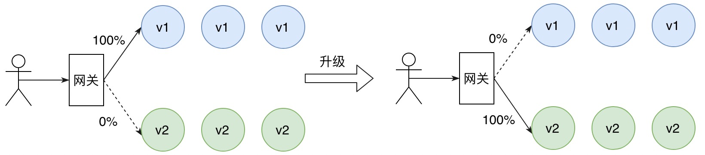
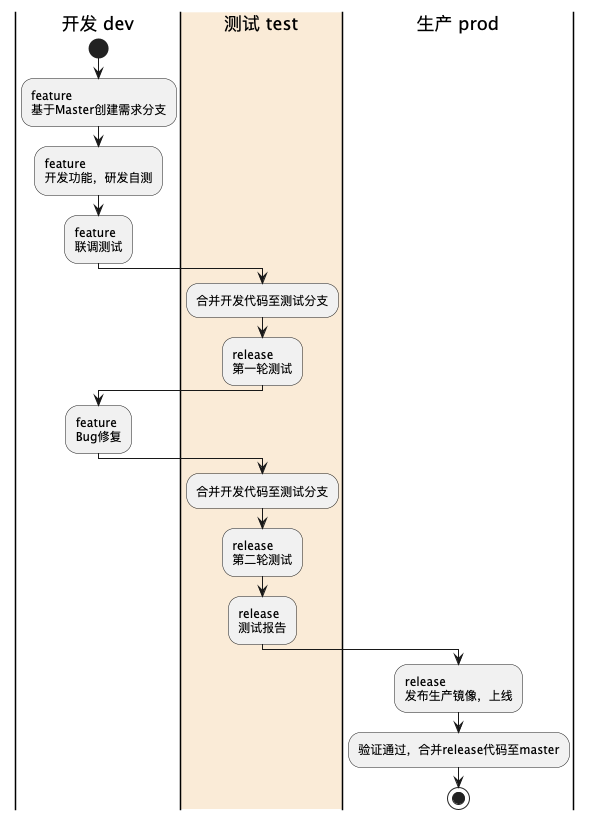

本文介绍目前被业界广泛采用的服务发布策略，包括蓝绿部署、A/B测试以及金丝雀发布。

# 蓝绿部署
蓝绿部署需要对服务的新版本进行冗余部署，一半新版本的实例规格和数量与旧版本保持一致，相当于该服务有两套完全相同的部署环境，只不过此时只有旧版本的在对外提供服务，新版本作为热备。当服务进行版本升级时，只需要将流量全部切换到新版本即可，旧版本作为热备。由于冗余部署的缘故，所以不必担心新版白的资源不够，如果新版本上线后出现严重的问题，那么只需要将流量全部切回旧版本，大大缩短恢复故障的时间。待新版本完成问题修复并重新部署之后，再将旧版本的流量切换到新版本。

蓝绿部署通过使用额外的实例资源来解决服务发布期间的不可用问题，当服务新版本出现故障时，也可以快速将流量切回旧版本。

如下图所示，某服务旧版本为v1，对新版本v2进行冗余部署。版本升级时，将现有流量全部切换为新版本v2。

当新版本v2存在问题或者发生故障时，可以快速切回旧版本v1。

- 蓝绿部署的优点：
  - 部署结构简单，运维方便。
  - 服务升级过程操作简单，周期短。
- 蓝绿部署的缺点
  - 资源荣誉，需要部署两套生产环境。
  - 新版本故障影响范围大。

# A/B测试
A/B测试基于用户请求的元信息将流量路由到新版本，这是一种基于请求内容匹配的灰度发布侧率。只有匹配特定规则的请求才会这引流到新版本，常见的做法包括基于 `HTTP Header` 和 `Cookie`。基于 `HTTP Header`方式，例如 `User-Agent` 的值为 `Android` 的请求可以访问新版本，其他系统仍然访问旧版本。
基于 `Cookie`方式，`Cookie`中通常包含具有业务语义的用户信息，例如普通用户可以访问新版本，VIP用户仍然访问接版本。

如下图所示，某服务当前版本为v1，现在新版本v2要上线。希望安卓用户可以尝鲜新功能，其他系统用户保持不变。

通过监控平台对比观察旧版本与新版本的成功率和响应时间（RT),当确认新版本整体服务表现符合预期后，可以将所有请求切换至新版本 v2，最后为了节省资源，
可以逐步下线调旧版本v1。

- A/B测试的优点：
  - 可以对特定的请求或者用户提供服务新版本，新版本故障影响范围小。
  - 需要构建完备的监控平台，用于对比不同版本只见请求状态的差异。
- A/B测试的缺点：
  - 仍然存在资源冗余，因为无法准确评估请求的容量。
  - 发布周期长

# 金丝雀发布
金丝雀发布是将少量的请求引流到新版本上，因此部署新版本服务只需极小数的实例。验证新版本傅欢预期后，逐步调整流量权重比例，
使得流量慢慢从老版本迁移至新版本，期间可以根据设置的流量比例，对新版本服务进行扩容，同时对老版本服务进行缩容，
使得底层资源得到最大化利用。

如下图所示，某服务当前版本为v1，现在新版本v2要上线。为确保流量在服务升级过程中平稳无损，采用金丝雀发布方案，
逐步将流量从老版本迁移至新版本。

- 金丝雀发布的优点：
  - 按比例将流量无差别地导向新版本，新版本故障影响范围小。
  - 发布期间逐步对新版本扩容，同时对老版本缩容，资源利用率高。

- 金丝雀发布的缺点：
  - 流量无差别地导向新版本，可能会影响到重要用户的体验
  - 发布周期长

# 流量隔离环境发布

一般我们发布的单位都是应用，但是一个功能模块往往是由多个应用组合在一起提供的服务（如微服务），即使当前发布的应用出现了异常，这个异常也未必出现在当前应用中，
在复杂的情况下，异常会延迟到他的下游应用才体现出来，如何发现此类问题并且不影响用户体验是非常重要的。此外，我们有时候还希望新版本的代码上线以后，只影响到一小部分用户。
而传统的灰度发布，因为无法识别业务流量，所以即使某个应用只有一台机器出现了问题，也可能会影响到所有的用户。

如下图左侧的灰度发布，App1 的所有机器都有一定概率会路由到出现问题的红色 App2 机器上。
而右侧的隔离环境发布中，新版本的代码会先发布在全链路隔离环境中，即使发布中出现问题，也只会影响少量用户。

- 优点：
  - 能够发现一些复杂的，涉及到多应用的问题
  - 出现故障时，只会影响很小一部分用户
- 缺点：
  - 需要对流量隔离环境进行独立监控
  - 系统设计复杂，需要中间件和链路上的所有应用能够识别业务流量

- 适用场景：
  -较为核心的生产业务场景