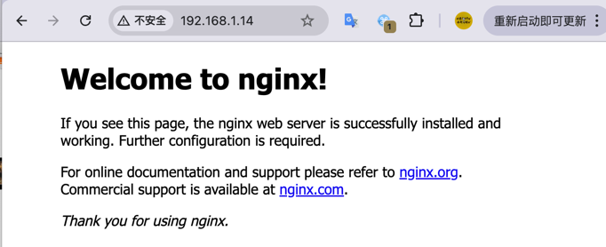
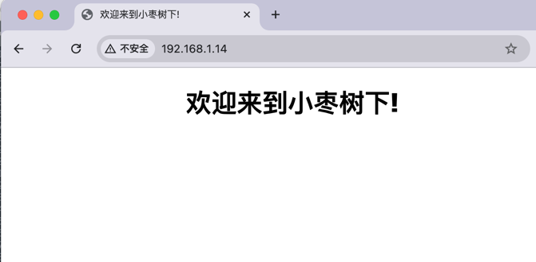

# docker 拉取镜像与启动容器
在前边的文章中我们已经成功的安装了 `docker` 并测试了相关的拉取。

> docker pull docker.1ms.run/nginx:1.27.3-perl

接下来我们开始进行 `Nginx` 的安装与配置

先查看一下我们的镜像

```shell
[root@xiaozaoshu ~]# docker images
REPOSITORY             TAG           IMAGE ID       CREATED       SIZE
docker.1ms.run/nginx   1.27.3-perl   bde8fbc9aaa8   6 weeks ago   240MB
nginx                  latest        3f8a4339aadd   7 years ago   108MB
```
其中 `bde8fbc9aaa8` 是本次要使用的镜像的版本

启动容器，看看服务是否能够正常访问
```shell
[root@xiaozaoshu ~]# docker run -d --name nginx-xiaozaoshu -p 80:80 bde8fbc9aaa8
caf39a69561b967df1e775776e8f59379c61db9b2562da74840e4960a145f251
```

打开浏览器访问得到如下的结果，可以看到 `Nginx` 的服务已经正常启动了



# docker 挂在宿主机的目录进行资源的配置
资源数据、配置数据、日志数据，这三项数据是我们需要保存到物理机的数据，如果容器重启或者更换镜像，可以继续使用之前配置和数据，进行系统的恢复或者系统的升级迭代

创建相关的目录
```shell
# 创建挂载目录
# 配置文件存放位置
mkdir -p /usr/local/nginx/conf
# 日志文件存放位置
mkdir -p /usr/local/nginx/log
# 资源文件存放位置
mkdir -p /usr/local/nginx/html
```

容器中的nginx.conf文件和conf.d文件夹复制到宿主机

```shell
# 生成容器
# 将容器nginx.conf文件复制到宿主机
docker cp nginx-xiaozaoshu:/etc/nginx/nginx.conf /usr/local/nginx/conf/nginx.conf
# 将容器conf.d文件夹下内容复制到宿主机
docker cp nginx-xiaozaoshu:/etc/nginx/conf.d /usr/local/nginx/conf/conf.d
# 将容器中的html文件夹复制到宿主机
docker cp nginx-xiaozaoshu:/usr/share/nginx/html /usr/local/nginx/
```

修改 `nginx` 的配置
```textmate
# 编辑配置文件, 每个人的配置存放文职可能有所不同，根据自己的配置进行调整
vim /usr/local/nginx/conf/conf.d/default.conf
# 添加 charset utf-8; 配置， 使系统支持中文
server {
    listen       80;
    listen  [::]:80;
    server_name  localhost;
    charset utf-8;
    #access_log  /var/log/nginx/host.access.log  main;

   ......
}
```

修改首页内容
> vim /usr/local/nginx/html/index.html
```html
<!DOCTYPE html>
<html>
<head>
    <meta charset="text/html;charset=utf-8" />
    <title>欢迎来到小枣树下!</title>
    <style>
        html { color-scheme: light dark; }
        body { width: 35em; margin: 0 auto;
            font-family: Tahoma, Verdana, Arial, sans-serif; }
    </style>
</head>
<body>
<h1>欢迎来到小枣树下!</h1>
</body>
</html>
```

本次启动的容器只是为了拷贝对应的配置文件，拷贝完成基础的配置文件后，可以将容器删除了

```shell
# 查看容器列表
[root@xiaozaoshu html]# docker ps
CONTAINER ID   IMAGE          COMMAND                   CREATED          STATUS          PORTS                               NAMES
caf39a69561b   bde8fbc9aaa8   "/docker-entrypoint.…"   36 minutes ago   Up 36 minutes   0.0.0.0:80->80/tcp, :::80->80/tcp   nginx-xiaozaoshu
# 停止容器
[root@xiaozaoshu html]# docker stop nginx-xiaozaoshu
nginx-xiaozaoshu
# 删除容器
[root@xiaozaoshu html]# docker rm nginx-xiaozaoshu
nginx-xiaozaoshu
```

然后使用宿主机的自定义的配置启动一个新的容器运行 `Nginx`

```shell
docker run \
-p 80:80 \
--name nginx-xiaozaoshu \
-v /usr/local/nginx/conf/nginx.conf:/etc/nginx/nginx.conf \
-v /usr/local/nginx/conf/conf.d:/etc/nginx/conf.d \
-v /usr/local/nginx/log:/var/log/nginx \
-v /usr/local/nginx/html:/usr/share/nginx/html \
-d bde8fbc9aaa8
```
重新访问页面



参数说明

<table align="center" border="1" cellpadding="1" cellspacing="1">
	<thead>
		<tr>
			<th>命令</th>
			<th>描述</th>
		</tr>
	</thead>
	<tbody>
		<tr>
			<td>–name nginx-xiaozaoshu</td>
			<td>启动容器的名字</td>
		</tr>
		<tr>
			<td>-d</td>
			<td>后台运行</td>
		</tr>
		<tr>
			<td>-p 80:80</td>
			<td>将容器的 80(后面那个) 端口映射到主机的 80(前面那个) 端口</td>
		</tr>
		<tr>
			<td>-v /usr/local/nginx/conf/nginx.conf:/etc/nginx/nginx.conf</td>
			<td>挂载nginx.conf配置文件</td>
		</tr>
		<tr>
			<td>-v /usr/local/nginx/conf/conf.d:/etc/nginx/conf.d</td>
			<td>挂载nginx配置文件</td>
		</tr>
		<tr>
			<td>-v /usr/local/nginx/log:/var/log/nginx</td>
			<td>挂载nginx日志文件</td>
		</tr>
		<tr>
			<td>-v /usr/local/nginx/html:/usr/share/nginx/html</td>
			<td>挂载nginx内容</td>
		</tr>
		<tr>
			<td>bde8fbc9aaa8</td>
			<td>镜像ID</td>
		</tr>
		<tr>
			<td>\</td>
			<td>shell 命令换行</td>
		</tr>
	</tbody>
</table>


