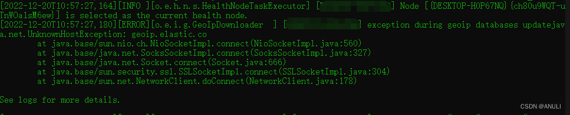
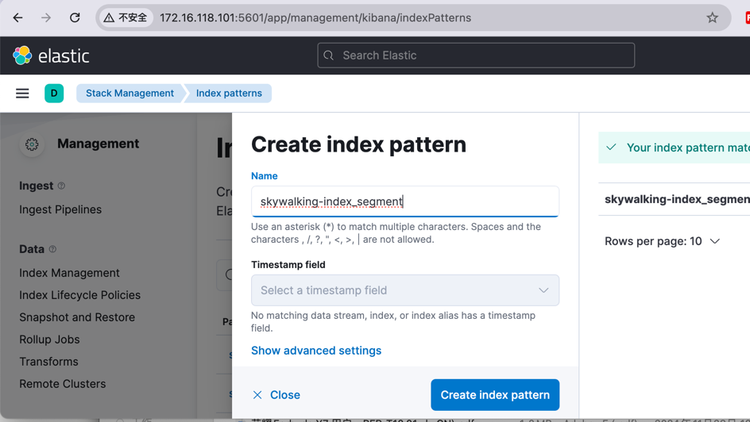
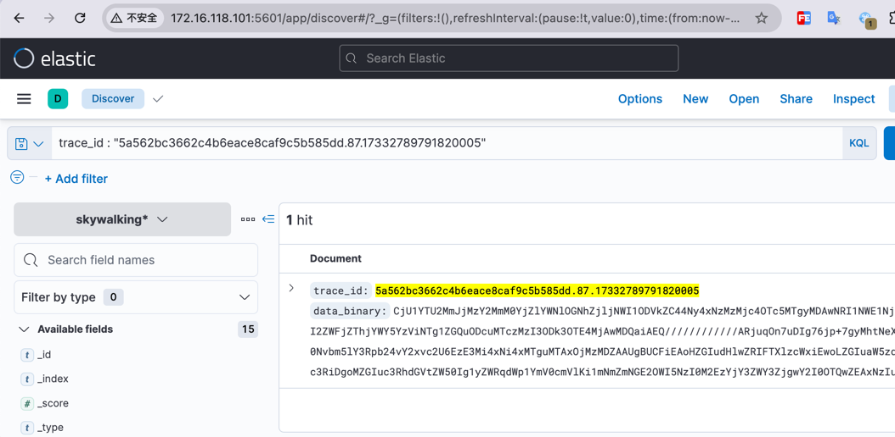
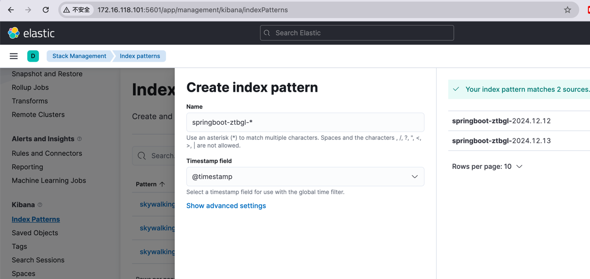
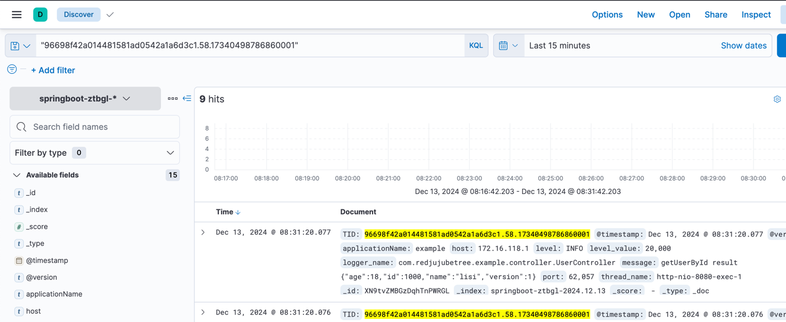
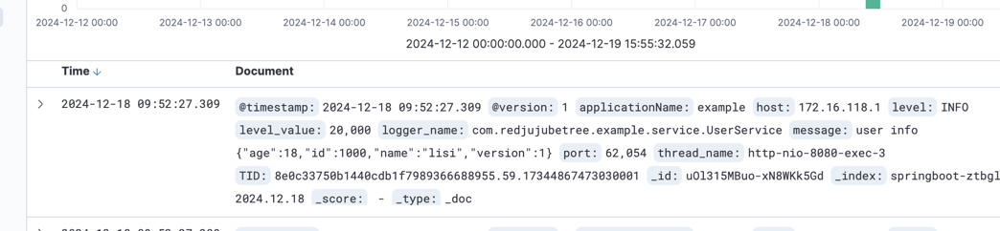
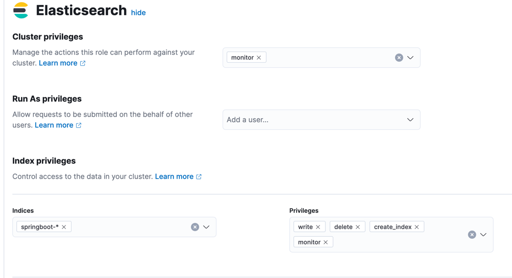

# 下载
# ElasticSearch 安装

到 /usr/local/ 下创建 elasticsearch 目录

拷贝 elasticsearch-7.17.25-linux-x86_64.tar.gz 到 /usr/local/elasticsearch/ 下

tar -zxvf elasticsearch-7.17.25-linux-x86_64.tar.gz ## 解压文件

创建用户 elasticsearch
更改目录的用户
chown elasticsearch:elasticsearch -R /usr/local/elasticsearch/

vim /usr/local/elasticseach/elasticsearch-7.17.25/config/elasticsearch.yml

	cluster.name: elasticsearch-ggxx ## 集群名称
	node.name: node-1 ## 节点名称
	path.data: /data/elasticsearch ## 数据存放目录
	path.logs: /data/elasticsearch/logs ## 日志存放目录
	
	network.host: 0.0.0.0  ## 节点绑定的网络地址，默认为 localhost , 0.0.0.0 表示绑定所有可用的网络地址， 如果想要指定地址可以使用 `,` 分开多个地址
	http.port: 9200  ## 访问端口
	
	cluster.initial_master_nodes: ["node-1"] ## 候选主节点的名称
	discovery.seed_hosts ## 应该配置为候选主节点。

/usr/local/elasticsearch/elasticsearch-7.17.25/bin/elasticsearch

内网启动时因为无法访问网络会有如下的异常



在 `elasticsearch.yml` 中禁用该项服务

	ingest.geoip.downloader.enabled: false

启动报错
```shell
ERROR: [2] bootstrap checks failed. You must address the points described in the following [2] lines before starting Elasticsearch.
bootstrap check failure [1] of [2]: max file descriptors [4096] for elasticsearch process is too low, increase to at least [65535]
bootstrap check failure [2] of [2]: max virtual memory areas vm.max_map_count [65530] is too low, increase to at least [262144]
```
主要是文件权限与内存大小问题：

elasticsearch用户拥有的可创建文件描述的权限太低，至少需要65536,

处理办法: #切换到root用户修改

vim /etc/security/limits.conf # 在最后面追加下面内容

    elasticsearch hard nofile 65536
    elasticsearch soft nofile 65536

max_map_count文件包含限制一个进程可以拥有的VMA(虚拟内存区域)的数量

处理办法: #切换到root用户修改

vim /etc/sysctl.conf # 在最后面追加下面内容

    vm.max_map_count=655360

执行 
    sysctl -p

后台启动

	[elasticsearch@localhost bin]$ ./elasticsearch -d

curl http://172.16.118.101:9200/ 

	{
		"name": "node-1",
		"cluster_name": "elasticsearch",
		"cluster_uuid": "cADHxwLJSXKyY7SfovmLIA",
		"version": {
			"number": "7.17.25",
			"build_flavor": "default",
			"build_type": "tar",
			"build_hash": "f9b6b57d1d0f76e2d14291c04fb50abeb642cfbf",
			"build_date": "2024-10-16T22:06:36.904732810Z",
			"build_snapshot": false,
			"lucene_version": "8.11.3",
			"minimum_wire_compatibility_version": "6.8.0",
			"minimum_index_compatibility_version": "6.0.0-beta1"
		},
		"tagline": "You Know, for Search"
	}

ElasticSearch 在测试虚拟机配置时，通常不需要占用太多的资源，我们需要修改下默认的JVM配置来

修改JVM 参数需要自己创建一个文件，不要修改自带的 elasticsearch-7.17.25/config/jvm.options,
文件以 `.options` 后缀， 每行一个参数，参数以 `-` 为前缀

	[root@localhost jvm.options.d]# pwd
	/usr/local/elasticsearch/elasticsearch-7.17.25/config/jvm.options.d
	[root@localhost jvm.options.d]# touch jvm.options
	[root@localhost jvm.options.d]# echo "-Xmx1g" > jvm.options
	[root@localhost jvm.options.d]# echo "-Xms1g" >> jvm.options
	[root@localhost jvm.options.d]# cat jvm.options
	-Xmx1g
	-Xms1g
	[root@localhost jvm.options.d]#

<br/>

	-XX:MaxDirectMemorySize ## 参数会默认配置为JVM Heap 内存的一半


# Kibana 安装

解压文件

	tar -zxvf kibana-7.17.25-linux-x86_64.tar.gz 

更改用户

	chown elasticsearch:elasticsearch -R kibana-7.17.25

修改配置文件，不限制访问地址

	vim config/kibana.yml
	server.port: 5601
	server.host: 0.0.0.0
	
切换 elasticsearch 用户启动项目
	
```shell
# 前台启动
su elasticsearch
bin/kibana
# 后台启动使用如下命令
nohup bin/kibana &
```

访问地址，正常情况下可以看见 `Kibana` 的首页的页面了

	http://172.16.118.101:5601/app/home#/

创建一个索引映射


 
然后可以在相应的页面进行查询操作了



# 安装 LogStash
解压到指定的目录
```shell
tar -xvf logstash-7.17.25-linux-x86_64.tar.gz -C /usr/local/elasticsearch
```

## 配置
修改配置文件

vim config/logstash.conf

添加如下内容
```shell
# Sample Logstash configuration for creating a simple
# Beats -> Logstash -> Elasticsearch pipeline.

input {
  tcp {
    mode => "server"
    host => "172.16.118.101"
    port => 5044
    codec => json_lines
  }
}

output {
  elasticsearch {
    hosts => ["172.16.118.101:9200"]
    index => "springboot-ztbgl-%{+YYYY.MM.dd}"
  }
}
```
```text
{
                "TID" => "d21f92d042684df18644a9454c582b53.68.17346225108250001",
           "@version" => "1",
        "logger_name" => "com.redjujubetree.example.service.UserService",
        "thread_name" => "http-nio-8080-exec-10",
         "@timestamp" => 2024-12-19T15:35:10.833Z,
    "applicationName" => "example",
            "message" => "user info {\"age\":21,\"id\":1,\"name\":\"kenny\",\"nextId\":0,\"version\":0}",
               "host" => "172.16.118.1",
              "level" => "INFO",
        "level_value" => 20000,
               "port" => 51834
}
```
## 启动
启动 `logstash`
*bin/logstash -f config/ztbgl.config*
```shell
[root@zeus logstash-7.17.25]# bin/logstash -f config/ztbgl.config
Using JAVA_HOME defined java: /usr/local/java/jdk-17.0.11
WARNING: Using JAVA_HOME while Logstash distribution comes with a bundled JDK.
DEPRECATION: The use of JAVA_HOME is now deprecated and will be removed starting from 8.0. Please configure LS_JAVA_HOME instead.
Sending Logstash logs to /usr/local/elasticsearch/logstash-7.17.25/logs which is now configured via log4j2.properties
[2024-12-12T15:42:13,239][INFO ][logstash.runner          ] Log4j configuration path used is: /usr/local/elasticsearch/logstash-7.17.25/config/log4j2.properties
[2024-12-12T15:42:13,257][INFO ][logstash.runner          ] Starting Logstash {"logstash.version"=>"7.17.25", "jruby.version"=>"jruby 9.2.20.1 (2.5.8) 2021-11-30 2a2962fbd1 Java HotSpot(TM) 64-Bit Server VM 17.0.11+7-LTS-207 on 17.0.11+7-LTS-207 +indy +jit [linux-x86_64]"}
[2024-12-12T15:42:13,260][INFO ][logstash.runner          ] JVM bootstrap flags: [-Xms1g, -Xmx1g, -Djava.awt.headless=true, -Dfile.encoding=UTF-8, -Djdk.io.File.enableADS=true, -Djruby.compile.invokedynamic=true, -Djruby.jit.threshold=0, -Djruby.regexp.interruptible=true, -XX:+HeapDumpOnOutOfMemoryError, -Djava.security.egd=file:/dev/urandom, -Dlog4j2.isThreadContextMapInheritable=true, --add-opens=java.base/sun.nio.ch=ALL-UNNAMED, --add-opens=java.base/java.io=ALL-UNNAMED]
[2024-12-12T15:42:13,525][WARN ][logstash.config.source.multilocal] Ignoring the 'pipelines.yml' file because modules or command line options are specified
[2024-12-12T15:42:14,486][INFO ][logstash.agent           ] Successfully started Logstash API endpoint {:port=>9600, :ssl_enabled=>false}
[2024-12-12T15:42:15,139][INFO ][org.reflections.Reflections] Reflections took 55 ms to scan 1 urls, producing 119 keys and 419 values
[2024-12-12T15:42:15,719][INFO ][logstash.outputs.elasticsearch][main] New Elasticsearch output {:class=>"LogStash::Outputs::ElasticSearch", :hosts=>["//172.16.118.101:9200"]}
[2024-12-12T15:42:15,987][INFO ][logstash.outputs.elasticsearch][main] Elasticsearch pool URLs updated {:changes=>{:removed=>[], :added=>[http://172.16.118.101:9200/]}}
[2024-12-12T15:42:16,177][WARN ][logstash.outputs.elasticsearch][main] Restored connection to ES instance {:url=>"http://172.16.118.101:9200/"}
[2024-12-12T15:42:16,188][INFO ][logstash.outputs.elasticsearch][main] Elasticsearch version determined (7.17.25) {:es_version=>7}
[2024-12-12T15:42:16,193][WARN ][logstash.outputs.elasticsearch][main] Detected a 6.x and above cluster: the `type` event field won't be used to determine the document _type {:es_version=>7}
[2024-12-12T15:42:16,258][INFO ][logstash.outputs.elasticsearch][main] Config is not compliant with data streams. `data_stream => auto` resolved to `false`
[2024-12-12T15:42:16,259][INFO ][logstash.outputs.elasticsearch][main] Config is not compliant with data streams. `data_stream => auto` resolved to `false`
[2024-12-12T15:42:16,304][INFO ][logstash.outputs.elasticsearch][main] Using a default mapping template {:es_version=>7, :ecs_compatibility=>:disabled}
[2024-12-12T15:42:16,333][INFO ][logstash.javapipeline    ][main] Starting pipeline {:pipeline_id=>"main", "pipeline.workers"=>4, "pipeline.batch.size"=>125, "pipeline.batch.delay"=>50, "pipeline.max_inflight"=>500, "pipeline.sources"=>["/usr/local/elasticsearch/logstash-7.17.25/config/ztbgl.config"], :thread=>"#<Thread:0x34d10ea4 run>"}
[2024-12-12T15:42:16,850][INFO ][logstash.javapipeline    ][main] Pipeline Java execution initialization time {"seconds"=>0.51}
[2024-12-12T15:42:16,964][INFO ][logstash.javapipeline    ][main] Pipeline started {"pipeline.id"=>"main"}
[2024-12-12T15:42:17,003][INFO ][logstash.inputs.tcp      ][main][0378a415d03d2b363c20de1a3689af6a195031e7ace075b0d57d2540b4dfabc9] Starting tcp input listener {:address=>"172.16.118.101:5044", :ssl_enable=>false}
[2024-12-12T15:42:17,069][INFO ][logstash.agent           ] Pipelines running {:count=>1, :running_pipelines=>[:main], :non_running_pipelines=>[]}
```

# springboot 修改logback-spring.xml 配置

```xml    
<configuration>
    <!--输出到logstash的appender-->
    <appender name="LOGSTASH" class="net.logstash.logback.appender.LogstashTcpSocketAppender">
        <!--可以访问的logstash日志收集端口-->
        <destination>172.16.118.101:5044</destination>
        <encoder class="net.logstash.logback.encoder.LogstashEncoder">
            <!-- skywalking插件, log加tid -->
            <provider class="org.apache.skywalking.apm.toolkit.log.logback.v1.x.logstash.TraceIdJsonProvider" />
        </encoder>
    </appender>
    
    <!-- 设置 Appender -->
    <root level="INFO">
        <appender-ref ref="console"/>
        <appender-ref ref="file"/>
        <appender-ref ref="LOGSTASH"/>
    </root>
</configuration>
```

在 `kibana` 的页面创建一个 `index patten` 


在 `Discover` 页面就可以查找到相关的日志信息了


这里我们看到时间的格式不是我们的=常见的格式，这个是显示的问题，需要修改下显示的格式

`Stack Management > Advanced Settings > General > Date format` 
修改为如下值：
```shell
YYYY-MM-DD HH:mm:ss.SSS
```

可以看见时间的格式已经是我们常见的时间的格式了


到现在我们已经搭建好了ELK的相关的服务了, 下面我们还需要处理一些常见的问题

# 安全问题
## ES 设置密码
```shell
[elasticsearch@zeus bin]$ ./elasticsearch-setup-passwords  -h
warning: usage of JAVA_HOME is deprecated, use ES_JAVA_HOME
Sets the passwords for reserved users

Commands
--------
auto - Uses randomly generated passwords
interactive - Uses passwords entered by a user

Non-option arguments:
command

Option             Description
------             -----------
-E <KeyValuePair>  Configure a setting
-h, --help         Show help
-s, --silent       Show minimal output
-v, --verbose      Show verbose output
```

如果用 `interactive` 需要手动设置密码，如果使用 `auto` 则自动生成一个随机的密码

```shell
[elasticsearch@zeus bin]$ ./elasticsearch-setup-passwords  interactive
warning: usage of JAVA_HOME is deprecated, use ES_JAVA_HOME

Unexpected response code [500] from calling GET http://172.16.118.101:9200/_security/_authenticate?pretty
It doesn't look like the X-Pack security feature is enabled on this Elasticsearch node.
Please check if you have enabled X-Pack security in your elasticsearch.yml configuration file.

ERROR: X-Pack Security is disabled by configuration.
```
设置密码需要我们先开启安全组件，`X-Pack Security`, 参考文章后续内容开启安全组件

开启安全组件后重新执行上边的命令设置密码
```shell
[elasticsearch@zeus bin]$ ./elasticsearch-setup-passwords  interactive
warning: usage of JAVA_HOME is deprecated, use ES_JAVA_HOME
Initiating the setup of passwords for reserved users elastic,apm_system,kibana,kibana_system,logstash_system,beats_system,remote_monitoring_user.
You will be prompted to enter passwords as the process progresses.
Please confirm that you would like to continue [y/N]y

Enter password for [elastic]:
Reenter password for [elastic]:
Enter password for [apm_system]:
Reenter password for [apm_system]:
Enter password for [kibana_system]:
Reenter password for [kibana_system]:
Enter password for [logstash_system]:
Reenter password for [logstash_system]:
Enter password for [beats_system]:
Reenter password for [beats_system]:
Enter password for [remote_monitoring_user]:
Reenter password for [remote_monitoring_user]:
Changed password for user [apm_system]
Changed password for user [kibana_system]
Changed password for user [kibana]
Changed password for user [logstash_system]
Changed password for user [beats_system]
Changed password for user [remote_monitoring_user]
Changed password for user [elastic]
[elasticsearch@zeus bin]$ 
```
## Security
Elasticsearch默认没有开启安全组件，生产环境中是不允许直接访问的，必须开启安全组件后才能对系统及相关的数据进行访问

从Elasticsearch 6.8版及以后版本开始，X Pack基本许可证（免费）在标准Elasticsearch版本中包含安全性，而在此之前，它是一个付费功能。
### elasticsearch7.x 开启安全认xpack
#### 1 生成ca证书
```shell
[elasticsearch@zeus elasticsearch-7.17.25]$ bin/elasticsearch-certutil ca

......
#这里直接回车
Please enter the desired output file [elastic-stack-ca.p12]:
#这里直接回车
Enter password for elastic-stack-ca.p12 :

# 会在elasticsearch的家目录下看到新生成的证书 `elastic-stack-ca.p12`
[elasticsearch@zeus elasticsearch-7.17.25]$ ls elastic-stack-ca.p12
elastic-stack-ca.p12
```
#### 2 生成p12密钥
```shell
[elasticsearch@zeus elasticsearch-7.17.25]$ bin/elasticsearch-certutil cert --ca elastic-stack-ca.p12

......

# 使用上面生成的ca证书 `elastic-stack-ca.p12` 生成p12密钥
#下面三项直接回车即可
Enter password for CA (elastic-stack-ca.p12) :
Please enter the desired output file [elastic-certificates.p12]:
Enter password for elastic-certificates.p12 :

# 设置完成后，会在elasticsearch的家目录下看到新生成的密钥elastic-certificates.p12
Certificates written to /usr/local/elasticsearch/elasticsearch-7.17.25/elastic-certificates.p12

This file should be properly secured as it contains the private key for
your instance.

This file is a self contained file and can be copied and used 'as is'
For each Elastic product that you wish to configure, you should copy
this '.p12' file to the relevant configuration directory
and then follow the SSL configuration instructions in the product guide.

For client applications, you may only need to copy the CA certificate and
configure the client to trust this certificate.
```
#### 3 使用安全证书
首先在config/目录下创建个 certs 目录，然后将p12证书移动到certs目录下，方便后面在配置文件里引用
```shell
[elasticsearch@zeus elasticsearch-7.17.25]$ mkdir -p config/certs
[elasticsearch@zeus elasticsearch-7.17.25]$ mv ./elastic-certificates.p12 config/certs/
[elasticsearch@zeus elasticsearch-7.17.25]$ chmod -R +755 config/certs/
[elasticsearch@zeus elasticsearch-7.17.25]$ ll config/certs/
total 4
-rwxr-xr-x. 1 elasticsearch elasticsearch 3596 Dec 17 13:43 elastic-certificates.p12
```
#### 修改elasticsearch配置文件开启xpack

```shell
xpack.security.enabled: true
xpack.security.transport.ssl.enabled: true
xpack.security.transport.ssl.verification_mode: certificate

xpack.security.transport.ssl.keystore.path: certs/elastic-certificates.p12
xpack.security.transport.ssl.truststore.path: certs/elastic-certificates.p12
```

## ES 修改默认的端口
vim config/elasticsearch.yml

```shell
# 设置对外服务的http端口，默认为 10920
http.port: 10920
# 设置节点之间交互的tcp端口，默认是 10930
transport.tcp.port: 10930
```

修改完成后，对 `Elasticseach` 有依赖的客户端也需要进行相应的端口的修改

## Kibana 修改配置

```shell
# Kibana is served by a back end server. This setting specifies the port to use.
server.port: 10940

 # The URLs of the Elasticsearch instances to use for all your queries.
 elasticsearch.hosts: ["http://172.16.118.101:10920"]
 
# If your Elasticsearch is protected with basic authentication, these settings provide
# the username and password that the Kibana server uses to perform maintenance on the Kibana
# index at startup.
elasticsearch.username: "kibana_system"
elasticsearch.password: "123456"
```
# Logstash 修改配置
虽然我们在开启es认证时设置过"logstash_system"用户，但是这个用户并不能像kibana那样直接使用，如果直接使用"logstash_system"用户的话，在将数据写入索引的时候，会报403的错误，如下：
```shell
[2023-01-13T13:32:59,126][ERROR][logstash.outputs.elasticsearch][main][53f2ca2de58f24f94b83b4a2ddfacfaaa953df1f59b7c9426f204cd3cda13a80] Encountered a retryable error (will retry with exponential backoff) {:code=>403, :url=>"http://10.8.0.6:9200/_bulk", :content_length=>3145}
```
## 创建logstash用户
### 创建角色
- 首先创建个角色，名为"logstash_write"，集群权限为：monitor；

- 此角色对索引的操作权限为：write、delete、create_index monitor；



### 创建用户


- 修改启动端口
- 修改对应的 `Elasticsearch` 的端口
```shell
input {
  tcp {
    mode => "server"
    host => "172.16.118.101"
    port => 10950
    codec => json_lines
  }
}

output {
  elasticsearch {
    hosts => ["172.16.118.101:10920"]
    index => "springboot-ztbgl-%{+YYYY.MM.dd}"
    user => "logstash-ztbgl"
    password => "password"
  }
}
```
重启logstash；
