# GRPC
gRPC (gRPC Remote Procedure Calls) is a modern open source high performance RPC framework that can run in any environment. It is designed to make it easier for developers to build efficient and robust distributed systems.

gRPC is a high-performance, open-source universal RPC framework that can run in any environment. It is based on the HTTP/2 protocol and uses Protocol Buffers as its interface definition language (IDL).

## Protocol Buffers 
Protocol Buffers are a language-neutral, platform-neutral extensible mechanism for serializing structured data. It is used by gRPC to define the service and message types.

Protocol Buffers identify each field by its field number(tag), not by its name or order. This allows for more efficient serialization and deserialization of data.

# Refrences
- [gRPC Official Documentation](https://grpc.io/docs/)
- [Protocol Buffers Official Documentation](https://developers.google.com/protocol-buffers/docs/overview)
- [Protocol Buffers Language Guide](https://developers.google.com/protocol-buffers/docs/proto3)

```plantuml

@startuml
title 单文件分片上传（gRPC流式传输 + 断点续传）流程图

actor Client
participant "FileTransferService\n(gRPC Server)" as Server
database "Storage\n(Filesystem + Meta)" as Storage

Client -> Server : CheckProgress(filename)
Server -> Storage : 查询文件上传进度
Storage --> Server : max_seq, completed
Server --> Client : FileProgress(max_seq, completed)

Client -> Client : 从 seq = max_seq+1 开始分片文件

loop [并发上传 chunk]
  Client -> Server : Upload(FileChunk seq=n)
  alt seq <= 已接收
    Server -> Server : 忽略重复块
  else
    Server -> Storage : 追加 data 写入文件
    Server -> Storage : 更新 meta 信息（记录 seq）
  end
end

Client -> Server : Upload(is_last=true)
Server -> Storage : 完成写入、校验完整性
Server --> Client : UploadStatus(success=true)

@enduml

```

```plantuml
@startuml
!theme plain
skinparam backgroundColor white
skinparam sequenceArrowThickness 2
skinparam roundcorner 20
skinparam maxmessagesize 60

title **gRPC四种通信模式下onCompleted()时序图**

participant "💻\nClient" as C
participant "🖥️\nServer" as S

group **1️⃣ Unary RPC (一元调用)**
    C -> S: **request**
    activate S #lightblue
    S -> C: **response**
    deactivate S
    note right of C #lightgreen: ✅ **onCompleted()**
end

group **2️⃣ Server Streaming RPC (服务端流)**
    C -> S: **request**
    activate S #lightblue
    S -> C: **response1**
    S -> C: **response2**
    S -> C: **response3**
    S -> C: ✅ **onCompleted()**
    deactivate S
    note right of C #lightgreen: ✅ **onCompleted()**
end

group **3️⃣ Client Streaming RPC (客户端流)**
    activate C #lightyellow
    C -> S: **request1**
    C -> S: **request2**
    C -> S: **request3**
    C -> S: ✅ **onCompleted()**
    deactivate C
    activate S #lightblue
    S -> C: **response**
    deactivate S
    note right of C #lightgreen: ✅ **onCompleted()**
end

group **4️⃣ Bidirectional Streaming RPC (双向流)**
    activate C #lightyellow
    activate S #lightblue
    C -> S: **request1**
    S -> C: **response1**
    C -> S: **request2**
    S -> C: **response2**
    C -> S: **request3**
    C -> S: ✅ **Client onCompleted()**
    deactivate C
    S -> C: **response3**
    S -> C: ✅ **Server onCompleted()**
    deactivate S
    note right of C #lightgreen: ✅ **onCompleted()**
end

legend right
    |= **图标说明** |
    | 💻 | 客户端 |
    | 🖥️ | 服务端 |
    | ✅ | 完成信号 |
    |= **颜色说明** |
    | <back:lightyellow>黄色</back> | 客户端激活 |
    | <back:lightblue>蓝色</back> | 服务端激活 |
    | <back:lightgreen>绿色</back> | 完成状态 |
endlegend

@enduml

```

```mermaid
sequenceDiagram
    participant C as Client
    participant S as Server

    Note over C,S: 1. Unary RPC (一元调用)
    C->>S: request
    S->>C: response
    Note over C: onCompleted()

    Note over C,S: 2. Server Streaming RPC (服务端流)
    C->>S: request
    S->>C: response1
    S->>C: response2
    S->>C: response3
    S->>C: onCompleted()
    Note over C: onCompleted()

    Note over C,S: 3. Client Streaming RPC (客户端流)
    C->>S: request1
    C->>S: request2
    C->>S: request3
    C->>S: onCompleted()
    S->>C: response
    Note over C: onCompleted()

    Note over C,S: 4. Bidirectional Streaming RPC (双向流)
    C->>S: request1
    S->>C: response1
    C->>S: request2
    S->>C: response2
    C->>S: request3
    C->>S: onCompleted()
    S->>C: response3
    S->>C: onCompleted()
    Note over C: onCompleted()

```

