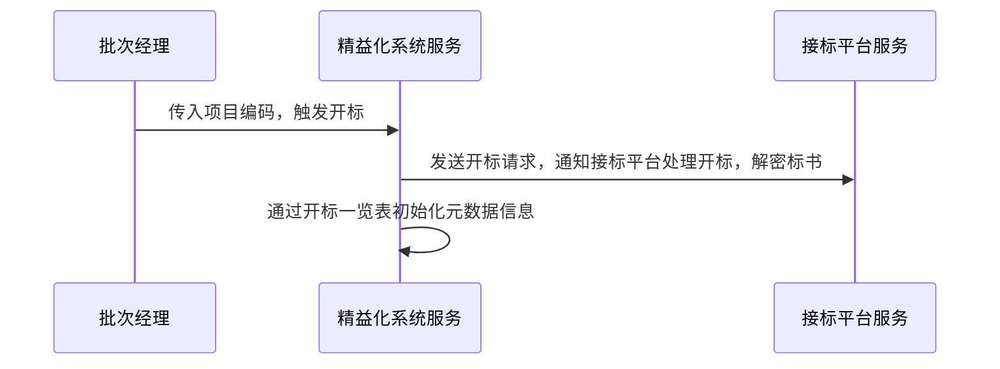
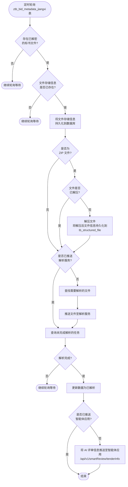
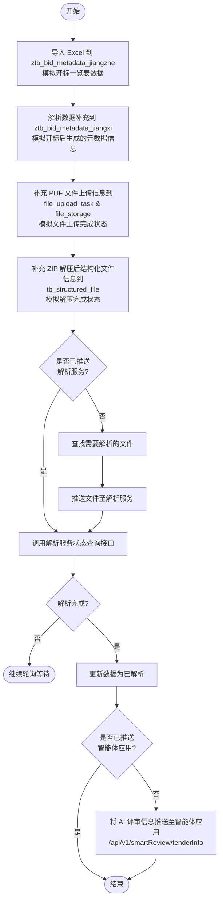
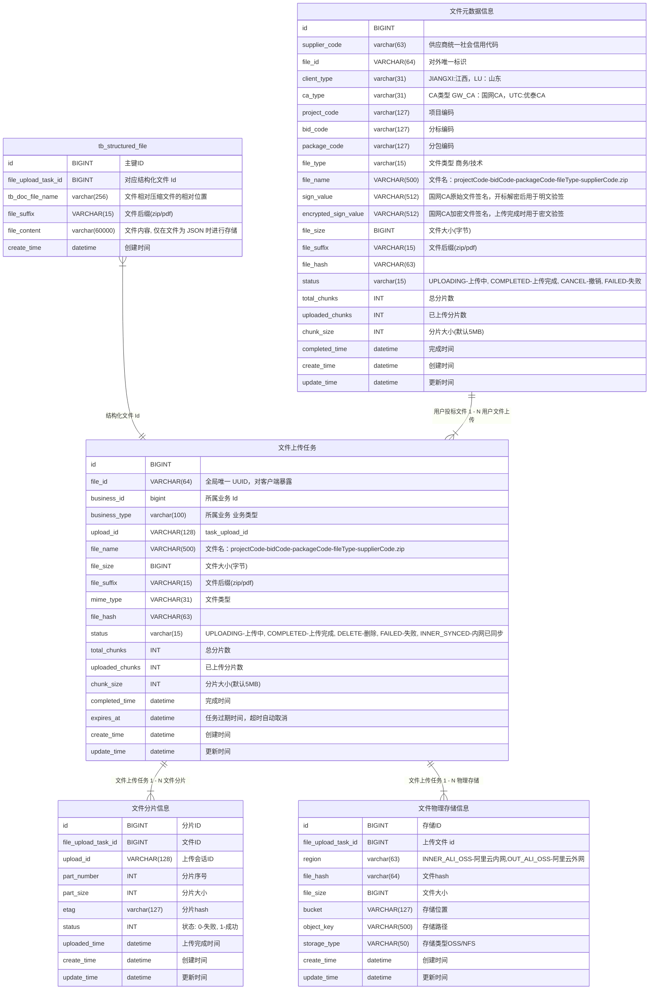
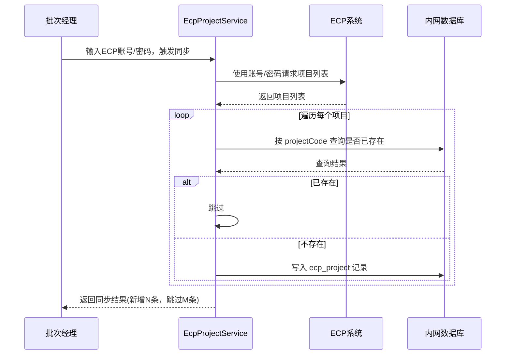
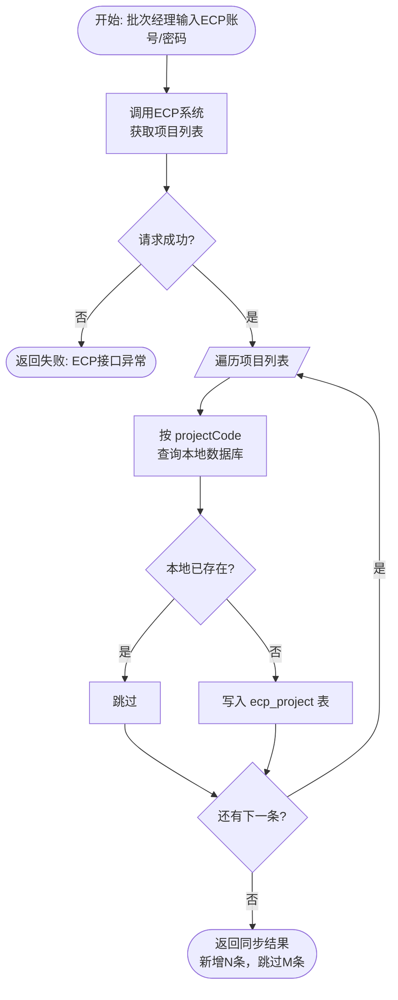

##  分支命名：feature/shandong-pc2-202605
## 分支命名：feature/shandong-pc2-202605-tanjianwei
## 1. 必须写单元测试 2. 单元测试要覆盖所有字段 3. 请求接口参数命名：XxxRequest

## 内网精益化-项目开标

开标时，批次经理在精益化系统触发项目开标流程。系统根据项目编码列出内网 OSS 指定目录下的所有标书信息同步到精益化数据库；
若为 ZIP 格式则进一步解压,解压后的文件存储到内网 OSS, 并持久化结构化标书信息。
最后将需要智能评标的文件推送至解析服务，并将 AI 评审信息推送至智能体应用。

*项目编码/商务/分标编码_分包编码(没有填无)_投标人名称.pdf*

标书文件：
- Open/182535/商务/互感器_包1_9111000071093123XX_商务.pdf
- Open/182535/商务/互感器_包1_9111000071093123XX_商务.zip

- Open/182535/商务/互感器_包1_9111000071093123XX_商务/tb_document_file.json
- Open/182535/商务/互感器_包1_9111000071093123XX_商务/tb_document_label_info.json
- Open/182535/商务/互感器_包1_9111000071093123XX_商务/uploads/93541433a3124b07bb896010f500ffb4.png

**触发方式**
- 批次经理在精益化系统手动触发，传入项目编码

**主要步骤**
- 向接标平台发送开标请求，通知接标平台进行开标处理（解密标书文件）
- 通过开标一览表初始化元数据信息

- 定时轮询metadata 查询是否存在已解密的标书文件进行处理
    - 根据路径信息保存 metadata 信息到数据库
    - 根据如果是 zip 文件则解压到指定目录

### 项目开标-请求时序图

### 文件解析
- 定时轮询 `ztb_bid_metadata_jiangxi` 表，查询是否存在已解密的标书文件进行处理
- 如果 metadata 数据对应的文件存储信息已存在则说明文件已经上传完成，直接进行后续处理；如果不存在则说明文件还未上传完成，继续轮询等待
- 如果标书文件已上传，将文件的存储相关的信息持久化到数据库中，否则继续轮询等待
- 如果是 ZIP 文件，如果文件还未解押则进行解压处理，并将解压后的文件信息持久化到 `tb_structured_file` 表中，供后续文件解析和智能评标使用，如果已解压则直接进行后续处理
- 如果智能评审项目还没有推送解析服务进行解析，在查找需要进行解析的文件后将文件推送之解析服务进行解析，如果已经推送过了则直接进行后续处理
- 调用解析服务状态查询接口查询解析结果，如果解析完成则将数据更新为已解析，否则接续轮询等待
- 如果解析完成则将 AI 评审信息推送至智能体应用 `/api/v1/smartReview/tenderInfo`，如果已经推送过了则直接进行后续处理

### 业务流程图

### 试用逻辑
- 导入 excel到 `ztb_bid_metadata_jiangzhe`，模拟开标一览表数据，包含项目编码、分标编码、包编码、文件类型、供应商统一社会信用代码等信息
- 根据 `ztb_bid_metadata_jiangzhe` 解析数据补充到 `ztb_bid_metadata_jiangxi` 表中，模拟开标后生成的元数据信息
- 补充 PDF 文件的上传信息到 `file_upload_task` 和 `file_storage` 表中，模拟文件上传完成的状态
- 补充 ZIP 解压后的结构化文件信息到 `tb_structured_file` 表中，模拟解压完成的状态
- 如果智能评审项目还没有推送解析服务进行解析，在查找需要进行解析的文件后将文件推送之解析服务进行解析，如果已经推送过了则直接进行后续处理
- 调用解析服务状态查询接口查询解析结果，如果解析完成则将数据更新为已解析，否则接续轮询等待
- 如果解析完成则将 AI 评审信息推送至智能体应用 `/api/v1/smartReview/tenderInfo`，如果已经推送过了则直接进行后续处理

### 试用逻辑业务流程图

# 表设计
## ER 图

## 内网精益化-获取ECP项目信息

批次经理登录精益化系统，输入 ECP 账号和密码，系统调用 ECP 接口拉取该账号下的项目列表。对每条项目记录判断本地是否已存在，已存在则跳过，不存在则写入本地数据库完成同步。

**触发方式**
- 批次经理在精益化系统手动触发，输入 ECP 账号/密码

**主要步骤**
1. 调用 `EcpProjectService`，携带 ECP 账号/密码请求 ECP 系统获取项目列表
2. 遍历项目列表，按 `projectCode` 查询本地数据库
3. 本地已存在 → 跳过
4. 本地不存在 → 写入本地 `ecp_project` 表

### 请求时序图

### 业务流程图
