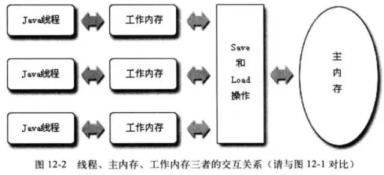

# Java内存模型与线程
Java 内存模型的主要目的是定义程序中的各种变量的访问规则，即关注在虚拟机中把变量值存储到内存和从内存中取出变量值的底层细节

Java内存模型规定了所有的变量都存储在主内存（Main Memory）中，每条线程还有自己的工作内存（Working Memory）线程对变量的所有操作都必须在工作内存中进行，而不能直接读写主内存中的数据，不同的线程也无法访问对方工作内存中的变量，线程间变量值的传递均需通过主内存来完成。

Java内存模型是围绕并发过程中如何处理原子性、可见性、有序性来建立的。
- 原子性：通过 synchronized、LOCK解决
- 可见性：一个线程对变量的修改另一个线程能够立即察觉到，通过synchronized、LOCK、volatile来解决
- 有序性：通过volatile 和 hapen-before原则保证
  

## 1.2 volatile
1) 保证共享变量对所有线程的可见性
2) 禁止代码重排序优化

*被 `volatile`  修饰的变量，赋值后多执行了一个 `lock add1 $0x0,(%esp)`  这里的关键在于 `lock`，它的作用是将本处理器的缓存写入内存，这个写入操作会引起其它的处理器或内核无效化其缓存，所以通过这样一个操作，可以让对 `volatile` 的修改对其他处理器立即可见。*

由于 `volatile` 变量只能保证可见性，在不符合一下两条原则的运算场景中，我们仍要通过加锁（使用synchronized、java.uitl.concurrent 中的锁或原子类）来保证原子性：

- 运算结果不依赖变量的当前值，或者只有单一的线程来修改变量的值
- 变量不需要与其他的状态变量共同参与不变约束

eg.
```java
volatile boolean shutdowRequested;

public void shutdown() {

	shutdownRequested = true;
}

public void doWork() {
	while (!shutdownRequest) {
		// 代码业务逻辑
	}
}
```
## 内存屏障
1. lfence 是一种Load Barrier 读屏障
2. sfence 是一种Store Barrier 写屏障
3. mfence 是一种全能型的屏障，具备lfence 和 sfence的能力
4. Lock前缀 lock 不是一种内存屏障，但是他能完成类似内存屏障的功能，lock 会对CPU总线和告诉缓存加锁，可以理解为CPU指令级的一种锁。

## 线程状态
- 新建（New）
  创建后尚未启动的线程处于这种状态
- 运行（Runnable）
  包括操作系统线程状态中的Running 和 Ready状态，也就是说线程正在执行，或者线程正在等待被CPU等待
- 无限期等待（Waiting）
  处于这种状态的线程不会被分配CPU执行时间，要等待被其他线程显示唤醒
    - 没有设置超时时间的 wait() 方法
    - 没有设置超时时间的 join() 方法
    - LockSupport.park
- 限期等待(Timed Waiting)
  处于这种状态的向后才能也不会被分配CPU执行时间，但是无需等待被其他线程显示唤醒，在等待一定时间后，他们由系统自动唤醒
    - Thread::sleep()
    - 设置了超时时间的 Object.wait()
    - 设置了超时时间的Thread::join()
    - LockSupport::parkNanos()
    - LockSupport::parkUntil
- 阻塞(Blocked):
  线程被阻塞了，“阻塞状态” 与“等待状态”的区别是“阻塞状态”在等待着获取一个排它锁，这个时间将在另一个线程放弃这个锁的时候发生；而“等待状态”则是在等待一段时间，或者唤醒动作的发生。在程序进入同步区域的时候，线程将进入这种状态
- 结束（Terminated）
  以终止的线程的状态，线程已经结束执行
