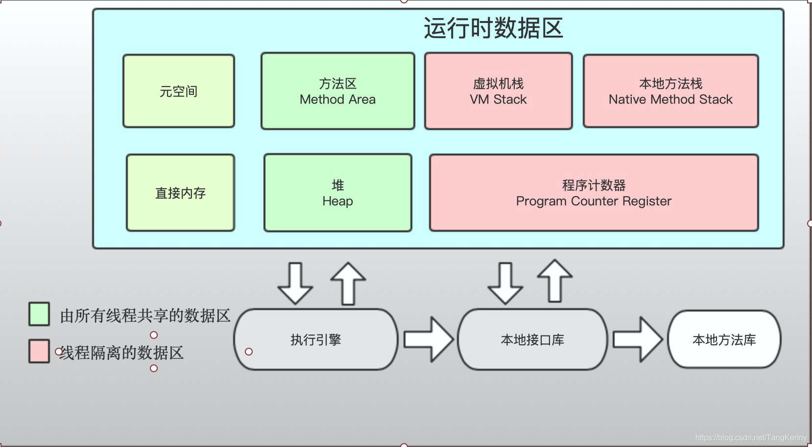
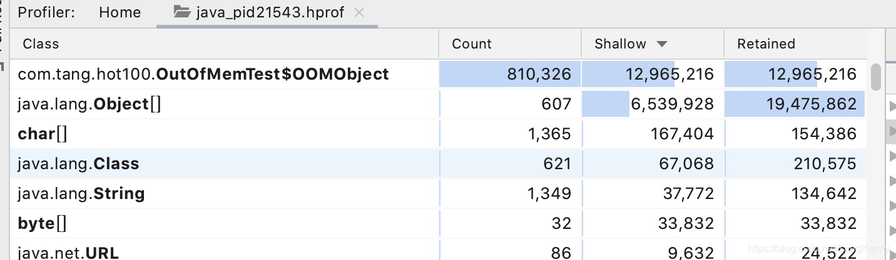

# Java内存区域
## 2.2 运行时数据区域

## 2.2.1 程序计数器
当前线程所执行字节码的行号指示器
## 2.2.2 Java 虚拟机栈 & 本地方法栈
在HotSpot虚拟机中虚拟机栈和本地方法栈是一样的不进行区分，我们通常所说的栈一般情况下指的是Java虚拟机栈

Java虚拟机栈 是线程私有的 描述的是Java方法执行的线程内存模型：每个方法被执行的时候，Java虚拟机都会同步创建一个栈帧（Stack Frame）用于存储局部变量、操作数栈、动态链接、方法出口等信息。每一个方法被调用直至执行完毕的过程，就对应着一个栈帧在虚拟机中从入栈到出栈的过程。

## 2.2.3 Java堆

所有的对象实例以及数组都应当在堆上分配。Java堆是垃圾收集器管理的内存区域。
## 2.2.4 方法区
是各个线程共享的内存区域，他用于存储已经被虚拟机加载的类型信息、常量、静态变量、即时编译器编译后的代码缓存等数据。

考虑到HotSpot的发展，JDK7的HotSpot，已经把原来放在永久代的字符串常量池、静态变量等移出，而到JDK8已经完全废弃了永久代的概念，将相关的内容全部移到元空间中。
## 2.2.5 运行时常量池（Runtime Constant Pool）
运行时常量池是方法区的一部分。

Class文件中除了有类的版本、字段、方法、接口等描述信息以外，还有一项信息是常量池表（Constant Pool Table)，用于存放编译期生成的各种字面量与符号引用，这部分内容将在类加载后存放到方法区的运行时常量池中。
## 2.2.6 直接内存（Direct Memory)
并不是虚拟机运行时数据区的一部分，也不是《Java虚拟机规范》中定义的内存区域。

在JDK1.4 中新加入了NIO，引入了一种基于通道（Channel）与缓冲区（Buffer)的I/O方式，它可以使用Native函数库直接分配堆外内存，然后通过一个存储在Java堆里面的DirectByteBuffer对象作为这块内存的引用进行操作。

这样内在一些场景中显著的提高性能，因为避免了在Java堆和Native中来回复制数据。


## 测试内存溢出
设置JVM的参数，设置内存的最大值和最小值都是20m，并且在内存溢出时打印快照。
```
-Xms20m -Xmx20m -XX:+HeapDumpOnOutOfMemoryError
```
测试代码，不断地向集合中添加对象，知道内存不足产生溢出
```java
public class OutOfMemTest {

    static class OOMObject{}
    public static void main(String[] args) {
        List<OOMObject> list = new ArrayList<>() ;
        while (true) {
            list.add(new OOMObject());
        }
    }
}
```
内存溢出异常
```java
java.lang.OutOfMemoryError: Java heap space
Dumping heap to java_pid21685.hprof ...
Heap dump file created [27847034 bytes in 0.138 secs]
Exception in thread "main" java.lang.OutOfMemoryError: Java heap space
	at java.util.Arrays.copyOf(Arrays.java:3210)
	at java.util.Arrays.copyOf(Arrays.java:3181)
	at java.util.ArrayList.grow(ArrayList.java:265)
```
内存溢出快照分析结果

## 栈溢出测试
1. 设置参数
```
-Xss256k
```
2. 测试代码
```java 
class MinStack {
    private long deep = 1;
    public void stackLeak() {
        deep++ ;
        stackLeak();
    }

    public static void main(String[] args) {
        MinStack stack  = new MinStack() ;
        try {
            stack.stackLeak();
        } catch (Throwable e) {
            System.out.println("deep : " + stack.deep);
            e.printStackTrace();
        }
    }
}
```
3. 异常信息
```java
Connected to the target VM, address: '127.0.0.1:55815', transport: 'socket'
deep : 2258
java.lang.StackOverflowError
	at com.tang.hot100.MinStack.stackLeak(MinStack.java:12)
	.....
```
## 线上实际调优案例
由于我们使用的是虚拟机，虚拟机的内存是由物理机的内存决定的，当我们的物理机的内存不足时，我们需要降低部分内存参数，最终找到的就是这个比较庞大的项目。

为什么会内存不足呢？
这些庞大的项目已经运行了将近十年的时间，代码量已经非常庞大，而且里面使用了很多非常古老的技术，后续业务开发的成本已经非常高，于是我将一些比较重要的功能从项目中抽离出来，构建新的独立的项目进行处理。随着业务量的增大需要的内存也越来越多，这个时候宿主机器的内存已经不足够使用了。我们只能尝试压缩一些项目的内存。

为什么选择这个项目进行处理？
基于我的业务能力进行推测，因为我已经将其中很多重要的业务已经剥离出来，依据我的经验判定，缩减这些机器的内存是可行的。