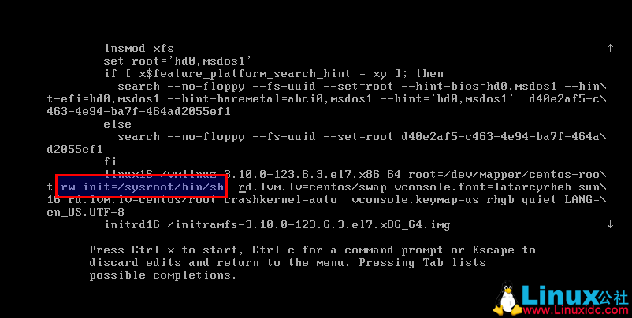

Linux入门教程：如何重置CentOS 7的root密码

# 重置CentOS 7 root密码

1 - 在启动grub菜单，选择编辑选项启动

2 - 按键盘e键，来进入编辑界面

3 - 找到Linux 16的那一行，将ro改为rw init=/sysroot/bin/

4 - 现在按下 Control+x ，使用单用户模式启动

5 - 现在，可以使用下面的命令访问系统

chroot /sysroot

6 - 重置密码

passwd root

7 - 更新系统信息

touch /.autorelabel

8 - 退出chroot

exit

9 - 重启你的系统

reboot

CentOS(Linux)重置root密码 http://www.linuxidc.com/Linux/2013-03/80647.htm

更多CentOS相关信息见CentOS 专题页面 http://www.linuxidc.com/topicnews.aspx?tid=14