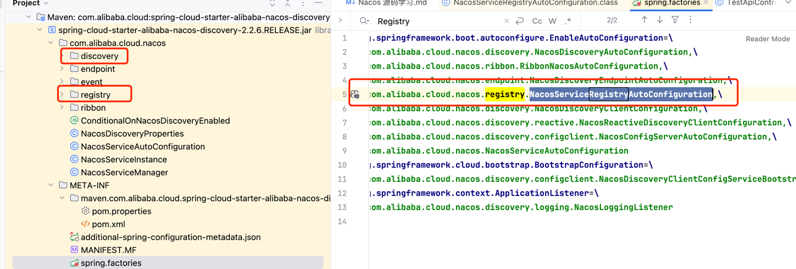

最近需要进行 Nacos 源码学习，对系统进行单元化架构的改造
---

首要的一点是看看服务是如何注册的，和项目是如何进行服务发现的，通过特定的标识可以进行对指定服务的注册和发现，让上下游系统可以识别不同的流量进行处理。

### **1. 环境准备**
- **JDK 1.8+**：确保已安装并配置环境变量。
- **Maven 3.2+**：用于源码编译。
- **Git**：用于拉取源码（可选）。
- **IDE**：推荐 IntelliJ IDEA。
---

### **2. 获取源码**
从 GitHub 克隆 Nacos 仓库：
```bash
git clone https://github.com/alibaba/nacos.git
cd nacos
```
或直接下载源码 ZIP 包并解压。

---

### **3. 编译源码**
在项目根目录执行 Maven 编译命令：
```bash
mvn -Prelease-nacos -Dmaven.test.skip=true clean install -U
```
- `-Prelease-nacos`：激活 release 配置。
- `-Dmaven.test.skip=true`：跳过单元测试（加快编译速度）。
- 首次编译可能耗时较长（需下载依赖）。

---

### **4. 启动 Nacos 服务**

1. 用 IDE 打开项目。
2. 找到启动类：`console` 模块下的 `com.alibaba.nacos.Nacos`。
3. 添加启动参数（单机模式）：
   ```bash
   -Dnacos.standalone=true
   ```
4. 运行 `com.redjujubetree.ApiGatewayApplication` 方法。


### **5. 访问管理界面**
浏览器打开 `http://localhost:8848/nacos`：
- 默认账号：`nacos`
- 默认密码：`nacos`

通过以上步骤，应该能够顺利启动 Nacos 源码。

# 客户端

接下来，需要看一下 Nacos的客户端是如何注册服务的。
如果可以在这个过程中增加一个机器标识，那么我们就可以再服务发现的时候利用这个标识来进行流量的隔离。

服务注册的类 ：`com.alibaba.cloud.nacos.registry.NacosServiceRegistryAutoConfiguration`