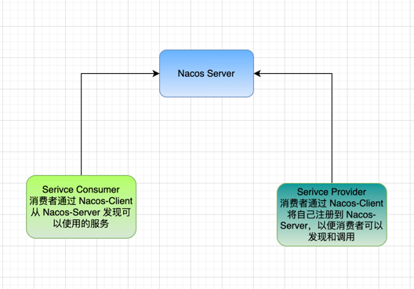

*不积跬步，无以至千里；不积细流，无以成江河*

Nacos 是阿里巴巴开源的一个动态服务发现、配置和服务管理平台，提供了云原生应用的服务治理解决方案。Nacos 的客户端代码主要用于与 Nacos 服务器进行交互，提供服务注册、发现、配置管理等功能。

调用流程如图所示



这里我们首先学习 *Nacos* 的服务的注册和发现的功能， 服务注册和服务发现是微服务架构中非常重要的功能，Nacos 提供了简单易用的 API 来实现这些功能。

这里笔者搭建一个 SpringCloud 的项目，使用 Nacos 作为服务注册中心和配置中心。以下是一些关键的配置和代码片段。通过这个项目，一步步跟踪源码，看看服务是如何注册的，以及消费者是如何发现服务的。

# Nacos 源码学习 - Client 源码

在 pom.xml 中添加 Nacos 相关依赖：

```xml
<dependency>
    <groupId>com.alibaba.cloud</groupId>
    <artifactId>spring-cloud-starter-alibaba-nacos-discovery</artifactId>
</dependency>
```

通过 starter 引入了相关的 Nacos 依赖。通常在 SpringBoot 的 starter 中会自动配置相关的 Nacos 组件，其中有一个很重的配置文件 `spring.factories`, 通常在这个文件中我们可以找到一些中的入口配置文件。

如果想要使用服务，首先需要注册一个服务，Nacos 提供了一个自动配置类 `NacosServiceRegistryAutoConfiguration`，这个类会在 Spring Boot 启动时自动加载。
在 `spring.factories` 文件中，我们可以看到以下配置：

```properties
org.springframework.boot.autoconfigure.EnableAutoConfiguration=\
  com.alibaba.cloud.nacos.discovery.NacosDiscoveryAutoConfiguration,\
  com.alibaba.cloud.nacos.endpoint.NacosDiscoveryEndpointAutoConfiguration,\
  com.alibaba.cloud.nacos.registry.NacosServiceRegistryAutoConfiguration,\
  com.alibaba.cloud.nacos.discovery.NacosDiscoveryClientConfiguration,\
  com.alibaba.cloud.nacos.discovery.reactive.NacosReactiveDiscoveryClientConfiguration,\
  com.alibaba.cloud.nacos.discovery.configclient.NacosConfigServerAutoConfiguration,\
  com.alibaba.cloud.nacos.loadbalancer.LoadBalancerNacosAutoConfiguration,\
  com.alibaba.cloud.nacos.NacosServiceAutoConfiguration,\
  com.alibaba.cloud.nacos.util.UtilIPv6AutoConfiguration
org.springframework.cloud.bootstrap.BootstrapConfiguration=\
  com.alibaba.cloud.nacos.discovery.configclient.NacosDiscoveryClientConfigServiceBootstrapConfiguration
org.springframework.boot.SpringApplicationRunListener=\
  com.alibaba.cloud.nacos.logging.NacosLoggingAppRunListener 
```

接下来启动服务，一步步的看一下我们的服务是如何注册的。


在 `NacosServiceRegistryAutoConfiguration` 中，我们可以看到以下关键代码：

```java
	@Bean
	@ConditionalOnBean(AutoServiceRegistrationProperties.class)
	public NacosAutoServiceRegistration nacosAutoServiceRegistration(
			NacosServiceRegistry registry,
			AutoServiceRegistrationProperties autoServiceRegistrationProperties,
			NacosRegistration registration) {
		return new NacosAutoServiceRegistration(registry,
				autoServiceRegistrationProperties, registration);
	}
```
这里的 `NacosAutoServiceRegistration` 是一个自动注册类，它会在 Spring Boot 启动时自动注册服务到 Nacos。它依赖于 `NacosServiceRegistry` 和 `AutoServiceRegistrationProperties`。

接下来，我们可以查看 `NacosAutoServiceRegistration` 的实现，它主要负责将服务注册到 Nacos 服务器。

```java
	@Override
	protected void register() {
		if (!this.registration.getNacosDiscoveryProperties().isRegisterEnabled()) {
			log.debug("Registration disabled.");
			return;
		}
		if (this.registration.getPort() < 0) {
			this.registration.setPort(getPort().get());
		}
		super.register();
	}
```
这里的 `register` 方法会检查是否启用了注册功能，如果启用，则调用父类的 `register` 方法进行注册。


在 `NacosServiceRegistry` 中，我们可以看到以下关键代码：

```java
	@Override
	public void register(Registration registration) {

		if (StringUtils.isEmpty(registration.getServiceId())) {
			log.warn("No service to register for nacos client...");
			return;
		}

		NamingService namingService = namingService();
		String serviceId = registration.getServiceId();
		String group = nacosDiscoveryProperties.getGroup();

		Instance instance = getNacosInstanceFromRegistration(registration);

		try {
			namingService.registerInstance(serviceId, group, instance);
			log.info("nacos registry, {} {} {}:{} register finished", group, serviceId,
					instance.getIp(), instance.getPort());
		}
		catch (Exception e) {
			......
		}
	}
```

这里的 `register` 方法会将服务实例注册到 Nacos 服务器。它首先检查服务 ID 是否为空，然后获取 Nacos 的 `NamingService` 实例，最后调用 `registerInstance` 方法进行注册。

其中，`getNacosInstanceFromRegistration` 方法会将 `Registration` 对象转换为 Nacos 的 `Instance` 对象。

通过 `namingService.registerInstance(serviceId, group, instance)`  方法，服务实例被注册到 Nacos 服务器上。

```java
    public void registerInstance(String serviceName, String groupName, Instance instance) throws NacosException {
        NamingUtils.checkInstanceIsLegal(instance);
        clientProxy.registerService(serviceName, groupName, instance);
    }
```

在 `NamingService` 接口中，`registerInstance` 方法会调用 `clientProxy.registerService` 方法，将服务实例注册到 Nacos 服务器。

看一下 `clientProxy.registerService` 的实现，会发现有三个实现，2.0 之前的版本中，通信都是使用的 http 进行通信，2.0 之后的版本中，Nacos 将通信方式迁移到 grpc ：


为了兼容以前的代码，Nacos 仍然保留了 `HttpNamingClientProxy` 的实现，调用委派个给 `NamingClientProxyDelegate` 来进行通信方式的选择。

在 `NamingClientProxyDelegate` 中，我们可以看到以下代码：

```java
    @Override
    public void registerService(String serviceName, String groupName, Instance instance) throws NacosException {
        if (NamingClientProxyDelegate.isUseGrpc()) {
            grpcNamingClientProxy.registerService(serviceName, groupName, instance);
        }
        else {
            httpNamingClientProxy.registerService(serviceName, groupName, instance);
        }
    }
```

这里的 `isUseGrpc` 方法会根据配置判断是否使用 gRPC 进行通信，如果使用 gRPC，则调用 `grpcNamingClientProxy` 的 `registerService` 方法，否则调用 `httpNamingClientProxy` 的 `registerService` 方法。
在 `HttpNamingClientProxy` 中，我们可以看到以下代码：

```java
    @Override
    public void registerService(String serviceName, String groupName, Instance instance) throws NacosException {
        String url = NamingUtils.getServiceUrl(serviceName, groupName);
        HttpResponse response = httpClient.post(url, instance.toJson());
        if (response.getStatusCode() != 200) {
            throw new NacosException(NacosException.SERVER_ERROR, "Failed to register service: " + response.getMessage());
        }
    }
```

这里的 `registerService` 方法会构建一个 HTTP 请求，将服务实例注册到 Nacos 服务器。它首先构建服务的 URL，然后使用 HTTP 客户端发送 POST 请求，将服务实例的 JSON 数据发送到 Nacos 服务器。

在 `grpcNamingClientProxy` 中，我们可以看到以下代码：

```java
    @Override
    public void registerService(String serviceName, String groupName, Instance instance) throws NacosException {
        NAMING_LOGGER.info("[REGISTER-SERVICE] {} registering service {} with instance {}", namespaceId, serviceName,
                instance);
        redoService.cacheInstanceForRedo(serviceName, groupName, instance);
        doRegisterService(serviceName, groupName, instance);
    }
```

这里的 `registerService` 方法会调用 `doRegisterService` 方法进行 gRPC 注册，跟踪代码实现可以看到, 调用了 `requestToServer` 向服务端发送请求。

```java
    public void doRegisterService(String serviceName, String groupName, Instance instance) throws NacosException {
        InstanceRequest request = new InstanceRequest(namespaceId, serviceName, groupName,
                NamingRemoteConstants.REGISTER_INSTANCE, instance);
        requestToServer(request, Response.class);
        redoService.instanceRegistered(serviceName, groupName);
    }
```

在 `doRegisterService` 方法中，首先创建了一个 `InstanceRequest` 请求对象,将要注册服务的信息封装，然后调用 `requestToServer` 方法向 Nacos 服务器发送注册请求。

```java
    private <T extends Response> T requestToServer(AbstractNamingRequest request, Class<T> responseClass)
            throws NacosException {
        try {
            request.putAllHeader(
                    getSecurityHeaders(request.getNamespace(), request.getGroupName(), request.getServiceName()));
            Response response =
                    requestTimeout < 0 ? rpcClient.request(request) : rpcClient.request(request, requestTimeout);
            if (ResponseCode.SUCCESS.getCode() != response.getResultCode()) {
                throw new NacosException(response.getErrorCode(), response.getMessage());
            }
            if (responseClass.isAssignableFrom(response.getClass())) {
                return (T) response;
            }
            NAMING_LOGGER.error("Server return unexpected response '{}', expected response should be '{}'",
                    response.getClass().getName(), responseClass.getName());
        } catch (NacosException e) {
            ......
        }
        throw new NacosException(NacosException.SERVER_ERROR, "Server return invalid response");
    }
```

默认没有设置 `requestTimeout`，所以会使用默认的超时时间进行请求，如果请求成功，则返回响应结果，否则抛出异常。请求的具体实现是通过 `rpcClient.request(request)` 方法发送请求到 Nacos 服务器。
在 `rpcClient` 中，我们可以看到以下代码：
```java
public Response request(Request request, long timeoutMills) throws NacosException {
        int retryTimes = 0;
        Response response;
        Throwable exceptionThrow = null;
        long start = System.currentTimeMillis();
        while (retryTimes < rpcClientConfig.retryTimes() && System.currentTimeMillis() < timeoutMills + start) {
            boolean waitReconnect = false;
            try {
                if (this.currentConnection == null || !isRunning()) {
                    waitReconnect = true;
                    throw new NacosException(NacosException.CLIENT_DISCONNECT,
                            "Client not connected, current status:" + rpcClientStatus.get());
                }
                response = this.currentConnection.request(request, timeoutMills);
                if (response == null) {
                    throw new NacosException(SERVER_ERROR, "Unknown Exception.");
                }
                if (response instanceof ErrorResponse) {
                    ......
                }
                // return response.
                lastActiveTimeStamp = System.currentTimeMillis();
                return response;
                
            } catch (Throwable e) {
                ......
            }
            retryTimes++;
        }
```
以上的代码展示了 `rpcClient` 的 `request` 方法，它会尝试发送请求到 Nacos 服务器，并处理可能的异常。如果请求失败，会进行重试，直到达到最大重试次数或超时。

在 `rpcClient` 中，`request` 方法会调用 `currentConnection.request(request, timeoutMills)` 方法发送请求到 Nacos 服务器。
只有这一行是核心的请求发送逻辑，其他的都是一些异常处理和重试逻辑。

在 `currentConnection` 中，我们可以看到以下代码：
```java
    @Override
    public Response request(Request request, long timeouts) throws NacosException {
        Payload grpcRequest = GrpcUtils.convert(request);
        ListenableFuture<Payload> requestFuture = grpcFutureServiceStub.request(grpcRequest);
        Payload grpcResponse;
        try {
            grpcResponse = requestFuture.get(timeouts, TimeUnit.MILLISECONDS);
        } catch (Exception e) {
            throw new NacosException(NacosException.SERVER_ERROR, e);
        }
    
        return (Response) GrpcUtils.parse(grpcResponse);
    }
```

通过 GRPC 的连接发送请求并获得结果，到这里，我们已经完成了服务注册的流程。Nacos 客户端通过 GRPC 或 HTTP 协议将服务实例注册到 Nacos 服务器上。
接下来就是看一下 Nacos 的服务端是如何处理注册请求的。