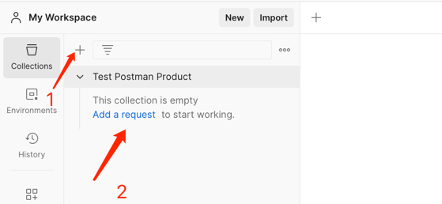
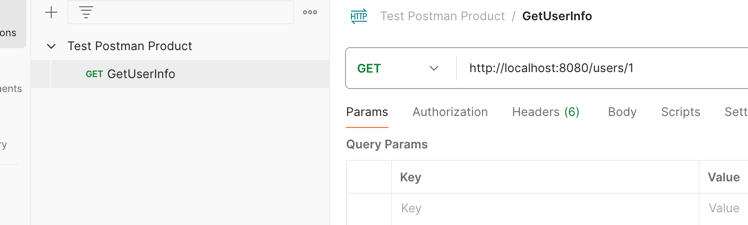
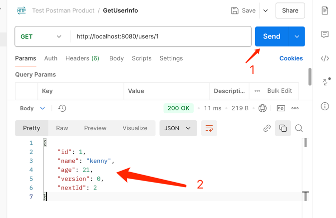
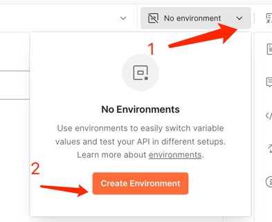
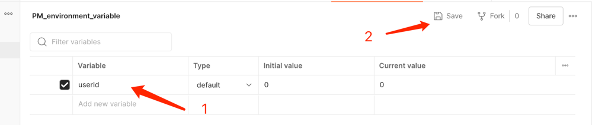
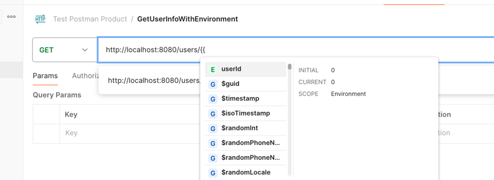
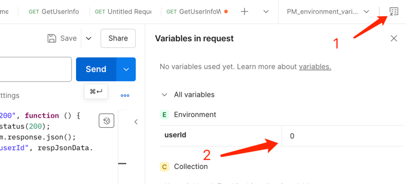
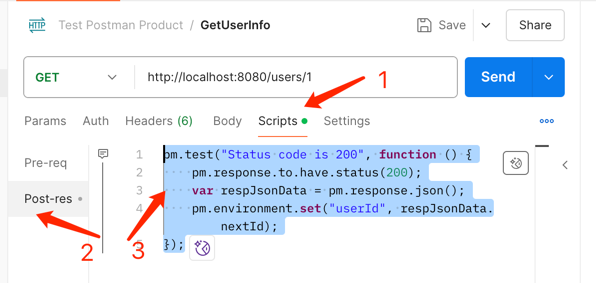
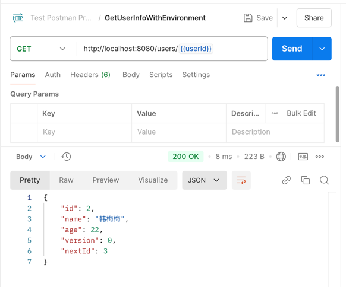

# 前言
新的项目中没有人写单元测试，大家都是用 `postman` 进行测试的，之前虽然也会用 `postman` 进行测试，但都是作为辅助工具来使用的，虽然我不敢苟同先公司的这种做法，但是大家都这么做，我觉得我有必要在重新学习下这个工具的使用，以便解决工作中遇到的一些问题

# 创建一个 `Collections` 用于测试学习的内容
`Test Postman Product`

为这个 `Test Postman Product` 添加一个请求， 请求的地址（http://localhost:8080/users/1） 为我本地启动的一个简单的服务

点击发送可以看见返回的结果


想要使用上图中的返回的结果，我们需要先把返回的结果存储下来， `postman` 使用环境变量来存储变量，
在这里我们设置一个本地变量，然后使用返回值中的结果来修改这个变量的值，那么在这个请求成功返回之后我们在其他提防再次使用这个环境变量的时候，
就是最新的值了

添加环境变量



添加变量后保存，就创建了一份可以使用的环境变量


创建一个新的请求使用我们的环境变量，`postman` 环境变量的使用格式为 `{{environmentName}}`


目前我们的环境变量的值还是我们设置的初始值 0 


接下来，我们需要用 `GetUserInfo` 请求的返回值去修改这个环境变量的值


在请求之后添加如下代码
```javascript
pm.test("Status code is 200", function () {
    pm.response.to.have.status(200);
    // 获取返回数据
    var respJsonData = pm.response.json();
    // 设置环境变量
    pm.environment.set("userId", respJsonData.nextId);
});
```

发送请求可以看见右侧值已经，变成了我们的返回值的结果 `2`, 也就是说在之后如果使用到 `userId` 这个变量都将会是 `2` 这个值。

发送我们定义的 `GetUserInfoWithEnvironment` 请求，可以看见，返回结果是基于上一个请求的返回值得到的。
