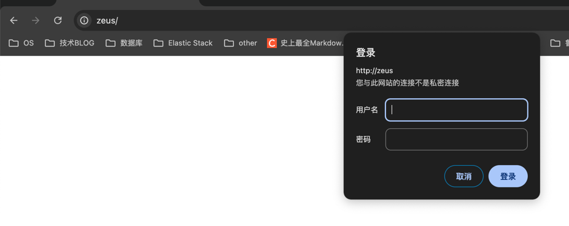
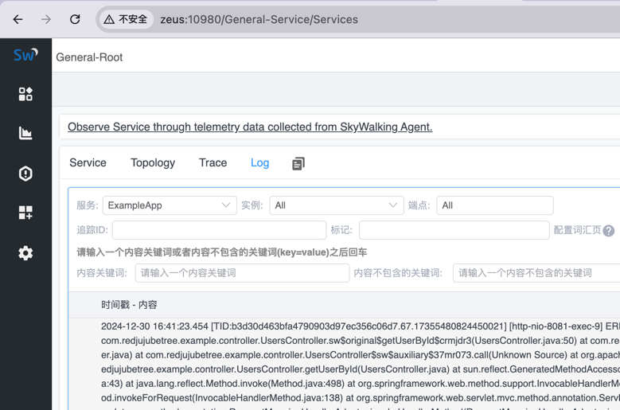
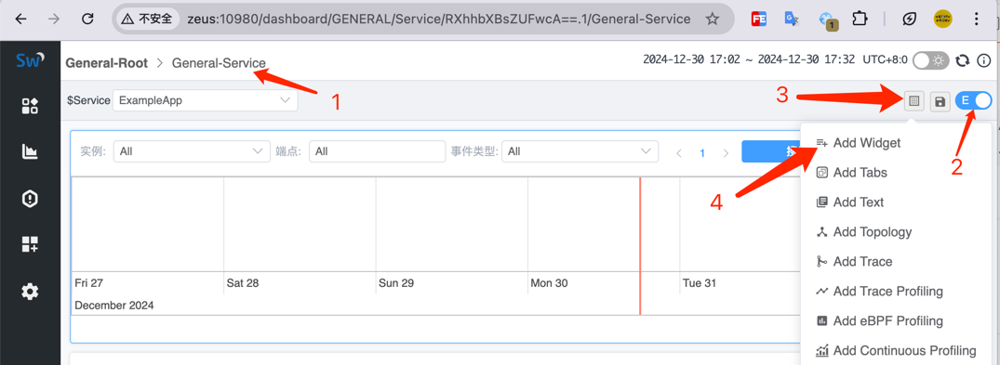
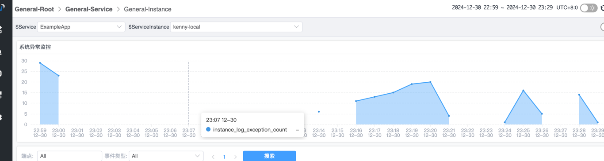
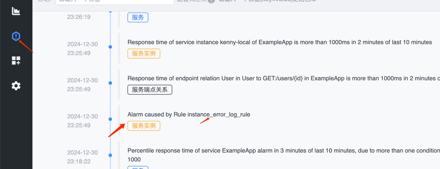

# skywalking
## 安装
### 准备

- 安装服务器： CentOS Linux release 7.9.2009 (Core)
- JDK openjdk17
- apache-skywalking-apm-9.7.0.tar.gz
- apache-skywalking-java-agent-9.0.0.tgz

解压到指定目录下
`tar -xvf apache-skywalking-apm-9.7.0.tar.gz -C /usr/local/skywalking/` 

修改名称：
```shell
mv apache-skywalking-apm-bin/ skywalking-9.7.0
```
因为我的目录下有两个，为了方便区分，我重命名了文件，如果不需要该过程可以跳过

修该为 `elasticsearch` 为后端存储, 
> vi config/application.yml
```shell
storage:
  selector: ${SW_STORAGE:elasticsearch}
  elasticsearch:
    namespace: ${SW_NAMESPACE:"glxx-sw"}
    clusterNodes: ${SW_STORAGE_ES_CLUSTER_NODES:172.16.118.101:10920}
    protocol: ${SW_STORAGE_ES_HTTP_PROTOCOL:"http"}
    connectTimeout: ${SW_STORAGE_ES_CONNECT_TIMEOUT:3000}
    socketTimeout: ${SW_STORAGE_ES_SOCKET_TIMEOUT:30000}
    responseTimeout: ${SW_STORAGE_ES_RESPONSE_TIMEOUT:15000}
    numHttpClientThread: ${SW_STORAGE_ES_NUM_HTTP_CLIENT_THREAD:0}
    user: ${SW_ES_USER:"username"}
    password: ${SW_ES_PASSWORD:"password"}
```

修改默认端口 server 端口

http: `restPort: ${SW_CORE_REST_PORT:10960}`

grpc: `gRPCPort: ${SW_CORE_GRPC_PORT:10970}`

```shell
core:
  selector: ${SW_CORE:default}
  default:
    # Mixed: Receive agent data, Level 1 aggregate, Level 2 aggregate
    # Receiver: Receive agent data, Level 1 aggregate
    role: ${SW_CORE_ROLE:Mixed} # Mixed/Receiver/Aggregator
    restHost: ${SW_CORE_REST_HOST:0.0.0.0}
    # UI template use port 
    restPort: ${SW_CORE_REST_PORT:10960}
    restContextPath: ${SW_CORE_REST_CONTEXT_PATH:/}
    restMaxThreads: ${SW_CORE_REST_MAX_THREADS:200}
    restIdleTimeOut: ${SW_CORE_REST_IDLE_TIMEOUT:30000}
    restAcceptQueueSize: ${SW_CORE_REST_QUEUE_SIZE:0}
    httpMaxRequestHeaderSize: ${SW_CORE_HTTP_MAX_REQUEST_HEADER_SIZE:8192}
    gRPCHost: ${SW_CORE_GRPC_HOST:0.0.0.0}
    # gRPCPort agent port
    gRPCPort: ${SW_CORE_GRPC_PORT:10970}
    maxConcurrentCallsPerConnection: ${SW_CORE_GRPC_MAX_CONCURRENT_CALL:0}
```

编辑 `webapp/application.yml` 修改端口

```shell
serverPort: ${SW_SERVER_PORT:-10980}

# Comma seperated list of OAP addresses.
oapServices: ${SW_OAP_ADDRESS:-http://localhost:10960}
```

修改好文件后，停掉原来的服务，重新启动，访问 `http://172.16.118.101:10980/`


# Agent
## IDEA
VM options 添加代理参数
	
	-javaagent:/Users/kenny/skywalking/skywalking-agent/skywalking-agent.jar

Environment variables

	SW_AGENT_COLLECTOR_BACKEND_SERVICES=172.16.118.101:10970;SW_AGENT_NAME=ExampleApp

默认情况下，ThreadPool 是不会被代理，无法获取 traceId 的相关的信息，开启此功能需要将 bootstrap-plugins apm-jdk-threadpool-plugin.jar 拷贝到 plugins 目录下来开启此功能

# logback
```xml
<?xml version="1.0" encoding="UTF-8"?>
<configuration>
    <!-- 引入 Spring Boot 默认的 logback XML 配置文件  -->
    <include resource="org/springframework/boot/logging/logback/defaults.xml"/>

    <!-- 控制台 Appender -->
    <property name="CONSOLE_LOG_PATTERN" value="%clr(%d{${LOG_DATEFORMAT_PATTERN:-yyyy-MM-dd HH:mm:ss.SSS}}){faint} %clr(${LOG_LEVEL_PATTERN:-%5p}) %clr(${PID:- }){magenta} %tid %clr(---){faint} %clr([%15.15t]){faint} %clr(%-40.40logger{39}){cyan} %clr(:){faint} %m%n${LOG_EXCEPTION_CONVERSION_WORD:-%wEx}"/>
    <appender name="console" class="ch.qos.logback.core.ConsoleAppender">
        <!-- 日志的格式化 -->
        <encoder class="ch.qos.logback.core.encoder.LayoutWrappingEncoder">
            <layout class="org.apache.skywalking.apm.toolkit.log.logback.v1.x.TraceIdPatternLogbackLayout">
                <Pattern>${CONSOLE_LOG_PATTERN}</Pattern>
            </layout>
        </encoder>
    </appender>

    <!-- 从 Spring Boot 配置文件中，读取 spring.application.name 应用名 -->
    <springProperty name="applicationName" scope="context" source="spring.application.name" />
    <property name="FILE_LOG_PATTERN" value="%d{${LOG_DATEFORMAT_PATTERN:-yyyy-MM-dd HH:mm:ss.SSS}} ${LOG_LEVEL_PATTERN:-%5p} ${PID:- } %tid --- [%t] %-40.40logger{39} : %m%n${LOG_EXCEPTION_CONVERSION_WORD:-%wEx}"/>
    <!-- 日志文件的路径 -->
    <property name="LOG_FILE" value="/Users/kenny/IdeaProjects/example/logs/${applicationName}.log"/>
    <!-- 日志文件 Appender -->
    <appender name="file" class="ch.qos.logback.core.rolling.RollingFileAppender">
        <file>${LOG_FILE}</file>
        <!--滚动策略，基于时间 + 大小的分包策略 -->
        <rollingPolicy class="ch.qos.logback.core.rolling.SizeAndTimeBasedRollingPolicy">
            <fileNamePattern>${LOG_FILE}.%d{yyyy-MM-dd}.%i.log</fileNamePattern>
            <maxHistory>7</maxHistory>
            <maxFileSize>100MB</maxFileSize>
        </rollingPolicy>
        <!-- 日志的格式化 -->
        <encoder class="ch.qos.logback.core.encoder.LayoutWrappingEncoder">
            <layout class="org.apache.skywalking.apm.toolkit.log.logback.v1.x.TraceIdPatternLogbackLayout">
                <Pattern>${FILE_LOG_PATTERN}</Pattern>
            </layout>
        </encoder>
    </appender>

    <appender name="grpc-log" class="org.apache.skywalking.apm.toolkit.log.logback.v1.x.log.GRPCLogClientAppender">
        <encoder class="ch.qos.logback.core.encoder.LayoutWrappingEncoder">
            <layout class="org.apache.skywalking.apm.toolkit.log.logback.v1.x.mdc.TraceIdMDCPatternLogbackLayout">
                <Pattern>%d{yyyy-MM-dd HH:mm:ss.SSS} [%X{tid}] [%thread] %-5level %logger{36} -%msg%n</Pattern>
            </layout>
        </encoder>
    </appender>

    <!--输出到logstash的appender-->
    <appender name="LOGSTASH" class="net.logstash.logback.appender.LogstashTcpSocketAppender">
        <!--可以访问的logstash日志收集端口-->
        <destination>172.16.118.101:10950</destination>
        <encoder class="net.logstash.logback.encoder.LogstashEncoder">
            <!-- skywalking插件, log加tid -->
            <provider class="org.apache.skywalking.apm.toolkit.log.logback.v1.x.logstash.TraceIdJsonProvider" />
        </encoder>
    </appender>

    <!-- 设置 Appender -->
    <root level="INFO">
        <appender-ref ref="console"/>
        <appender-ref ref="file"/>
        <appender-ref ref="LOGSTASH"/>
        <appender-ref ref="grpc-log"/>
    </root>

</configuration>
```

# 添加用户名和密码

## 安装 htpasswd 工具
centos 
```shell
sudo yum install httpd-tools
```

## 生成密码文件
```shell
htpasswd -c /etc/nginx/.htpasswd skywalking
```
若需要为已有文件添加新用户：
```bash
htpasswd /etc/nginx/.htpasswd another_user
```

## 修改 Nginx 配置
```conf
server {
    listen       80;
    server_name  localhost;

    #配置全局密码， 如果需要部分访问需要密码，可以将一下两个配置放在指定的location 映射之下
    auth_basic  "enter the username and password";
    auth_basic_user_file  /usr/local/nginx/password;

	location / {
	    proxy_pass http://127.0.0.1:12900;
	    proxy_set_header Host $host;
            proxy_set_header X-Real-IP $remote_addr;
            proxy_set_header X-Forwarded-For $proxy_add_x_forwarded_for;
	}
    
    }
```


# 配置告警
## 使用skywalking 上报日志信息
```shell
    <appender name="grpc-log" class="org.apache.skywalking.apm.toolkit.log.logback.v1.x.log.GRPCLogClientAppender">
        <encoder class="ch.qos.logback.core.encoder.LayoutWrappingEncoder">
            <layout class="org.apache.skywalking.apm.toolkit.log.logback.v1.x.mdc.TraceIdMDCPatternLogbackLayout">
                <Pattern>%d{yyyy-MM-dd HH:mm:ss.SSS} [%X{tid}] [%thread] %-5level %logger{36} -%msg%n</Pattern>
            </layout>
        </encoder>
    </appender>
```


增加 `lal` 规则，对日志数据进行提取分析

`default.yaml`

```shell
rules:
  - name: default
    layer: GENERAL
    dsl: |
      filter {
        text {
          abortOnFailure false
          regexp $/(?<time>\d{4}-\d{2}-\d{2} \d{2}:\d{2}:\d{2}\.\d{3}) \[.+] \[.+] (?<level>\w+) (?<msg>.*)/$
        }

        extractor {
          tag level: parsed.level
          timestamp parsed.time as String, "yyyy-MM-dd HH:mm:ss.SSS"
      
          if (parsed.level == "ERROR") {
            metrics {
              timestamp log.timestamp as Long
              labels service: log.service, service_instance_id: log.serviceInstance
              name "log_exception_count"
              value 1
            }
          }
        }

        sink {
        }
      } 
```

添加指标配置 `log-mal-rules/logwarning.yaml`
```shell
metricPrefix: instance
metricsRules:
  - name: log_exception_count
    exp: log_exception_count.sum(['service','service_instance_id']).downsampling(SUM).instance(['service'], ['service_instance_id'], Layer.GENERAL)
```

修改 `config/application.yaml`
```shell
log-analyzer:
  selector: ${SW_LOG_ANALYZER:default}
  default:
    # add count event
    lalFiles: ${SW_LOG_LAL_FILES:envoy-als,mesh-dp,mysql-slowsql,pgsql-slowsql,redis-slowsql,k8s-service,nginx,default}
    # add custom mertix
    malFiles: ${SW_LOG_MAL_FILES:"nginx,logwarning"}
    
query:
  selector: ${SW_QUERY:graphql}
  graphql:
    enableLogTestTool: ${SW_QUERY_GRAPHQL_ENABLE_LOG_TEST_TOOL:false}
    maxQueryComplexity: ${SW_QUERY_MAX_QUERY_COMPLEXITY:3000}
    # ui add custom dashboard
    enableUpdateUITemplate: ${SW_ENABLE_UPDATE_UI_TEMPLATE:true}
    enableOnDemandPodLog: ${SW_ENABLE_ON_DEMAND_POD_LOG:false}
```

添加观测看板
点击 `服务 --> 你的项目`

2 -> 打开编辑
3 -> 选择添加组件类型
4 -> 添加一个自定义组件类型


报错信息大概回被统计成这个样子，这里需要自己制造异常


## 添加报警规则
```shell
  instance_error_log_rule:
    expression: sum(instance_log_exception_count > 2) >= 1
    period: 1
    tags:
      level: ERROR

hooks:
  webhook:
    default:
      is-default: true
      urls:
        - http://172.16.118.1:8080/alarm/store
```
在告警页面查看相关的信息


<br/>
<br/>
<br/>
<br/>

<br/>