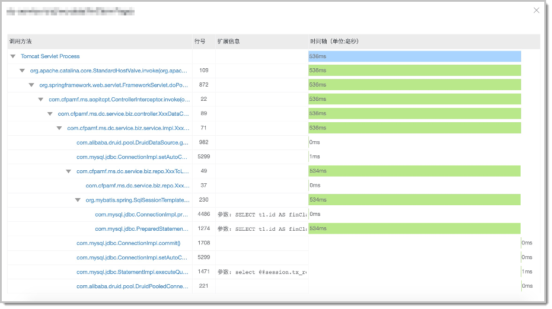
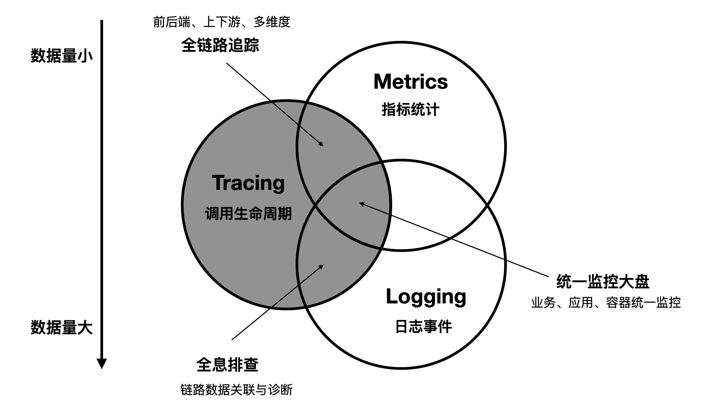
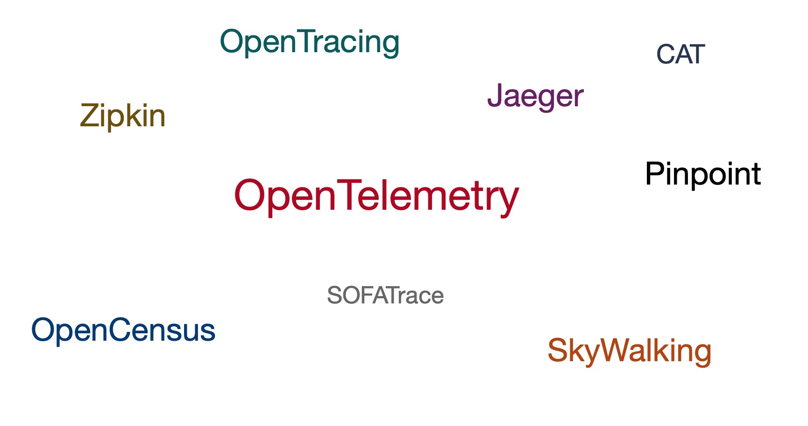
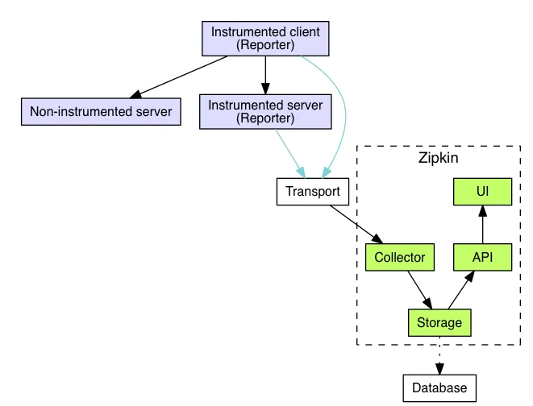
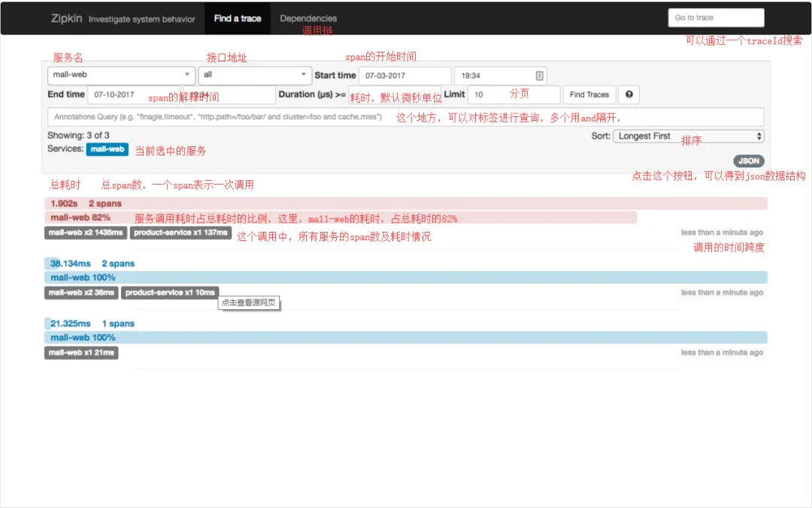
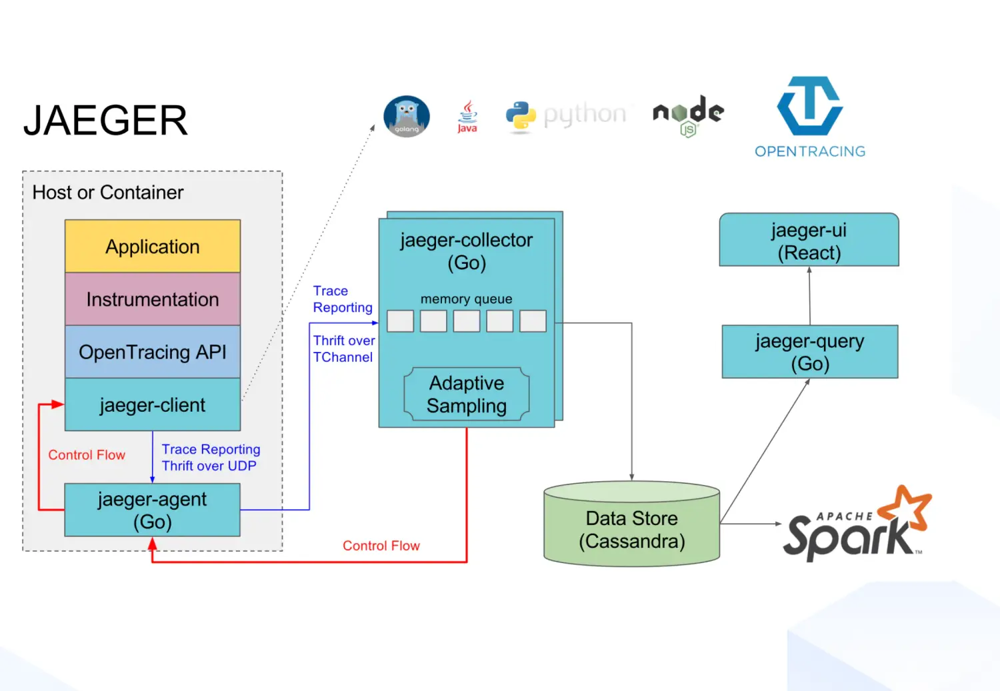
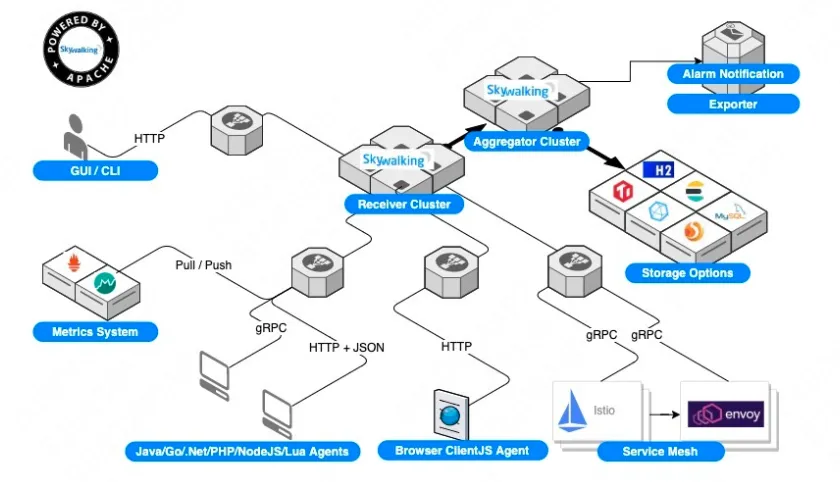
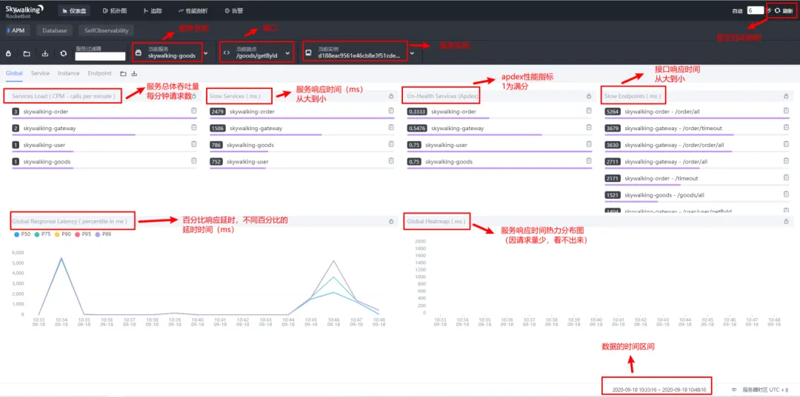
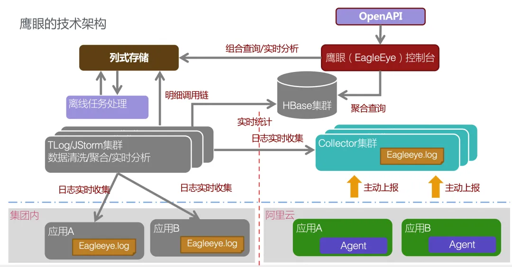
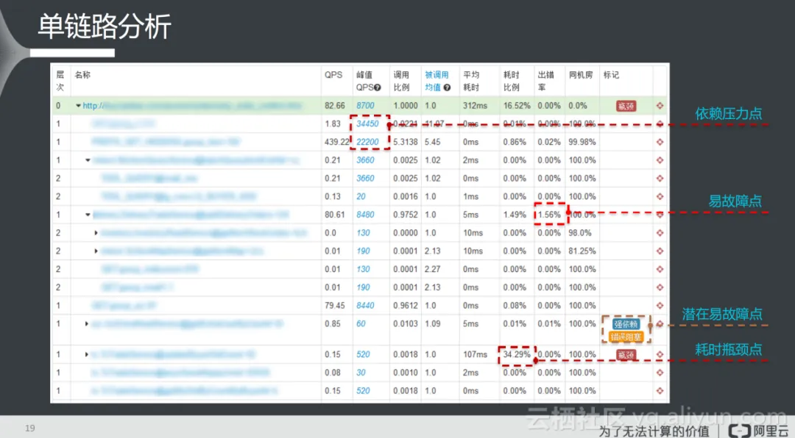

# 系统现状及需要解决的问题

### 系统异常无法接收告警

系统总会有这样或者那样的问题，同样的现象可能是不同的系统问题引起的，解决这些问题是研发的基本职责之一。

但是解决问题的前提是发现问题，系统告警就是我们发现感知问题的重要的手段，及早的发现问题，将问题处理在萌芽阶段，能够有效的避免线上问题的发生。

系统现状： 山东部分部署在阿里云，宁夏部分部署在华为云，相关的监控告警系统不完善

### 系统潜在问题发现不及时

系统监控运维数据需要到专有的机器进行查看，无法及时观测系统健康状态发现系统问题

### 客户现场问题复现困难
系统发生问题后，无法通过的有效的收到观测当时的数据，无法进行问题的还原

### 缺少代码审察机制

代码提交后，没有进行 **CodeReview**，增加了问题发生的可能性

### 需求代码测试覆盖率，缺少有效的监控手段

需求上线前，没有针对需求修改代码的覆盖率监控，增加系统风险

### 没有灰度运行环境

# 链路追踪

## 分布式系统与微服务

**分布式服务的优点**

- **扩展性：** 分布式系统天然具备“按需扩展”的能力，在业务高峰期可以通过添加机器实现快速水平扩容，业务高峰结束后释放机器，充分利用云计算的分时复用能力，节约成本。利用微服务，还可以实现按需精准扩容，比如登录服务扩容3倍，交易服务扩容10倍，最大化的节省资源。

- **可靠性：** 分布式系统可以有效抵抗“单点风险”，不会因为某一个节点的故障，影响整体的服务可用性。结合流量调度、离群实例摘除和弹性扩容等技术，甚至可以实现故障自愈。

- **可维护性：** 分布式系统的可维护性更强，一方面我们将一个复杂服务按照领域模型拆分成多个简单的微服务，每一个微服务的逻辑都更加清晰、更易理解。就好比我们写代码，将一个几百行的复杂函数重构成若干个简单函数，代码可读性就会直线上升。另一方面，一些通用的微服务可以被高度复用，无需重复开发和维护。

**分布式系统与微服务带来的问题**
- **去中心化：** 当你的系统拥有上千个微服务镜像运行在数百台机器实例上，你该如何梳理它们之间的依赖关系，又该如何找到核心业务的关键执行路径？特别是在分布式的场景下，你没有一个中心化的节点（Master）来保存每个服务之间的依赖与调度状态，每个独立节点都在自行其是，无法分辨自己在整个系统中的位置，只能“盲人摸象、管中窥豹”，缺乏全局视图。

- **不一致：**  虽然分布式应用从总体上变的更加可靠，但是每一个独立节点的状态却难以保证。导致这种不一致的原因有很多，比如前文提到的单机故障这种预期外的不一致，或者应用 Owner 执行分批发布或流量灰度时导致的预期内行为不一致。这种不一致性导致我们难以确定一个用户请求在系统内的准确执行路径与行为逻辑，可能引发不可预知的逻辑灾难。

- **模糊性：** 随着系统的分布式程度越来越高，异常表象与根因之间的逻辑联系变得愈加模糊，问题诊断的难度急剧上升。比如 A、B 两个服务共享同一个数据库实例，当 A 服务在压测期间，大量占用数据库的服务端连接和计算资源，会导致 B 服务出现连接超时或响应变慢等问题。如果 B 服务是通过 C 服务间接依赖该数据库实例，问题的定位就会变得更加困难。

# 分布式链路追踪
为了应对分布式环境下的不一致、模糊性等问题，人们试图通过请求粒度的轨迹追踪与数据透传，实现节点间的确定性关联，分布式链路追踪技术也由此诞生。

## Google Dapper
2010年4月，Benjamin H. Sigelman 等人在 Google Technical Report 上发表了《Dapper, a Large-Scale Distributed Systems Tracing Infrastructure》，
Dapper 论文有两个重要的意义：

一是详细阐述了分布式链路追踪的设计理念，为后来的实现者提供了重要的理论指导；

二是通过 Dapper 在 Google 生产环境的大规模落地实践，证明了分布式链路追踪技术的企业级价值，为分布式链路追踪的推广作出了不可磨灭的贡献。

Dapper 首先明确了分布式链路追踪的两个目标：
1. 拥有广泛的覆盖面。
2. 提供持续的监控服务。

进而给出了三个具体的设计准则：
- **低开销：**
  
	低开销是链路监控系统最重要的关注点，分布式系统对于资源和性能的要求本身就很苛刻，因此监控组件必须对原服务的影响足够小，将对业务主链路的影响降到最低。链路监控组件对于资源的消耗主除了体现在增强方法的消耗上，其次还有网络传输和数据存储的消耗，因为对于链路监控系统来说，想要监控一次请求势必会产生出请求本身外的额外数据，并且在请求过程中，这些额外的数据不仅会暂时保存在内存中，在分布式场景中还会伴随着该请求从上游服务传输至下游服务，这就要求产生的额外数据尽可能地少，并且在伴随请求进行网络传输的时候只保留少量必要的数据。
- **应用级透明：**
  
	链路监控组件应该以基础通用组件的方式提供给用户，以提高稳定性，应用开发者不需要关心它们。对于Java语言来说，方法可以说是调用的最小单位，想要实现对调用链的监控埋点势必对方法进行增强。Java中对方法增强的方式有很多，比如直接硬编码、动态代理、字节码增强等等。应用级透明其实是一个比较相对的概念，透明度越高意味着难度越大，对于不同的场景可以采用不同的方式。

- **可扩展：** 
  
	每个业务系统由不同的团队和开发人员负责，虽然使用的框架和中间件在同一个企业中有大致的规范和要求，但是在各方面还是存在差异的。因此作为一个基础设施，链路监控系统需要具有非常好的可扩展性，除了对企业中常用中间件和框架的支撑外，还要能够方便开发人员针对特殊的业务场景进行定制化的开发。

## Tracing 的原理

分布式链路追踪的基本原理就是在分布式应用的接口方法上设置一些观察点（类似快递中转站记录点），然后在入口节点给每个请求分配一个全局唯一的标识 TraceId（类似快递单号），当请求流经这些观察点时就会记录一行对应的链路日志（包含链路唯一标识，接口名称，时间戳，主机信息等）。最后通过 TraceId 将一次请求的所有链路日志进行组装，就可以还原出该次请求的链路轨迹，如下图所示。
## 基础术语
虽然分布式链路追踪的实现方式多种多样，不同开源或商业化产品都有自己的数据模型和定义。但是仍然有一些基础术语在业界具备广泛的共识，以 OpenTracing 为例。

### Trace
一条 Trace 代表一次入口请求在 IT 系统内的完整调用轨迹及其关联数据集合。其中，全局唯一的链路标识 TraceId，是最具代表的一个属性。通过 TraceId 我们才能将同一个请求分散在不同节点的链路数据准确的关联起来，实现请求粒度的“确定性关联”价值。这也是 Trace 区别于 Metrics、Log 其他两类可观测技术的关键属性。

### Span
光有 TraceId 还不够，请求在每一跳的接口方法上执行了什么动作，耗时多久，执行状态是成功还是失败？承载这些信息的基础对象就是 Span。通常一个完整的 Span 具有如下属性：

Operation Name：描述了当前接口的行为语义，比如 /api/createOrder 代表执行了一次创建订单的动作。
SpanId/ParentSpanId：接口调用的层级标识，用于还原 Trace 内部的层次调用关系。
Start/FinishTime：接口调用的开始和结束时间，二者相减就是该次调用的耗时。
StatusCode：响应状态，标识当次调用是成功或失败。
Tags & Events：调用附加信息，详见下面的描述。
### Tags
SpanName 的描述通常是高度抽象的，仅仅回答这个接口是做什么的。如果需要进一步记录请求的行为特征，可以使用 Tags 来扩展语义。Tags 是一组由 {Key:Value} 组成的键值对集合，描述这一次接口调用的具体属性，比如将 UserType 添加到 Tags 中，就可以观察某一类用户（比如 VIP 用户）的链路行为状态。如果将设备类型加到 Tags 中，可以对比不同设备的性能差异。

由于 Tags 只支持结构化的 KV 键值对，因此，它可以作为标签添加到聚合后的链路指标中，有效提升监控告警的数据精度。更准确的回答异常或性能问题发生的原因，比如集中在某个地域、设备或版本。

### Logs
Tags 会随着链路上下文自动向下游透传，如果希望记录一些不需要透传的事件信息，可以使用 Logs 字段。每个 Span 都可以进行多次 Logs 操作，但每个 Logs 对象都需要带有一个时间戳，Logs 的内容可以是非结构化的复杂对象。

# Tracing 的应用
## 单请求轨迹回溯
单请求轨迹回溯是分布式链路追踪最基础的功能，它记录了一次请求经过的所有服务节点以及对应的节点状态信息（接口名称、耗时、状态码等），

## 服务监控
每一个服务节点，将途经的所有调用信息汇总后，就可以得到当前服务接口的吞吐量、耗时、来源与去向等统计指标。这些指标可以帮助我们快速识别当前服务的健康状态。在实际生产系统中，还可以与告警系统结合，实现风险的快速识别与处理，降低业务损失。

# Tracing的现状&相关产品
分布式链路追踪（Tracing）已经成为主流软件架构不可或缺的基础技术之一，它与指标（Metrics）、日志（Logging）并称为可观测领域的“三驾马车”，它们三者之间的关系如下图所示：

随着 Kubenetes 容器技术与云计算的普及，未来的软件架构会更加趋向分布式云、微服务化的方向，软件开发、部署成本将大幅下降，但是系统维护和问题诊断的难度却急剧上升。因此，分布式链路追踪以及由它提供的“确定性关联”价值将愈加凸显

Tracing 在开源社区也颇受喜爱，拥有着旺盛的生命力，主流的开源标准包括 OpenTelemetry、OpenTracing、OpenCensus 和国内使用较多的 SkyWalking。其他影响力较强的实现还包括 Jaeger、Zipkin、Pinpoint等，如下图所示。

分布式链路追踪近几年实现了如下技术突破：

- **无侵入探针 + 一体化解决方案：** 类似 JavaAgent 的探针插桩技术，实现了0代码入侵，0改造成本的链路自动埋点，而类似 SkyWalking 的开源实现还提供了端到端的一体化解决方案，从链路数据生成到最后的可视化，中小企业可以快速搭建并享受到分布式链路追踪技术的价值，大幅降低了 Tracing 的前期建设成本和接入门槛。
- **链路采样 + 边缘计算：** 链路采样策略，例如固定比例采样、限流采样、错慢全采、自定义标签采样等，可以大幅降低链路数据的传输、处理、存储成本；结合用户网络内的指标聚合，长文本编码/压缩等边缘计算技术，可以合理控制分布式链路追踪的数据成本，保障链路系统持续健康运转。
- **关联分析 + 立体化可观测：** 单条链路的价值难以凸显，但是基于成千上万条链路的聚合/关联分析却能快速定位，导致系统异常的关键因素，比如版本、地域、用户类型等。同时，结合业务、容器、基础设施等其他层面的可观测数据，建立一套端到端、立体化的可观测体系，能够更加有效地释放分布式链路追踪的技术价值。
- **开源标准趋向统一：** 自从 2019 年 OpenTelemetry 开源立项，得到了两大主流开源实现 OpenTracing 和 OpenCensus 的大力支持，开启了可观测性的新时代。虽然，目前 OpenTelemetry 仅在 Tracing 领域拥有比较完善的技术标准，Metrics 和 Logging 仍在探索阶段，但是可观测性“三驾马车”融合一统的趋势已经势不可挡。未来基于统一完善的可观测数据标准，分布式链路追踪的“确定性关联”将得到更加广泛的应用。

[//]: # (|             | Zipkin         | Pinpoint  | SkyWalking | CAT      | Jaeger         | 鹰眼 |)

[//]: # (|-------------|----------------|-----------|----------|----------|----------------|----|)

[//]: # (| OpenTracing | 是              | 否         | 是        | 否        | 是              | 是  |)

[//]: # (| 客户端支持语言     | java/php/c#/go | java/php  | java/ C#/NodeJS/PHP | -        | java/php/c#/go | -  |)

[//]: # (| 存储          | ES/mysql/Cassandra | hbase     | ES/H2/mysql/TiDB/sharding sphere | -        | ES/Kafka| -  |)

[//]: # (| 传输协议支持      | http/MQ        | Thrift    | grpc     | http/tcp |udp/http|-|)

[//]: # (| UI丰富程度      | 低              | 高         | 中        | -        |中|-|)

[//]: # (| 代码侵入性       | 拦截请求,侵入        | 字节码注入，无侵入 | 字节码注入,无侵入| 代码侵入     |拦截请求,侵入    |-|)

[//]: # (| 扩展性         | 高              | 低         | 中        | -        |高|-|)

[//]: # (| trace查询     | 支持             | 不支持       | 支持       | -        |支持|-|)

[//]: # (| 告警支持        | 不支持            | 支持        | 支持       | -        |不支持|-|)

[//]: # (| JVM监控       | 不支持            | 支持        | 支持       | -        |不支持|-|)

[//]: # (| 性能损失        | 中              | 高         | 低        | -        |中|-|)

<table>
	<tr>
		<th></th>
	    <th>Zipkin</th>
	    <th>Pinpoint</th>
	    <th>SkyWalking</th>
		<th>Jaeger</th>
		<th>CAT</th>
		<th>EagleEye</th>
	</tr >
	<tr>
		<td>OpenTracing</td>
	    <td>是</td>
	    <td>否</td>
		<td>是</td>
		<td>是</td>
		<td>否</td>
		<td>是</td>
	</tr>
	<tr>
		<td> 客户端支持语言</td>     
		<td> java/php/c#/go</td>
		<td> java/php</td>  
		<td> java/C#/NodeJS/PHP</td> 
		<td> java/php/c#/go</td> 
		<td> - </td>       
		<td> -  <td>
	</tr>
	<tr>
	    <td> 存储</td>
		<td> ES/mysql/Cassandra </td>
		<td style="background-color: lightcoral"> hbase </td>
		<td> ES/H2/mysql/TiDB/sharding sphere </td>
		<td> ES/Kafka</td>
		<td> -  </td>
		<td> -  </td>
	</tr>
	<tr>
		<td> 传输协议支持  </td>
		<td> http/MQ  </td>
		<td> Thrift  </td>
		<td> grpc   </td>
		<td> udp/http</td>
		<td> http/tcp </td>
		<td>-</td>
	</tr>
	<tr>
	    <td style="background-color: lightgreen"> UI丰富程度</td>
		<td> 低    </td>
		<td> 高   </td>
		<td> 中 </td>
		<td> 中 </td>
		<td> -  </td>
		<td>-</td>
	</tr>
	<tr>
		<td style="background-color:lightgreen"> 代码侵入性 </td>
		<td> 拦截请求,侵入   </td>
		<td> 字节码注入，无侵入</td>
		<td> 字节码注入,无侵入</td>
		<td> 拦截请求,侵入 </td>
		<td> - </td>
		<td>-</td>
	</tr>
	<tr>
		<td> 扩展性</td>
		<td> 高</td> 
		<td> 低</td>
		<td> 中</td>
		<td>高</td>
		<td> -</td>
		<td>-</td>
	</tr>
	<tr>
		<td style="background-color:green"> trace查询   </td>
		<td> 支持 </td>
		<td style="background-color: lightcoral"> 不支持 </td>
		<td> 支持  </td>
		<td>支持</td>
		<td> - </td> 
		<td>-</td>
	</tr>
	<tr>
		<td style="background-color:green"> 告警支持  </td>
		<td style="background-color: lightcoral"> 不支持 </td>
		<td> 支持        </td>
		<td> 支持     </td>
		<td style="background-color: lightcoral">不支持</td>
		<td> -  </td>
		<td>-</td>
	</tr>
	<tr>
		<td style="background-color:green"> JVM监控 </td>
		<td> 不支持       </td>
		<td> 支持   </td>
		<td> 支持  </td>
		<td>不支持</td>
		<td> -    </td>
		<td>-</td>
	</tr>
	<tr>
		<td> 性能损失</td>
		<td> 中 </td>
		<td> 高 </td>
		<td> 低 </td>
		<td> 中 </td>
		<td> -  </td>
		<td> -  </td>
	</tr>
</table>

EagleEye 是阿里的内部实现，非开源项目可以与阿里云的相关组件进行深度的集成，同时和很友好的操作页面，目前相关的功能已经比较丰富

CAT 虽然是开源项目，但是已经很长时间不进行维护，各个公司都会基于自身的业务进行深度的开发，目前使用最多的是美团，与美团内部MTrace框架进行深度的集成，使用方便

什么是我们现在紧急且重要的内容？
## Zipkin

Zipkin是由Twitter公司贡献开发的一款开源的分布式追踪系统，官方提供有基于Finagle框架（Scala语言）的接口，而其他框架的接口由社区贡献，目前可以支持Java、Python、Ruby和C#等主流开发语言和框架，其主要功能是聚集来自各个异构系统的实时监控数据。主要由4个核心组件构成，如下图所示：

- **Collector**：收集器组件，它主要用于处理从外部系统发送过来的跟踪信息，将这些信息转换为Zipkin内部处理的Span格式，以支持后续的存储、分析、展示等功能。

- **Storage**：存储组件，它主要对处理收集器接收到的跟踪信息，默认会将这些信息存储起来，同时支持修改存储策略。

- **API**：API组件，它主要用来提供外部访问接口，比如给客户端展示跟踪信息，或是外接系统访问以实现监控等。
- **UI**：UI组件，基于API组件实现的上层应用，通过UI组件用户可以方便而有直观地查询和分析跟踪信息。

当用户发起一次调用的时候，Zipkin的客户端会在入口处先记录这次请求相关的trace信息，然后在调用链路上传递trace信息并执行实际的业务流程，为防止追踪系统发送延迟与发送失败导致用户系统的延迟与中断，采用异步的方式发送trace信息给Zipkin Collector，Zipkin Server在收到trace信息后，将其存储起来。随后Zipkin的Web UI会通过 API访问的方式从存储中将trace信息提取出来分析并展示。

## Jaeger
Jaeger是Uber开发的⼀套分布式追踪系统，受启发于 dapper 和OpenZipkin，兼容 OpenTracing 标准，CNCF的开源项⽬。

Jaeger 架构设计：

- **Jaeger Client** - 为不同语⾔实现了符合 OpenTracing 标准的 SDK。应⽤程序通过 API 写⼊数据，client library 把 trace 信息按照应⽤程序指定的采样策略传递给 jaeger-agent。

- **Agent** - 是⼀个监听在 UDP 端⼝上接收 span 数据的⽹络守护进程，它会将数据批量发送给 collector。它被设计成⼀个基础组件，推荐部署到所有的宿主机上。Agent 将 client library 和 collector 解耦，为 client library 屏蔽了路由和发现 collector 的细节。

- **Collector** - 接收 jaeger-agent 发送来的数据，然后将数据写⼊后端存储。Collector 被设计成⽆状态的组件，因此您可以同时运⾏任意数量的 jaeger-collector。

- **Data Store** - 后端存储被设计成⼀个可插拔的组件，⽀持将数据写⼊ cassandra、elastic search。

- **Query** - 接收查询请求，然后从后端存储系统中检索 trace 并通过 UI 进⾏展示。Query 是⽆状态的，您可以启动多个实例，把它们部署在 nginx 这样的负载均衡器后⾯。

**Jaeger 不支持dubbo 需要二次开发**

## SkyWalking
SkyWalking是Apache基金会下面的一个开源的应用程序性能监控系统，提供了一种简便的方式来清晰地观测云原生和基于容器的分布式系统。具有支持多种语言探针；微内核+插件的架构；存储、集群管理和使用插件集合都可以自由选择；支持告警；优秀的可视化效果的特点。其主要由4个核心组件构成，如下图所示：

- **探针**：基于不同的来源可能是不一样的，但作用都是收集数据，将数据格式化为 SkyWalking适用的格式。
- **平台后端**：支持数据聚合，数据分析以及驱动数据流从探针到用户界面的流程。分析包括Skywalking原生追踪和性能指标以及第三方来源，包括Istio、Envoy telemetry、Zipkin追踪格式化等。
- **存储**：通过开放的插件化的接口存放SkyWalking数据。用户可以选择一个既有的存储系统，如ElasticSearch、H2或MySQL集群（Sharding-Sphere管理），也可以指定选择实现一个存储系统。
- **UI**：一个基于接口高度定制化的Web系统，用户可以可视化查看和管理SkyWalking数据。

SkyWalking的工作原理和Zipkin类似，但是相比较于Zipkin接入系统的方式，SkyWalking使用了插件化+javaagent 的形式来实现：通过虚拟机提供的用于修改代码的接口来动态加入打点的代码，如通过javaagent premain来修改Java 类，在系统运行时操作代码，让用户可以在不需要修改代码的情况下进行链路追踪，对业务的代码无侵入性，同时使用字节码操作技术（Byte-Buddy）和AOP概念来实现拦截追踪上下文的trace信息，这样一来每个用户只需要根据自己的需用定义拦截点，就可以实现对一些模块实施分布式追踪。

## EagleEye
EagleEye阿里巴巴开源的应用性能监控工具，提供了多维度、实时、自动化的应用性能监控和分析能力。它可以帮助开发人员实时监控应用程序的性能指标、日志、异常信息等，并提供相应的性能分析和报告，帮助开发人员快速定位和解决问题。主要由以下5部分组成：

- **代理**：代理是鹰眼的数据采集组件，通过代理可以采集应用程序的性能指标、日志、异常信息等数据，并将其传输到鹰眼的存储和分析组件中。代理支持多种协议，如HTTP、Dubbo、RocketMQ、Kafka等，能够满足不同场景下的数据采集需求。

- **存储**：存储是鹰眼的数据存储组件，负责存储代理采集的数据，并提供高可用、高性能、高可靠的数据存储服务。存储支持多种存储引擎，如HBase、Elasticsearch、TiDB等，可以根据实际情况进行选择和配置。
- **分析**：分析是鹰眼的数据分析组件，负责对代理采集的数据进行实时分析和处理，并生成相应的监控指标和性能报告。分析支持多种分析引擎，如Apache Flink、Apache Spark等，可以根据实际情况进行选择和配置。
- **可视化**：可视化是鹰眼的数据展示组件，负责将分析产生的监控指标和性能报告以图形化的方式展示出来，以便用户能够直观地了解系统的运行状态和性能指标。
- **告警**：告警是鹰眼的告警组件，负责根据用户的配置进行异常检测和告警，及时发现和处理系统的异常情况，防止系统出现故障。
不同于SkyWalking的开源社区，EagleEye重点面向阿里内部环境开发，针对海量实时监控的痛点，对底层的流计算、多维时序指标与交互体系等进行了大量优化，同时引入了时序检测、根因分析、业务链路特征等技术，将问题发现与定位由被动转为主动。

EagleEye采用了StreamLib实时流式处理技术提升流计算性能，对采集的数据进行实时分析和处理，当监控一个电商网站时，可以实时地分析用户访问的日志数据，并根据分析结果来优化网站的性能和用户体验；参考Apache Flink的Snapshot优化齐全度算法来保证监控系统确定性；为了满足不同的个性化需求，把一些可复用的逻辑变成了“积木块”，让用户按照自己的需求，拼装流计算的pipeline。

# 参考
<a href="https://research.google/pubs/dapper-a-large-scale-distributed-systems-tracing-infrastructure/">Dapper, a Large-Scale Distributed Systems Tracing Infrastructure</a>

<a href="https://zipkin.io/pages/architecture.html">Zipkin Architecture</a>

<a href="https://skyapm.github.io/document-cn-translation-of-skywalking/zh/8.0.0/"> SkyWalking 8 官方文档</a>

<a href="https://www.jaegertracing.io/">Jaeger: open source, distributed tracing platform</a>

<a href="https://www.cnblogs.com/gzxbkk/p/9600263.html">阿里巴巴鹰眼技术解密</a>

<a href="https://mp.weixin.qq.com/s/T7P2-tiroXWI9xd8FhsuFA">一次「找回」TraceId的问题分析与过程思考</a>

<a href="https://zhuanlan.zhihu.com/p/611001538"> 入门分布式链路追踪系统原理</a>

<a href="https://arms.console.aliyun.com/?spm=a2c4g.11186623.0.0.1dbf352fIbNQt4#/home">ARMS云原生可观测平台</a>

<a href="https://github.com/opentracing-contrib/opentracing-specification-zh/blob/master/specification.md">OpenTracing语义标准中文版</a>
 
 
 
 
 
 
 
 
a