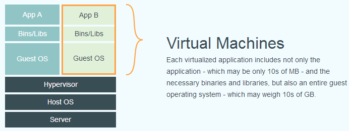
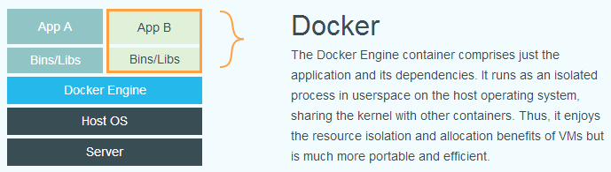
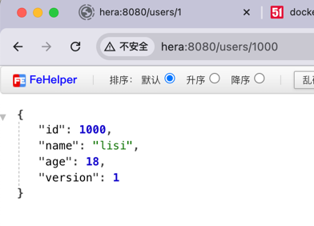

# 什么是Docker
Docker 在容器的基础上，进行了进一步的封装，从文件系统、网络互联到进程隔离等等，极大的简化了容器的创建和维护。使得 Docker 技术比虚拟机技术更为轻便、快捷。

下面的图片比较了 Docker 和传统虚拟化方式的不同之处。传统虚拟机技术是虚拟出一套硬件后，在其上运行一个完整操作系统，在该系统上再运行所需应用进程；而容器内的应用进程直接运行于宿主的内核，容器内没有自己的内核，而且也没有进行硬件虚拟。因此容器要比传统虚拟机更为轻便。

传统虚拟化



Docker


# 安装

服务所在的机器 `hera`
## 安装所需的软件包
```shell
yum install -y yum-utils \
           device-mapper-persistent-data \
           lvm2 --skip-broken
```

### 常见问题
```shell
Loading mirror speeds from cached hostfile
Could not retrieve mirrorlist http://mirrorlist.centos.org/?release=7&arch=x86_64&repo=os&infra=stock error was
14: curl#6 - "Could not resolve host: mirrorlist.centos.org; 未知的错误"
```
mirrorlist.centos.org这个域名被弃用了，更换源地址即可：
首先到储存源文件的目录

	[root@hera ~]# cd /etc/yum.repos.d

然后使用以下命令批量换mirrorlist.centos.org

	[root@hera yum.repos.d]# sed -i s/mirror.centos.org/vault.centos.org/g /etc/yum.repos.d/*.repo
	[root@hera yum.repos.d]# sed -i s/^#.*baseurl=http/baseurl=http/g /etc/yum.repos.d/*.repo
	[root@hera yum.repos.d]# sed -i s/^mirrorlist=http/#mirrorlist=http/g /etc/yum.repos.d/*.repo

## 设置仓库
选择阿里云的镜像源

	[root@hera ~]# yum-config-manager     --add-repo     https://mirrors.aliyun.com/docker-ce/linux/centos/docker-ce.repo
    [root@hera ~]# sed -i 's/download.docker.com/mirrors.aliyun.com\/docker-ce/g' /etc/yum.repos.d/docker-ce.repo
    [root@hera ~]# yum makecache fast

## 安装 Docker Engine-Community

	# yum install -y docker-ce

## 启动 docker

	# systemctl start docker

通过运行 hello-world 镜像来验证是否正确安装了 Docker Engine-Community 。

	[root@hera docker]# docker run hello-world
```shell
[root@hera docker]# docker run hello-world
Unable to find image 'hello-world:latest' locally
latest: Pulling from library/hello-world
78445dd45222: Pull complete
Digest: sha256:c5515758d4c5e1e838e9cd307f6c6a0d620b5e07e6f927b07d05f6d12a1ac8d7
Status: Downloaded newer image for hello-world:latest

Hello from Docker!
This message shows that your installation appears to be working correctly.

......
```

### 常见问题

	docker: Error response from daemon: Get "https://registry-1.docker.io/v2/": net/http: request canceled while waiting for connection (Client.Timeout exceeded while awaiting headers).

导致此问题产生，主要是因为国家把docker国外镜像hub封掉了，导致镜像pull不下来，为此，改用国内的镜像

更改镜像源

	sudo vim /etc/docker/daemon.json

修改为
```json
{
  "registry-mirrors": [
    "https://hub-mirror.c.163.com",
    "https://mirror.baidubce.com",
    "https://ccr.ccs.tencentyun.com"
  ]
}
```

> 如果配置了还是拉不下来，直接制定镜像源使用<br />
> docker pull docker.1ms.run/nginx:1.27.3-perl

重启 docker 即可

	[root@hera docker]# systemctl restart docker

## 加入开机启动
```shell
[root@hera ~]# systemctl enable docker
```


# 部署SpringBoot项目
创建项目存放目录
```shell
/usr/local/docker-projects/example
```
上传 springboot 运行 jar 项目
编写 Dockerfile

```shell
[root@hera example]# ll
total 49340
-rw-r--r--. 1 root root      113 Dec  7 20:34 Dockerfile
-rw-r--r--. 1 root root 50516902 Dec  7 20:20 example-0.0.1-SNAPSHOT.jar
[root@hera example]# cat Dockerfile
FROM openjdk:8

COPY *.jar /app.jar
CMD ["--server.port=8080"]
EXPOSE 8080
ENTRYPOINT ["java","-jar","/app.jar"]
[root@hera example]#
```

构建镜像
```shell
[root@hera example]# docker build -t example .
[+] Building 33.0s (7/7) FINISHED                                                                                                                              docker:default
 => [internal] load build definition from Dockerfile                                                                                                                     0.0s
 => => transferring dockerfile: 203B                                                                                                                                     0.0s
 => [internal] load metadata for docker.io/library/openjdk:8                                                                                                             5.1s
 => [internal] load .dockerignore                                                                                                                                        0.0s
 => => transferring context: 2B                                                                                                                                          0.0s
 => [internal] load build context                                                                                                                                        0.3s
 => => transferring context: 50.53MB                                                                                                                                     0.2s
 => [1/2] FROM docker.io/library/openjdk:8@sha256:86e863cc57215cfb181bd319736d0baf625fe8f150577f9eb58bd937f5452cb8                                                      25.8s
 => => resolve docker.io/library/openjdk:8@sha256:86e863cc57215cfb181bd319736d0baf625fe8f150577f9eb58bd937f5452cb8                                                       0.0s
 => => sha256:86e863cc57215cfb181bd319736d0baf625fe8f150577f9eb58bd937f5452cb8 1.04kB / 1.04kB                                                                           0.0s
 => => sha256:b273004037cc3af245d8e08cfbfa672b93ee7dcb289736c82d0b58936fb71702 7.81kB / 7.81kB                                                                           0.0s
 => => sha256:3af2ac94130765b73fc8f1b42ffc04f77996ed8210c297fcfa28ca880ff0a217 1.79kB / 1.79kB                                                                           0.0s
 => => sha256:001c52e26ad57e3b25b439ee0052f6692e5c0f2d5d982a00a8819ace5e521452 55.00MB / 55.00MB                                                                        13.0s
 => => sha256:d9d4b9b6e964657da49910b495173d6c4f0d9bc47b3b44273cf82fd32723d165 5.16MB / 5.16MB                                                                           2.3s
 => => sha256:2068746827ec1b043b571e4788693eab7e9b2a95301176512791f8c317a2816a 10.88MB / 10.88MB                                                                         8.5s
 => => sha256:9daef329d35093868ef75ac8b7c6eb407fa53abbcb3a264c218c2ec7bca716e6 54.58MB / 54.58MB                                                                        15.4s
 => => sha256:d85151f15b6683b98f21c3827ac545188b1849efb14a1049710ebc4692de3dd5 5.42MB / 5.42MB                                                                          12.3s
 => => sha256:52a8c426d30b691c4f7e8c4b438901ddeb82ff80d4540d5bbd49986376d85cc9 210B / 210B                                                                              13.0s
 => => extracting sha256:001c52e26ad57e3b25b439ee0052f6692e5c0f2d5d982a00a8819ace5e521452                                                                                2.8s
 => => sha256:8754a66e005039a091c5ad0319f055be393c7123717b1f6fee8647c338ff3ceb 105.92MB / 105.92MB                                                                      23.7s
 => => extracting sha256:d9d4b9b6e964657da49910b495173d6c4f0d9bc47b3b44273cf82fd32723d165                                                                                0.3s
 => => extracting sha256:2068746827ec1b043b571e4788693eab7e9b2a95301176512791f8c317a2816a                                                                                0.4s
 => => extracting sha256:9daef329d35093868ef75ac8b7c6eb407fa53abbcb3a264c218c2ec7bca716e6                                                                                3.5s
 => => extracting sha256:d85151f15b6683b98f21c3827ac545188b1849efb14a1049710ebc4692de3dd5                                                                                0.2s
 => => extracting sha256:52a8c426d30b691c4f7e8c4b438901ddeb82ff80d4540d5bbd49986376d85cc9                                                                                0.0s
 => => extracting sha256:8754a66e005039a091c5ad0319f055be393c7123717b1f6fee8647c338ff3ceb                                                                                1.9s
 => [2/2] COPY *.jar /app.jar                                                                                                                                            1.9s
 => exporting to image                                                                                                                                                   0.1s
 => => exporting layers                                                                                                                                                  0.1s
 => => writing image sha256:86fd8f910ac76a9bedcd8a73b6775f3c019d6a7482b7cb4bf017fb755a04718d                                                                             0.0s
 => => naming to docker.io/library/example                                                                                                                               0.0s
[root@hera example]#
```

启动容器
```shell
[root@hera config]# docker run -p 8080:8080 example
```
访问接口



<br /><br /><br /><br /><br /><br /><br /><br /><br /><br />