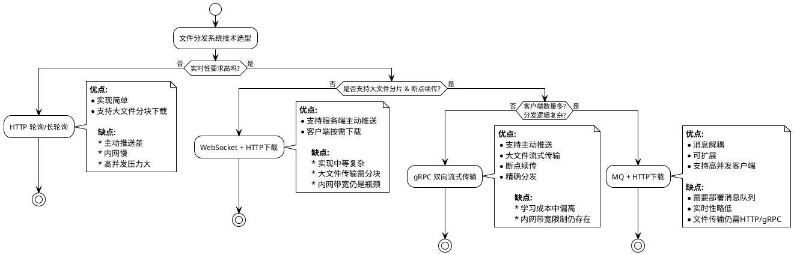

# 文件分发系统
系统需要满足的需求:

1. 要做一个文件分发系统
2. 整体为客户端+服务端架构
3. 服务端可以主动推送消息到客户端
4. 文件平均大小在100M以内,大文件能到300M左右
5. 文件整体最高可能在1.5T
6. 网络传输速度大概在10M左右
7. 文件存储在磁盘
8. 客户端使用 VUE+SpringBoot 开发, 服务端使用 SpringBoot 开发
9. 不能使用CDN进行加速
10. 目前为单体应用, 需要预留分布式改造的可能
11. 客户端有多个, 不同的文件需要根据业务逻辑分发到不同的客户端
<br />

---

## 服务端主动推送的典型实现方式
我们重点考虑 **内网 10M 带宽、文件分发量大、服务端主动推送、客户端差异化分发** 等条件,

**在文件分发系统中，服务端**可以**主动向客户端推送文件**，不过这需要满足一定的架构与技术条件，不能单靠传统的 HTTP 被动请求模型。

下面是常见的实现方式、场景与注意事项。

## **方案一：HTTP+轮询/长轮询下载**

### **实现方式**

* 服务端提供文件下载 HTTP 接口。
* 客户端定期轮询或者使用长轮询获取服务端的文件列表及推送通知。
* 客户端根据业务逻辑选择需要下载的文件。
* 文件分片可选，分块下载避免大文件阻塞。

### **优点**

* 技术成熟，Spring Boot 自带支持。
* 客户端实现简单，Vue 直接发 HTTP 请求即可。
* 可通过分块下载支持大文件（100\~300M）。

### **缺点**

* 主动推送体验差，必须轮询或长轮询。
* 内网 10M，单线程 HTTP 下载大文件可能速度慢。
* 文件分发量大时服务器压力高。

### **适用场景**

* 文件量不大，更新频率低。
* 客户端对实时性要求不高。

---

## **方案二：WebSocket + 分片下载**

### **实现方式**

* 服务端通过 WebSocket 主动通知客户端有新文件。
* 客户端收到通知后，通过 HTTP 或 gRPC 下载文件分片。
* 可实现断点续传和分片下载，支持大文件。
* 根据业务逻辑，将文件分发到指定客户端。

### **优点**

* 支持服务端主动推送。
* 支持大文件分片下载，避免单次传输失败。
* 客户端实时性好。

### **缺点**

* 实现复杂度高，尤其是分片下载和断点续传。
* 文件传输仍需 HTTP 或 TCP 实现，WebSocket 不适合直接传输大文件。
* 内网带宽受限，仍可能成为瓶颈。

### **适用场景**

* 文件分发量中等，要求实时通知。
* 客户端需要按需下载文件。

---

## **方案三：gRPC + 流式传输（推荐）**

### **实现方式**

* 服务端使用 gRPC 的 **双向流**（bidirectional streaming）接口：

    * 服务端主动推送文件列表或变更通知。
    * 客户端根据业务逻辑请求下载文件流。
* 支持文件分块流式传输，便于断点续传和并发下载。
* 文件分发逻辑可以在服务端控制，只推送给目标客户端。
* Spring Boot + gRPC Starter 可以快速集成。

### **优点**

* 双向流式通信，服务端可主动推送。
* 支持大文件分块传输，传输可靠性高。
* 适合内网低带宽环境，通过流控和分块避免阻塞。
* 服务端可精确控制不同客户端分发逻辑。
* gRPC 支持 Java 原生高性能，多线程控制容易。

### **缺点**

* 学习成本稍高，需要理解 gRPC 流式 API。
* 如果文件量极大（1.5T），磁盘 I/O 可能成为瓶颈。
* 内网 10M 带宽仍然是速度瓶颈。

### **适用场景**

* 文件分发量大，客户端实时性要求高。
* 大文件分片、断点续传是必须功能。
* 客户端按需分发逻辑复杂。

---

## **方案四：基于消息队列 + HTTP 下载（MQ + 文件存储）**

### **实现方式**

* 服务端文件上传后，将文件元信息推送到消息队列（如 RocketMQ、Kafka）。
* 客户端订阅消息，根据业务逻辑决定是否下载。
* 文件通过 HTTP 或 gRPC 下载。

### **优点**

* 服务端无需直接管理客户端列表。
* 消息可靠传递，可支持高并发。
* 可扩展为多服务分发架构。
* 分布式改造成本低。

### **缺点**

* 需要额外部署消息队列。
* 文件实际传输仍需 HTTP 或 gRPC，带宽瓶颈存在。
* 实时性略低于 gRPC 直接推送。

### **适用场景**

* 客户端数量多，分发逻辑复杂。
* 文件分发与通知解耦。
* 系统未来可能扩展为分布式。

---

## **方案对比表**

| 方案                 | 主动推送  | 大文件支持    | 实现复杂度 | 适用场景              |
| ------------------ | ----- | -------- | ----- | ----------------- |
| HTTP轮询/长轮询         | ✖     | ✅        | 低     | 小文件量，低实时性         |
| WebSocket + HTTP下载 | ✅     | ✅（分块）    | 中     | 实时性要求高，客户端需按需下载   |
| gRPC 流式传输          | ✅     | ✅（流式、分片） | 中偏高   | 文件量大，实时性高，按客户端分发  |
| MQ + HTTP下载        | ✅（延迟） | ✅        | 中     | 分发逻辑复杂，多客户端，系统可扩展 |

---

## **结论与推荐**

* **首选方案：gRPC 双向流**
  理由：

    1. 支持服务端主动推送和按需分发。
    2. 支持大文件分片传输，便于断点续传。
    3. 内网 10M 带宽可以通过流控优化传输，避免阻塞。
    4. 单体应用改造成本低，未来可逐步拆分成分布式。

* **备选方案：WebSocket + HTTP下载**
  如果团队对 gRPC 不熟悉，可以先用 WebSocket 进行通知，再用 HTTP 下载分片文件。

* **长期可扩展方案：MQ + 文件存储**
  当客户端数量多、分发逻辑复杂时，可使用消息队列解耦通知和下载。

---

以下是一张 **“文件分发技术选型决策图”**，把每种方案适用条件、优缺点和实现复杂度都直观展示出来。


## 二、gRPC 文件传输设计
### 1. 分布式 gRPC 主动推送通信架构图
下面是一份适用于 **分布式 gRPC 服务端主动推送客户端** 的典型通信架构流程图，包含连接注册、消息推送、消息转发等核心流程：

```
┌─────────────────────┐
│      客户端 ClientA │
└─────────┬───────────┘
          │ 建立双向流连接
          ▼
┌────────────────────────────────────┐
│   gRPC 实例节点 A（grpc-server-1） │
│ ┌──────────────────────────────┐  │
│ │ StreamObserver<ClientA>      │  │
│ │ 注册连接:                     │  │
│ │ Redis.set("clientA", {       │  │
│ │   node: "grpc-server-1",     │  │
│ │   time: "2025-08-01T16:00"   │  │
│ │ })                           │  │
│ └──────────────────────────────┘  │
└────────────────┬─────────────—────┘
                 │
         ▼ Redis 共享连接注册中心
┌────────────────────────────────────┐
│              Redis                │
│  clientA => { node: grpc-server-1 }│
└────────────────────────────────────┘
                 ▲
                 │
        ┌────────┴─────────┐
        │                  │
┌───────▼────────┐   ┌─────▼────────────┐
│ gRPC 实例节点 B│   │    后台业务模块  │
│ grpc-server-2  │   │ （发起推送操作）│
└────────────────┘   └────────┬────────┘
                              │
                       发起推送请求
                              ▼
               ┌─────────────────────────┐
               │ 查 Redis: clientA 属于A节点 │
               └────────────┬────────────┘
                            │
                   是我自己？否 ──────► 是
                            │             │
                            ▼             ▼
                  ┌────────────────────┐  ┌────────────────────┐
                  │ RPC 调用节点A      │  │ 获取 StreamObserver│
                  │ /push(clientA, msg)│  │ observer.onNext()  │
                  └────────────────────┘  └────────────────────┘
                            │
                  节点A 执行 observer.onNext()
```

---

- 核心组件说明

| 组件               | 作用                              |
| ---------------- | ------------------------------- |
| **客户端**          | 与某个 gRPC 节点建立流式连接，服务端可以向它推送数据   |
| **gRPC 节点（A/B）** | 部署多个副本，每个节点只管理连接到它的客户端          |
| **Redis / etcd** | 存储所有客户端连接所属节点（用于路由）             |
| **后台业务模块**       | 发起推送动作，不关心连接在哪个节点               |
| **推送调度逻辑**       | 查询客户端所在节点 → 本地推送或远程调用 gRPC 推送接口 |


- 数据结构示例（存入 Redis）：

```json
client:clientA {
  "node": "grpc-server-1",
  "sessionId": "uuid-xxx",
  "lastActive": "2025-08-01T16:00:00"
}
```

**这种架构具有以下优势：**

* **支持分布式多节点部署**
* **服务端可对客户端进行主动消息/文件推送**
* **客户端连接可通过 Redis 快速路由定位**
* **不需要集中式连接转发器（如 IM 网关）**

---

如果 **gRPC 服务端是分布式部署的**（即多个服务副本/节点可能部署在 Kubernetes、ECS、Docker Swarm 等环境中），那么连接管理变得复杂一些，需要考虑以下问题：

核心挑战：分布式服务如何管理客户端连接？
---
| 问题      | 描述                          |
| ------- | --------------------------- |
| 多节点连接隔离 | 客户端连接的是某个节点，连接状态只保存在该节点内存中  |
| 推送路径不明确 | 某个服务节点不知道客户端连到了哪个实例         |
| 主动推送失效  | 如果服务端 A 想推送消息给客户端，但客户端连接在 B |
| 状态一致性问题 | 各节点无法共享连接状态，无法广播、断点续传等操作    |

 解决方案汇总

| 方案                      | 描述                                      | 适用               |
| ----------------------- | --------------------------------------- | ---------------- |
|  1. 客户端连接固定节点（黏性连接）     | 基于负载均衡策略如 `ip_hash` 让客户端始终连同一个 gRPC 实例  | 少量客户端，服务固定部署     |
|  2. Redis / etcd 共享连接注册表 | 所有节点共享一个连接元信息存储（但不能共享 `StreamObserver`） | 注册推送消息路径、状态共享    |
|  3. 使用消息中间件中转推送（推荐）     | 服务端推送消息时通过 MQ（如 Kafka、RabbitMQ）转发给正确节点  | 客户端数量多，推送实时性要求中等 |
|  4. 使用统一中转网关（例如长连接转发中心） | 客户端统一接入一个网关节点，该节点与后端服务转发数据              | IoT、IM 等高并发系统    |
|  5. 使用服务注册 + 节点间 RPC 调用 | A 节点无法找到客户端连接时，调用 B 节点的 gRPC 推送服务       | 节点数量有限，强一致推送需求   |

---

### 2 方案详解：服务端分布式下的连接管理（推送）


 1. 客户端连接与注册流程

> 客户端连接任意服务节点，节点将其连接信息注册到 Redis 等共享注册中心：

```json
client_sessions:
  clientA -> {
      "connectedTo": "grpc-server-1",
      "lastActive": "2025-08-01T16:15:00",
      "sessionId": "uuid"
  }
```

 2. 服务端推送流程（主动推送）

当你想从服务端向某个客户端推送数据时：

 - A. 查 Redis 获取 clientId 所属的服务节点：

```java
String nodeId = redis.get("client:clientA:connectedTo");
```

- B. 判断本节点是否持有连接：

  * 如果是本节点，直接从内存中取出 `StreamObserver`，调用 `onNext()`
  * 如果不是，走 **RPC** 或 **消息中间件** 转发

 3. 使用 Kafka 或 Redis Stream 中转推送（推荐）

各服务节点启动监听任务，从 MQ 中监听“属于自己节点的推送消息”：

```json
topic: client-push
message:
  {
    "targetClientId": "clientA",
    "connectedNode": "grpc-server-2",
    "payload": { ... }
  }
```

每个节点只处理发往自己的 clientId，找出对应的连接，`onNext()` 发送。

---

4. 微服务中的节点间通信（服务间 RPC）

如果你不希望引入 MQ，也可以让节点之间互相调用 `grpc://nodeX/push` 接口：

```java
@GrpcClient("grpc-server-node-2")
private PushServiceGrpc.PushServiceBlockingStub pushStub;

// 服务 A 找到 client 在 B，就转发推送
pushStub.pushToClient(PushRequest.newBuilder()
    .setClientId("clientA")
    .setPayload(...)
    .build());
```

截止到现在我们已经设计了一个**分布式 gRPC 服务端主动推送客户端**的完整架构，支持多节点部署、客户端连接管理、消息路由与转发等核心功能。

接下来我们需要具体看看文件如何才能**可靠传输**，完整的被推送到客户端。

- 当 **客户端正常运行时** 持续监听服务端推送 `ServerMessage`，只要连接不断，服务端可随时 `onNext()` 推送数据。

- 当 **客户端意外断开（断网、崩溃、重启）** 后, 客户端需要**自动重连**，并重新注册连接, 上一次的推送可能是完成的也可能是未完成的需要重新推送, 或者进行断点续传.


当客户端重新连接后，服务端需要把未完成的文件重新推送给客户端, 但是服务端并不能很好的知道文件的推送的进度, 如果客户端已经完成了文件的大部分内容的下载, 那么再次推送就会造成重复传输浪费带宽和时间.

一下是服务端推送文件流可能遇到的一些问题:

1. **服务端难以确定客户端何时准备好**

* 服务端可能推过去时，客户端根本没准备好写入文件

2. **无法细粒度控制并发**

* 客户端可能同时收到多个大文件流，占满带宽和内存

3. **错误处理复杂**

* 如果服务端推文件失败，需要复杂的确认/重试机制
* 客户端断开时，服务端的 `onNext()` 会抛出异常，逻辑不优雅

4. **断点续传、确认机制复杂**

* 服务端需要维护状态：哪些客户端收了哪些块，传到第几块，确认了吗？

## 文件流式传输与推送控制分离
为了避免上述问题，我们采用**“通知 + 拉取”**的设计模式：

> 服务端通过 `ServerMessage` 推送 `FileNotice`（轻量通知），客户端随后通过 `DownloadFile(fileId)` 主动拉取。


```
服务端             中心节点               客户端
  │                    │                    │
  │ ── 推送 FileNotice ────────────────►    │
  │                    │         onNext: 收到 file_id
  │                    │                    │
  │                    │ ◄── 下载文件请求 ──┤
  │ ◄─ 文件块传输（流式）───────┘
```

## 这么做的好处：

### 1. **流量由客户端控制，更安全**

* 客户端决定是否/何时下载，避免过载（如网络慢/磁盘满）
* 客户端可以限速、断点续传、失败重试

### 2. **连接简单、职责清晰**

* 推送通道（Connect）用于通知
* 文件通道（DownloadFile）用于传输
* 易于区分问题来源、统计性能

### 3. **文件流可异步分发 / 多通道处理**

* 客户端可以在另一个线程或组件中并发处理文件拉取
* 支持 CDN 加速/OSS 临时 URL 拉取

### 4. **服务端资源释放更及时**

* `FileServiceImpl` 完成传输后可以立即 `onCompleted()`，无需维持长连接
* 一台服务可以高效同时服务多个客户端

## 推拉模式的总结类比：

| 模式            | 类比              | 优点      | 缺点         |
| ------------- | --------------- | ------- | ---------- |
| 服务端主动推送文件流    | 快递员直接把大箱子送上门    | 无需客户端发起 | 客户端没准备好可能崩 |
| 服务端通知 + 客户端拉取 | 通知你有快递，自己决定何时去拿 | 客户端控制节奏 | 实现稍微复杂点    |


## 所以，除非你有这些强烈需求：

* 所有客户端实时、强制接收推送
* 网络环境非常好、可控（如内网）
* 服务端具有调度权且负载较小

否则，在生产环境中：

> **使用通知 + 客户端拉取的模式，是目前主流、健壮、扩展性强的设计。**
