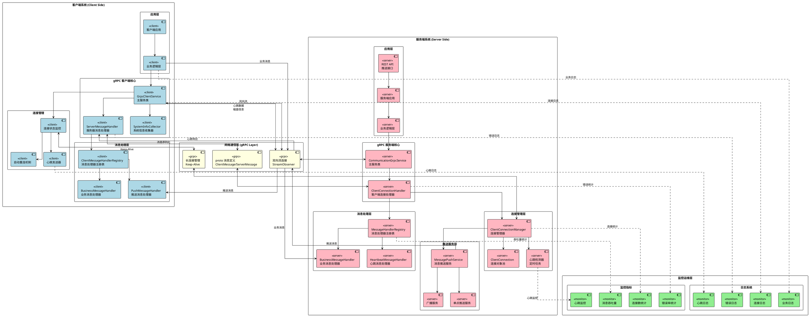
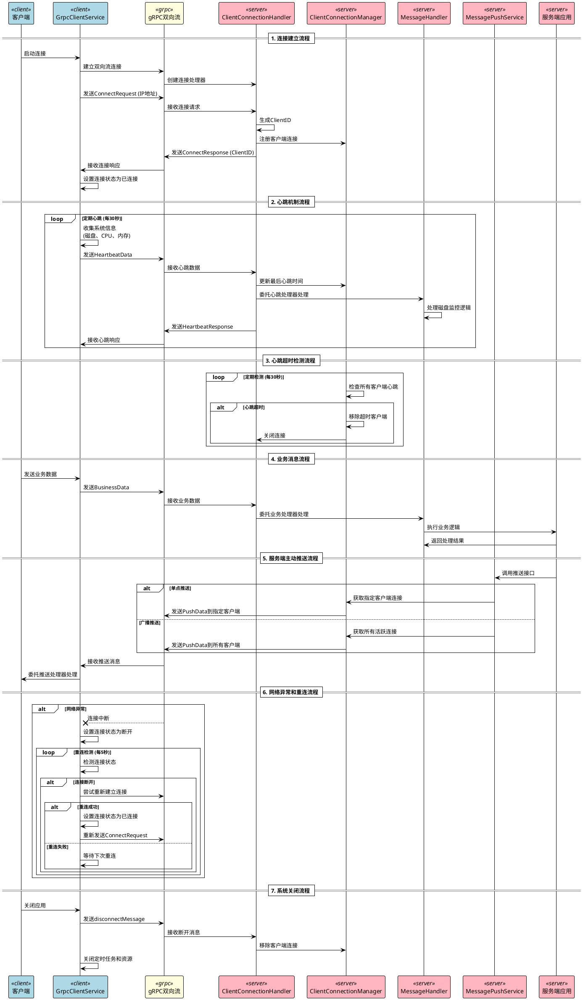
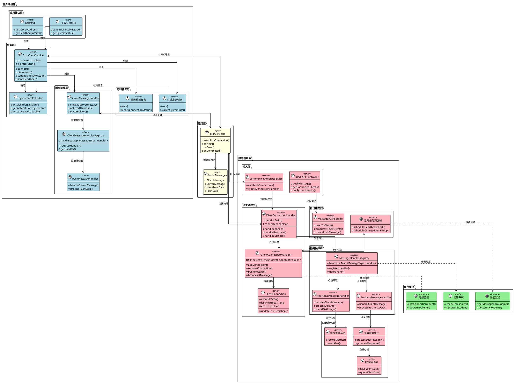
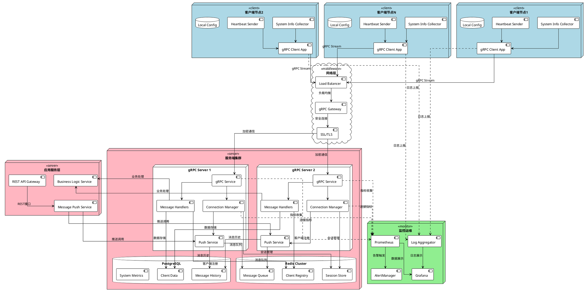
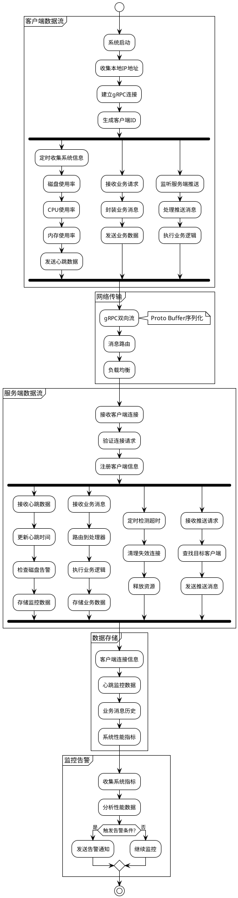

# gRPC通信系统 PlantUML 架构图

## 1. 整体系统架构图

```plantuml
@startuml grpc_system_architecture
!theme plain
skinparam linetype ortho
skinparam packageStyle rectangle
skinparam component {
    BackgroundColor<<client>> LightBlue
    BackgroundColor<<server>> LightPink
    BackgroundColor<<grpc>> LightYellow
    BackgroundColor<<monitor>> LightGreen
}

package "客户端系统 (Client Side)" as ClientSide {
    package "应用层" as ClientApp {
        component [客户端应用] as CA <<client>>
        component [业务逻辑层] as CB <<client>>
    }
    
    package "gRPC 客户端核心" as ClientCore {
        component [GrpcClientService\n主服务类] as CC <<client>>
        component [ServerMessageHandler\n服务器消息处理器] as CD <<client>>
        component [SystemInfoCollector\n系统信息收集器] as CE <<client>>
    }
    
    package "消息处理层" as ClientHandler {
        component [ClientMessageHandlerRegistry\n消息处理器注册表] as CF <<client>>
        component [PushMessageHandler\n推送消息处理器] as CG <<client>>
        component [BusinessMessageHandler\n业务消息处理器] as CH <<client>>
    }
    
    package "连接管理" as ClientConn {
        component [连接状态监控] as CI <<client>>
        component [自动重连机制] as CJ <<client>>
        component [心跳发送器] as CK <<client>>
    }
}

package "网络通信层 (gRPC Layer)" as GrpcLayer {
    component [双向流连接\nStreamObserver] as GR1 <<grpc>>
    component [proto 消息定义\nClientMessage/ServerMessage] as GR2 <<grpc>>
    component [长连接管理\nKeep-Alive] as GR3 <<grpc>>
}

package "服务端系统 (Server Side)" as ServerSide {
    package "gRPC 服务端核心" as ServerCore {
        component [CommunicationGrpcService\n主服务类] as SA <<server>>
        component [ClientConnectionHandler\n客户端连接处理器] as SB <<server>>
    }
    
    package "连接管理层" as ServerConnMgr {
        component [ClientConnectionManager\n连接管理器] as SC <<server>>
        component [ClientConnection\n连接对象池] as SD <<server>>
        component [心跳检测器\n定时任务] as SE <<server>>
    }
    
    package "消息处理层" as ServerHandler {
        component [MessageHandlerRegistry\n消息处理器注册表] as SF <<server>>
        component [HeartbeatMessageHandler\n心跳消息处理器] as SG <<server>>
        component [BusinessMessageHandler\n业务消息处理器] as SH <<server>>
    }
    
    package "推送服务层" as PushLayer {
        component [MessagePushService\n消息推送服务] as SI <<server>>
        component [广播服务] as SJ <<server>>
        component [单点推送服务] as SK <<server>>
    }
    
    package "应用层" as ServerApp {
        component [服务端应用] as SL <<server>>
        component [业务逻辑层] as SM <<server>>
        component [REST API\n推送接口] as SN <<server>>
    }
}

package "监控运维层" as MonitorLayer {
    package "监控指标" as Metrics {
        component [连接数统计] as M1 <<monitor>>
        component [心跳监控] as M2 <<monitor>>
        component [消息吞吐量] as M3 <<monitor>>
        component [错误率统计] as M4 <<monitor>>
    }
    
    package "日志系统" as Logging {
        component [连接日志] as L1 <<monitor>>
        component [心跳日志] as L2 <<monitor>>
        component [错误日志] as L3 <<monitor>>
        component [业务日志] as L4 <<monitor>>
    }
}

' 客户端内部连接
CA --> CB
CB --> CC
CC --> CD
CC --> CE
CC --> CI
CI --> CJ
CI --> CK
CD --> CF
CF --> CG
CF --> CH

' 服务端内部连接
SN --> SL
SL --> SM
SM --> SA
SA --> SB
SB --> SC
SC --> SD
SC --> SE
SB --> SF
SF --> SG
SF --> SH
SC --> SI
SI --> SJ
SI --> SK

' gRPC 通信连接
CC <--> GR1 : 双向流
GR1 <--> SA
CD <--> GR2 : 消息序列化
GR2 <--> SB
CI <--> GR3 : Keep-Alive
GR3 <--> SC

' 监控连接
SC ..> M1 : 连接统计
SE ..> M2 : 心跳监控
SF ..> M3 : 吞吐量统计
SB ..> M4 : 错误统计

CC ..> L1 : 连接日志
CK ..> L2 : 心跳日志
CD ..> L3 : 错误日志
CB ..> L4 : 业务日志

' 数据流标注
CC --> GR1 : 心跳数据\n磁盘信息
GR1 --> CD : 心跳响应
SI --> GR1 : 推送消息
GR1 --> CG : 推送消息
CB --> GR1 : 业务消息
GR1 --> SH : 业务消息

@enduml
```

## 2. 消息流程时序图

```plantuml
@startuml grpc_message_sequence
!theme plain
skinparam participant {
    BackgroundColor<<client>> LightBlue
    BackgroundColor<<server>> LightPink
    BackgroundColor<<grpc>> LightYellow
}

participant "客户端" as Client <<client>>
participant "GrpcClientService" as ClientService <<client>>
participant "gRPC双向流" as gRPC <<grpc>>
participant "ClientConnectionHandler" as ServerHandler <<server>>
participant "ClientConnectionManager" as ConnManager <<server>>
participant "MessageHandler" as MsgHandler <<server>>
participant "MessagePushService" as PushService <<server>>
participant "服务端应用" as ServerApp <<server>>

== 1. 连接建立流程 ==
Client -> ClientService : 启动连接
ClientService -> gRPC : 建立双向流连接
gRPC -> ServerHandler : 创建连接处理器
ClientService -> gRPC : 发送ConnectRequest (IP地址)
gRPC -> ServerHandler : 接收连接请求
ServerHandler -> ServerHandler : 生成ClientID
ServerHandler -> ConnManager : 注册客户端连接
ServerHandler -> gRPC : 发送ConnectResponse (ClientID)
gRPC -> ClientService : 接收连接响应
ClientService -> ClientService : 设置连接状态为已连接

== 2. 心跳机制流程 ==
loop 定期心跳 (每30秒)
    ClientService -> ClientService : 收集系统信息\n(磁盘、CPU、内存)
    ClientService -> gRPC : 发送HeartbeatData
    gRPC -> ServerHandler : 接收心跳数据
    ServerHandler -> ConnManager : 更新最后心跳时间
    ServerHandler -> MsgHandler : 委托心跳处理器处理
    MsgHandler -> MsgHandler : 处理磁盘监控逻辑
    ServerHandler -> gRPC : 发送HeartbeatResponse
    gRPC -> ClientService : 接收心跳响应
end

== 3. 心跳超时检测流程 ==
loop 定期检测 (每30秒)
    ConnManager -> ConnManager : 检查所有客户端心跳
    alt 心跳超时
        ConnManager -> ConnManager : 移除超时客户端
        ConnManager -> ServerHandler : 关闭连接
    end
end

== 4. 业务消息流程 ==
Client -> ClientService : 发送业务数据
ClientService -> gRPC : 发送BusinessData
gRPC -> ServerHandler : 接收业务数据
ServerHandler -> MsgHandler : 委托业务处理器处理
MsgHandler -> ServerApp : 执行业务逻辑
ServerApp -> MsgHandler : 返回处理结果

== 5. 服务端主动推送流程 ==
ServerApp -> PushService : 调用推送接口
alt 单点推送
    PushService -> ConnManager : 获取指定客户端连接
    ConnManager -> gRPC : 发送PushData到指定客户端
else 广播推送
    PushService -> ConnManager : 获取所有活跃连接
    ConnManager -> gRPC : 发送PushData到所有客户端
end
gRPC -> ClientService : 接收推送消息
ClientService -> Client : 委托推送处理器处理

== 6. 网络异常和重连流程 ==
alt 网络异常
    gRPC --x ClientService : 连接中断
    ClientService -> ClientService : 设置连接状态为断开
    loop 重连检测 (每5秒)
        ClientService -> ClientService : 检测连接状态
        alt 连接断开
            ClientService -> gRPC : 尝试重新建立连接
            alt 重连成功
                ClientService -> ClientService : 设置连接状态为已连接
                ClientService -> gRPC : 重新发送ConnectRequest
            else 重连失败
                ClientService -> ClientService : 等待下次重连
            end
        end
    end
end

== 7. 系统关闭流程 ==
Client -> ClientService : 关闭应用
ClientService -> gRPC : 发送disconnectMessage
gRPC -> ServerHandler : 接收断开消息
ServerHandler -> ConnManager : 移除客户端连接
ClientService -> ClientService : 关闭定时任务和资源

@enduml
```

## 3. 组件关系类图

```plantuml
@startuml grpc_component_relationships
!theme plain
skinparam linetype ortho
skinparam class {
    BackgroundColor<<client>> LightBlue
    BackgroundColor<<server>> LightPink
    BackgroundColor<<grpc>> LightYellow
    BackgroundColor<<monitor>> LightGreen
}

package "客户端组件" as ClientComponents {
    package "应用接口层" as ClientAppLayer {
        class "业务应用接口" as A1 <<client>> {
            +sendBusinessMessage()
            +getSystemStatus()
        }
        class "配置管理" as A2 <<client>> {
            +getServerAddress()
            +getHeartbeatInterval()
        }
    }
    
    package "服务层" as ClientServiceLayer {
        class "GrpcClientService" as B1 <<client>> {
            -connected: boolean
            -clientId: String
            +connect()
            +disconnect()
            +sendBusinessMessage()
            +sendHeartbeat()
        }
        class "SystemInfoCollector" as B2 <<client>> {
            +getDiskInfo(): DiskInfo
            +getSystemInfo(): SystemInfo
            +getCpuUsage(): double
        }
    }
    
    package "消息处理层" as ClientHandlerLayer {
        class "ServerMessageHandler" as C1 <<client>> {
            +onNext(ServerMessage)
            +onError(Throwable)
            +onCompleted()
        }
        class "ClientMessageHandlerRegistry" as C2 <<client>> {
            -handlers: Map<MessageType, Handler>
            +registerHandler()
            +getHandler()
        }
        class "PushMessageHandler" as C3 <<client>> {
            +handle(ServerMessage)
            +processPushData()
        }
    }
    
    package "定时任务层" as ClientTaskLayer {
        class "心跳发送任务" as D1 <<client>> {
            +run()
            +collectSystemInfo()
        }
        class "重连检测任务" as D2 <<client>> {
            +run()
            +checkConnectionStatus()
        }
    }
}

package "通信层" as CommunicationLayer {
    class "gRPC Stream" as E1 <<grpc>> {
        +establishConnection()
        +onNext()
        +onError()
        +onCompleted()
    }
    class "Proto Messages" as E2 <<grpc>> {
        +ClientMessage
        +ServerMessage
        +HeartbeatData
        +PushData
    }
}

package "服务端组件" as ServerComponents {
    package "接入层" as ServerAccessLayer {
        class "CommunicationGrpcService" as F1 <<server>> {
            +establishConnection()
            +createConnectionHandler()
        }
        class "REST API Controller" as F2 <<server>> {
            +pushMessage()
            +getConnectedClients()
            +getSystemMetrics()
        }
    }
    
    package "连接处理层" as ServerConnLayer {
        class "ClientConnectionHandler" as G1 <<server>> {
            -clientId: String
            -connected: boolean
            +handleConnect()
            +handleHeartbeat()
            +handleBusiness()
        }
        class "ClientConnectionManager" as G2 <<server>> {
            -connections: Map<String, ClientConnection>
            +addConnection()
            +removeConnection()
            +pushMessage()
            +broadcastMessage()
        }
        class "ClientConnection" as G3 <<server>> {
            -clientId: String
            -lastHeartbeat: long
            -active: boolean
            +updateLastHeartbeat()
        }
    }
    
    package "消息处理层" as ServerHandlerLayer {
        class "MessageHandlerRegistry" as H1 <<server>> {
            -handlers: Map<MessageType, Handler>
            +registerHandler()
            +getHandler()
        }
        class "HeartbeatMessageHandler" as H2 <<server>> {
            +handle(ClientMessage)
            +processDiskInfo()
            +checkDiskUsage()
        }
        class "BusinessMessageHandler" as H3 <<server>> {
            +handle(ClientMessage)
            +processBusinessData()
        }
    }
    
    package "推送服务层" as ServerPushLayer {
        class "MessagePushService" as I1 <<server>> {
            +pushToClient()
            +broadcastToAllClients()
            +createPushMessage()
        }
        class "定时任务调度器" as I2 <<server>> {
            +scheduleHeartbeatCheck()
            +scheduleConnectionCleanup()
        }
    }
    
    package "业务应用层" as ServerAppLayer {
        class "业务服务接口" as J1 <<server>> {
            +processBusinessLogic()
            +generateResponse()
        }
        class "数据存储层" as J2 <<server>> {
            +saveClientData()
            +queryClientInfo()
        }
        class "监控告警系统" as J3 <<server>> {
            +recordMetrics()
            +sendAlert()
        }
    }
}

package "监控组件" as MonitorComponents {
    class "连接监控" as M1 <<monitor>> {
        +getConnectionCount()
        +getActiveClients()
    }
    class "性能监控" as M2 <<monitor>> {
        +getMessageThroughput()
        +getLatencyMetrics()
    }
    class "告警系统" as M3 <<monitor>> {
        +checkThresholds()
        +sendNotification()
    }
}

' 客户端内部关系
A1 --> B1 : 调用
A2 --> B1 : 配置
B1 --> B2 : 使用
B1 --> C1 : 创建
B1 --> D1 : 启动
B1 --> D2 : 启动
C1 --> C2 : 获取处理器
C2 --> C3 : 注册处理器
D1 --> B2 : 收集信息

' 通信层关系
B1 <--> E1 : gRPC通信
C1 <--> E1 : 消息处理
E1 <--> E2 : 消息序列化

' 服务端内部关系
F2 --> I1 : 推送请求
F1 --> G1 : 创建处理器
G1 --> G2 : 连接管理
G1 --> H1 : 消息分发
G2 --> G3 : 连接对象
G2 --> I2 : 定时任务
H1 --> H2 : 心跳处理
H1 --> H3 : 业务处理
I1 --> G2 : 推送消息
H2 --> J3 : 监控告警
H3 --> J1 : 业务逻辑
J1 --> J2 : 数据存储

' 跨层关系
E1 <--> F1 : gRPC服务
E1 <--> G1 : 连接处理
G2 ..> M1 : 连接统计
I2 ..> M2 : 性能监控
H1 ..> M3 : 告警触发

@enduml
```

## 4. 部署架构图

```plantuml
@startuml grpc_deployment_architecture
!theme plain
skinparam linetype ortho

skinparam node {
    BackgroundColor<<client>> LightBlue
    BackgroundColor<<server>> LightPink
    BackgroundColor<<middleware>> LightYellow
    BackgroundColor<<monitor>> LightGreen
}

node "客户端节点1" as ClientNode1 <<client>> {
    component [gRPC Client App] as Client1
    component [System Info Collector] as SysInfo1
    component [Heartbeat Sender] as Heartbeat1
    database "Local Config" as Config1
}

node "客户端节点2" as ClientNode2 <<client>> {
    component [gRPC Client App] as Client2
    component [System Info Collector] as SysInfo2
    component [Heartbeat Sender] as Heartbeat2
    database "Local Config" as Config2
}

node "客户端节点N" as ClientNodeN <<client>> {
    component [gRPC Client App] as ClientN
    component [System Info Collector] as SysInfoN
    component [Heartbeat Sender] as HeartbeatN
    database "Local Config" as ConfigN
}

cloud "网络层" as Network <<middleware>> {
    component [Load Balancer] as LB
    component [gRPC Gateway] as Gateway
    component [SSL/TLS] as TLS
}

node "服务端集群" as ServerCluster <<server>> {
    node "gRPC Server 1" as Server1 {
        component [gRPC Service] as GrpcSvc1
        component [Connection Manager] as ConnMgr1
        component [Message Handlers] as Handlers1
        component [Push Service] as PushSvc1
    }
    
    node "gRPC Server 2" as Server2 {
        component [gRPC Service] as GrpcSvc2
        component [Connection Manager] as ConnMgr2
        component [Message Handlers] as Handlers2
        component [Push Service] as PushSvc2
    }
    
    database "Redis Cluster" as Redis {
        component [Session Store] as Sessions
        component [Message Queue] as MsgQueue
        component [Client Registry] as ClientReg
    }
    
    database "PostgreSQL" as DB {
        component [Client Data] as ClientData
        component [Message History] as MsgHistory
        component [System Metrics] as Metrics
    }
}

node "应用服务层" as AppLayer <<server>> {
    component [Business Logic Service] as BizSvc
    component [REST API Gateway] as RestAPI
    component [Message Push Service] as PushAPI
}

node "监控运维" as MonitorNode <<monitor>> {
    component [Prometheus] as Prometheus
    component [Grafana] as Grafana
    component [AlertManager] as AlertMgr
    component [Log Aggregator] as LogAgg
}

' 客户端连接
Client1 --> LB : gRPC Stream
Client2 --> LB : gRPC Stream
ClientN --> LB : gRPC Stream

SysInfo1 --> Client1
SysInfo2 --> Client2
SysInfoN --> ClientN

Heartbeat1 --> Client1
Heartbeat2 --> Client2
HeartbeatN --> ClientN

' 网络层
LB --> Gateway : 负载均衡
Gateway --> TLS : 安全连接

' 服务端连接
TLS --> GrpcSvc1 : 加密通信
TLS --> GrpcSvc2 : 加密通信

GrpcSvc1 --> ConnMgr1
GrpcSvc1 --> Handlers1
ConnMgr1 --> PushSvc1

GrpcSvc2 --> ConnMgr2
GrpcSvc2 --> Handlers2
ConnMgr2 --> PushSvc2

' 数据存储连接
ConnMgr1 --> Sessions : 会话管理
ConnMgr2 --> Sessions : 会话管理
PushSvc1 --> MsgQueue : 消息队列
PushSvc2 --> MsgQueue : 消息队列
Handlers1 --> ClientReg : 客户端注册
Handlers2 --> ClientReg : 客户端注册

Handlers1 --> ClientData : 数据存储
Handlers2 --> ClientData : 数据存储
PushSvc1 --> MsgHistory : 消息历史
PushSvc2 --> MsgHistory : 消息历史

' 应用服务层连接
Handlers1 --> BizSvc : 业务处理
Handlers2 --> BizSvc : 业务处理
RestAPI --> PushAPI : REST接口
PushAPI --> PushSvc1 : 推送调用
PushAPI --> PushSvc2 : 推送调用

' 监控连接
GrpcSvc1 ..> Prometheus : 指标收集
GrpcSvc2 ..> Prometheus : 指标收集
ConnMgr1 ..> Prometheus : 连接指标
ConnMgr2 ..> Prometheus : 连接指标

Prometheus --> Grafana : 数据展示
Prometheus --> AlertMgr : 告警触发
LogAgg --> Grafana : 日志展示

Client1 ..> LogAgg : 日志上报
Client2 ..> LogAgg : 日志上报
ClientN ..> LogAgg : 日志上报

@enduml
```

## 5. 数据流图

```plantuml
@startuml grpc_data_flow
!theme plain
skinparam activity {
    BackgroundColor<<client>> LightBlue
    BackgroundColor<<server>> LightPink
    BackgroundColor<<data>> LightYellow
}

start

partition "客户端数据流" {
    :系统启动;
    :收集本地IP地址;
    :建立gRPC连接;
    :生成客户端ID;
    
    fork
        :定时收集系统信息;
        :磁盘使用率;
        :CPU使用率;
        :内存使用率;
        :发送心跳数据;
    fork again
        :接收业务请求;
        :封装业务消息;
        :发送业务数据;
    fork again
        :监听服务端推送;
        :处理推送消息;
        :执行业务逻辑;
    end fork
}

partition "网络传输" {
    :gRPC双向流;
    note right: Proto Buffer序列化
    :消息路由;
    :负载均衡;
}

partition "服务端数据流" {
    :接收客户端连接;
    :验证连接请求;
    :注册客户端信息;
    
    fork
        :接收心跳数据;
        :更新心跳时间;
        :检查磁盘告警;
        :存储监控数据;
    fork again
        :接收业务消息;
        :路由到处理器;
        :执行业务逻辑;
        :存储业务数据;
    fork again
        :定时检测超时;
        :清理失效连接;
        :释放资源;
    fork again
        :接收推送请求;
        :查找目标客户端;
        :发送推送消息;
    end fork
}

partition "数据存储" {
    :客户端连接信息;
    :心跳监控数据;
    :业务消息历史;
    :系统性能指标;
}

partition "监控告警" {
    :收集系统指标;
    :分析性能数据;
    if (触发告警条件?) then (是)
        :发送告警通知;
    else (否)
        :继续监控;
    endif
}

stop

@enduml
```