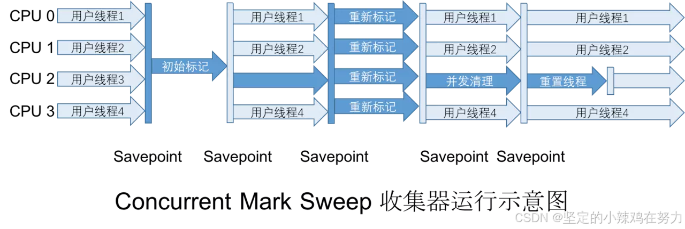
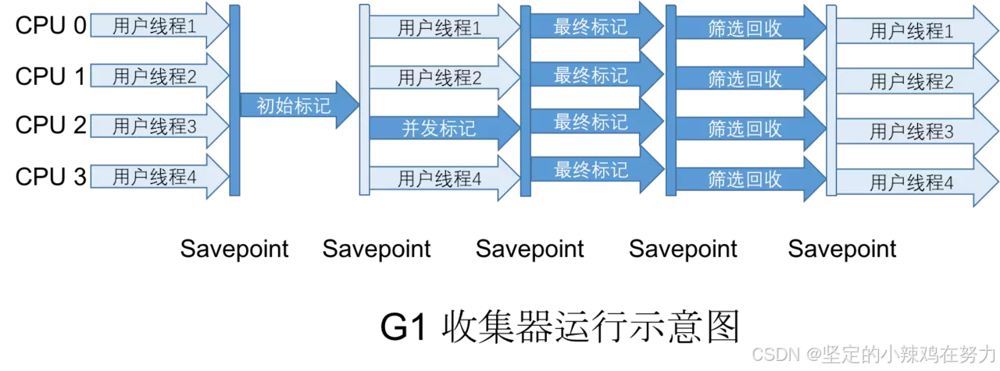
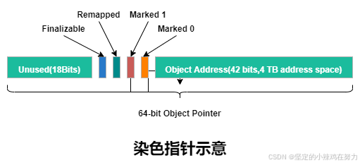

# 垃圾收集器与内存分配策略

## 3.2 对象死亡？
Java 堆中管理者几乎Java世界所有的对象实例，垃圾收集器在堆对象进行回收前，要做的第一件事情就是确定那些对象还活着，那些对象已经死亡（即这些对象永远不会被再次访问到），如何找到这写对象就是我们需要了解的垃圾收集算法。
## 3.3 垃圾收集算法
垃圾收集器大部分都是遵循了 `分代收集` (*Generational Collection*) 的理论进行设计，这个是符合大多数程序实际运行情况的一个经验法则，它建立在两个分代假说之上：
1. 弱分代假说（Weak Generational Hypothesis）: 绝大多数对象都是朝生夕死的
2. 强分代假说（Strong Generational Hypothesis）：熬过越多次垃圾收集过程的对象就越难以消亡

常见的垃圾收集算法
- 标记-清除算法
- 标记-整理算法
- 标记-复制算法
## 3.4 并发的可达性分析
三色标记法：

白色：表示对象尚未被垃圾收集器访问过。

黑色：表示对象已经被垃圾收集器访问过，且这个对象的所有引用都已经扫描过。

灰色：表示对象已经被垃圾收集器访问过，但这个对象上至少还存在一个引用还没有被扫描过。

**对象消失的问题**
1) 正在扫描的灰色对象的一个引用被切断了，同时该引用的对象又与已扫描过的黑色对象建立了引用关系
2) 切断后又重新被黑色对象引用的对象可能是原有引用链中的一部分，由于黑色对象不会被重新扫描，这将导致扫描结束后被黑色对象引用的对象仍然是白色

Wilson 于1994年在理论上证明了，当且仅当以下两个条件同时满足时时，会产生”对象消失的问题“
1) 赋值器插入了一条或多条从黑色对象到白色对象的新引用
2) 赋值器删除了全部从灰色对象到该白色对象的直接或间接引用

因此，我们要解决并发扫描时的对象消失问题，只需要破坏这两个条件的任意一个即可。由此分别产生了两种解决方案：
- 增量更新（Incremental Update)
- 原始快照（Snapshot At The Beginning,SATB)

增量更新要破坏的是第一个条件，当黑色对象插入新的指向白色对象的引用关系时，就将这个新插入的引用记录下来，并发扫描结束之后，再将这些记录过的引用关系中的黑色对象为根，重新扫描一次。

原始快照破坏的是第二个条件，当灰色对象要删除指向白色对象的引用关系时，就将这个要删除的关系记录下来，在并发扫描结束之后，再将这些记录过的引用关系中的灰色对象为根，重新扫描一次。

CMS是基于增量更新来做并发标记的，G1/Shenandoah则是用原始快照来实现。

## 3.5 垃圾收集器
###  CMS收集器（Concurrent Mark Sweep）
CMS垃圾收集的过程分为四个步骤

   1）初始标记（CMS initial mark）

   2）并发标记 (CMS concurrent mark)

   3）重新标记（CMS remark）
   4）并发清除（CMS concurrent sweep）

其中初始标记和重新标记这两个步骤仍然需要 “Stop The World”, 初始标记仅记录一下GC Roots能够关联到的对象，这个速度很快；并发标记阶段就是从GC Roots 开始遍历整个对象图的过程，这个过程耗时很长，但是不需要停顿用户线程，而重新标记则是为了修正并发标记期间，因为用户线程运行导致标记记录产生变动的那一部分记录，这个时间通常比初始标记时间长一些，但是远比并发标记时间短；最后是并发清除阶段，清理掉已经判断死亡的对象，由于该阶段不需要移动对象，所以这个阶段可以和用户线程并发执行。

### Garbage First收集器(G1)
G1开创了基于Region堆内存布局，虽然G1也仍是遵循分代收集理论设计的，但G1不再坚持以固定大小以及固定数量的分代区域划分，而是把连续的Java堆划分为多个大小相等的独立区域（Region），每一个Region 都可以根据需要，扮演新生代的Eden空间、Survivor空间，或者老年代空间。

1. 初始标记（Initial Marking）
2. 并发标记（Concurrent Marking）
3. 最终标记（Final Marking)
4. 筛选回收（Live Data Counting and Evacuation） 根据各个Region的回收
   价值和成本进行排序，根据用户配置的停顿时间制定回收计划。

`相比起增量更算法原始快照搜索能够减少并发标记和重新标记阶段的消耗`，避免CMS在最终标记阶段停顿时间过长的缺点，但是在用户线程运行过程中却是会产生由跟踪引用变化带来的额外负担。

### ZGC 低延迟的垃圾收集器
ZGC收集器有一个标志性的设计是它采用了染色指针技术（Colored Pointer）,将对象头的高四位（43-46）提取出来存储四个标志信息

   1. 并发标记（Concurrent Mark)
   2. 并发预备重分配（Concurrent Prepare for Relocate）
   3. 并发重分配（Concurrent Relocate)
   4. 并发重映射（Concurrent Remap)
