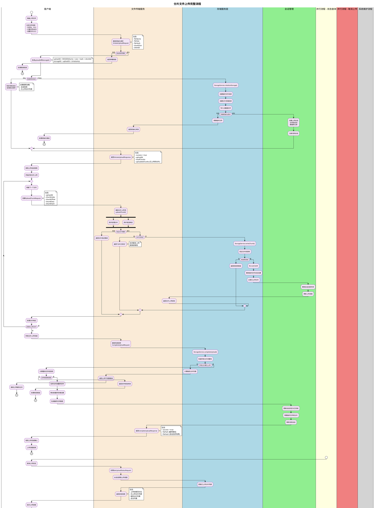
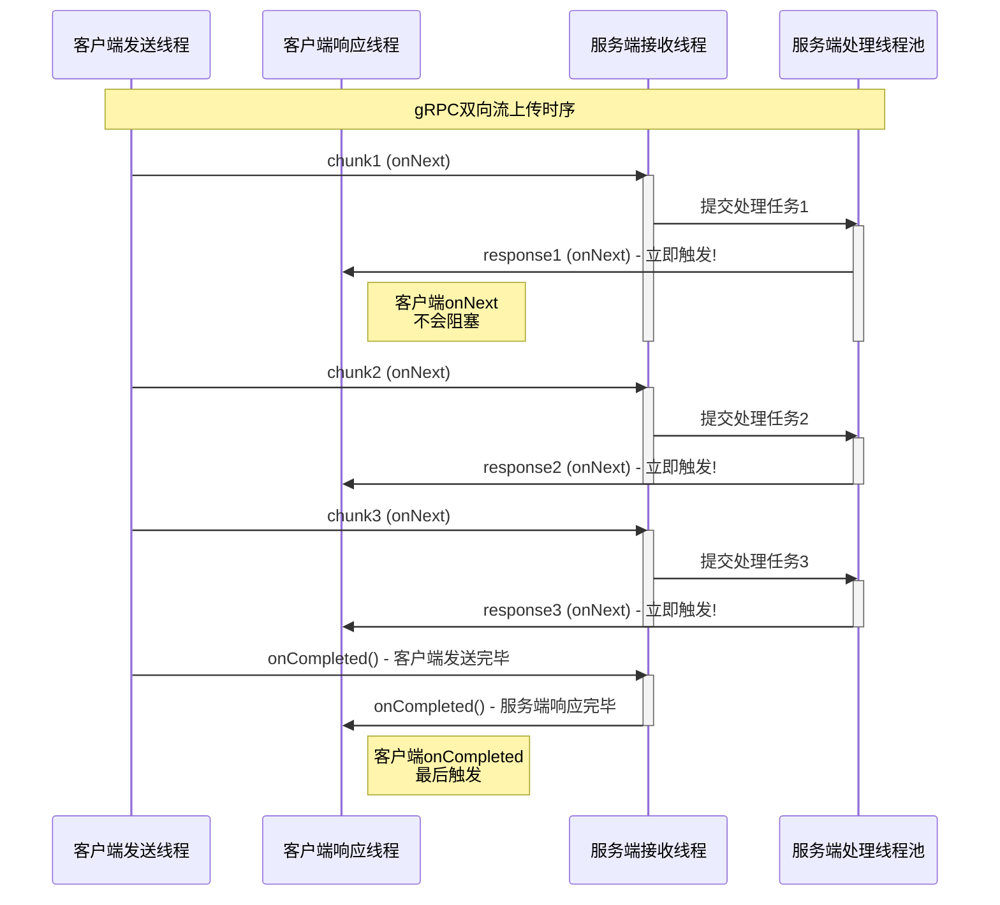

```plantuml
@startuml 文件上传功能流程图

!theme plain
skinparam backgroundColor #FFFFFF
skinparam participant {
  BackgroundColor #E1F5FE
  BorderColor #0277BD
}
skinparam activity {
  BackgroundColor #F3E5F5
  BorderColor #7B1FA2
  FontColor #000000
}
skinparam decision {
  BackgroundColor #FFF3E0
  BorderColor #EF6C00
}

title 分片文件上传完整流程

|客户端|
start
:准备上传文件;
:分析文件信息
- 文件名、大小
- 计算文件MD5
- 设置分片大小;

|#AntiqueWhite|文件传输服务|
:接收初始化请求
InitiateUploadRequest;
note right
  包含:
  - fileName
  - fileSize  
  - fileHash
  - chunkSize
  - clientId
end note

if (验证请求参数?) then (失败)
  :返回参数错误;
  |客户端|
  :处理错误信息;
  stop
else (成功)
  :生成uploadId和storageId;
  note right
    uploadId = MD5(fileName + size + hash + clientId)
    storageId = uploadId + timestamp
  end note
endif

if (检查现有会话?) then (存在)
  :恢复现有会话
  支持断点续传;
  note right
    从数据库加载:
    - 会话信息
    - 已上传分片列表
  end note
else (不存在)
  |#LightBlue|存储服务层|
  :StorageService.initializeStorage();
  :创建临时文件目录;
  :创建分片存储目录;
  :写入元数据文件;
  
  if (存储初始化成功?) then (失败)
    :清理临时文件;
    |文件传输服务|
    :返回初始化失败;
    |客户端|
    :处理初始化错误;
    stop
  else (成功)
    |#LightGreen|会话管理|
    :创建上传会话
    - 业务层会话
    - 数据库记录;
    :注册活跃会话;
  endif
endif

|文件传输服务|
:返回InitiateUploadResponse;
note right
  包含:
  - success = true
  - uploadId
  - totalChunks
  - uploadedChunks (已上传的分片)
end note

|客户端|
:收到上传会话信息;
:开始并发分片上传;

repeat
  :准备下一个分片;
  :创建UploadChunkRequest;
  note right
    包含:
    - uploadId
    - chunkIndex
    - chunkOffset
    - chunkData
    - chunkHash
  end note
  
  |文件传输服务|
  :接收分片上传流
  uploadChunk();
  
  fork
    :异步处理分片;
  fork again
    :异步发送响应;
  end fork
  
  if (验证分片参数?) then (失败)
    :返回分片验证错误;
  else (成功)
    if (分片已存在?) then (是)
      :返回"分片已存在";
      note right
        支持重复上传
        提高容错性
      end note
    else (否)
      |存储服务层|
      :StorageService.writeChunk();
      :验证分片校验和;
      
      if (校验和匹配?) then (否)
        :返回校验和错误;
      else (是)
        :写入分片文件;
        :更新临时文件对应位置;
        :记录已上传分片;
        
        |会话管理|
        :更新会话活跃时间;
        :更新上传进度;
        
        |文件传输服务|
        :返回分片上传成功;
      endif
    endif
  endif
  
  |客户端|
  :处理分片响应;
  
repeat while (还有未上传分片?) is (是)
-> 否;

:所有分片上传完成;

|文件传输服务|
:接收完成请求
CompleteUploadRequest;

|存储服务层|
:StorageService.completeUpload();
:检查所有分片完整性;

if (所有分片都已上传?) then (否)
  :计算缺失分片列表;
  |文件传输服务|
  :返回上传不完整错误;
  |客户端|
  :继续上传缺失分片;
  stop
else (是)
  :计算整体文件校验和;
  
  if (文件校验和匹配?) then (否)
    |文件传输服务|
    :返回文件校验失败;
    |客户端|
    :处理校验错误;
    stop
  else (是)
    :合并分片到最终文件;
    :移动到最终存储位置;
    :生成最终文件路径;
    
    |会话管理|
    :更新会话状态为已完成;
    :清理临时文件和分片;
    :移除活跃会话;
    
    |文件传输服务|
    :返回CompleteUploadResponse;
    note right
      包含:
      - success = true
      - filePath (最终路径)
      - fileHash (验证后的哈希)
    end note
  endif
endif

|客户端|
:收到上传完成确认;
:上传流程结束;
stop

|#LightYellow|并行流程 - 状态查询|
start
|客户端|
:查询上传状态;
|文件传输服务|
:处理GetUploadStatusRequest;
:从会话获取上传进度;
|存储服务层|
:获取已上传分片列表;
|文件传输服务|
:返回状态信息;
note right
  包含:
  - 上传进度百分比
  - 已上传分片列表
  - 缺失分片列表
  - 总分片数
end note
|客户端|
:显示上传进度;
stop

|#LightCoral|并行流程 - 取消上传|
start
|客户端|
:发起取消请求;
|文件传输服务|
:处理CancelUploadRequest;
|存储服务层|
:StorageService.cancelUpload();
:清理临时文件;
:清理分片目录;
|会话管理|
:移除上传会话;
:清理数据库记录;
|文件传输服务|
:返回取消确认;
|客户端|
:处理取消响应;
stop

|#LightGray|系统维护流程|
start
:定期清理任务启动;
repeat
  |会话管理|
  :扫描过期会话;
  if (发现过期会话?) then (是)
    :标记会话为过期;
    |存储服务层|
    :清理过期临时文件;
    |会话管理|
    :清理过期数据库记录;
  endif
  :等待下次清理周期;
repeat while (系统运行中?) is (是)
stop

@enduml
```

```mermaid

sequenceDiagram
    participant C as 客户端发送线程
    participant CR as 客户端响应线程
    participant S as 服务端接收线程
    participant SP as 服务端处理线程池

    Note over C,SP: gRPC双向流上传时序

    C->>S: chunk1 (onNext)
    activate S
    S->>SP: 提交处理任务1
    activate SP
    SP->>CR: response1 (onNext) - 立即触发!
    note right of CR: 客户端onNext<br/>不会阻塞
    deactivate SP
    deactivate S

    C->>S: chunk2 (onNext)
    activate S
    S->>SP: 提交处理任务2
    activate SP
    SP->>CR: response2 (onNext) - 立即触发!
    deactivate SP
    deactivate S

    C->>S: chunk3 (onNext)
    activate S
    S->>SP: 提交处理任务3
    activate SP
    SP->>CR: response3 (onNext) - 立即触发!
    deactivate SP
    deactivate S

    C->>S: onCompleted() - 客户端发送完毕
    activate S
    S->>CR: onCompleted() - 服务端响应完毕
    deactivate S
    note right of CR: 客户端onCompleted<br/>最后触发
```