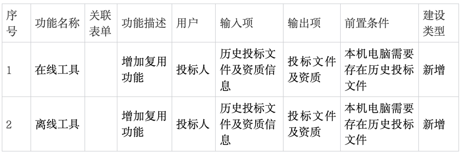
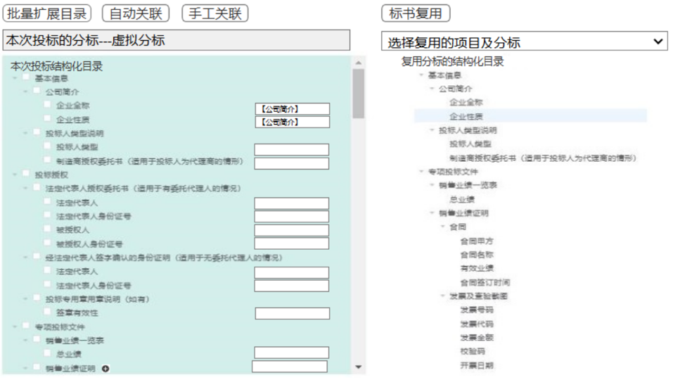
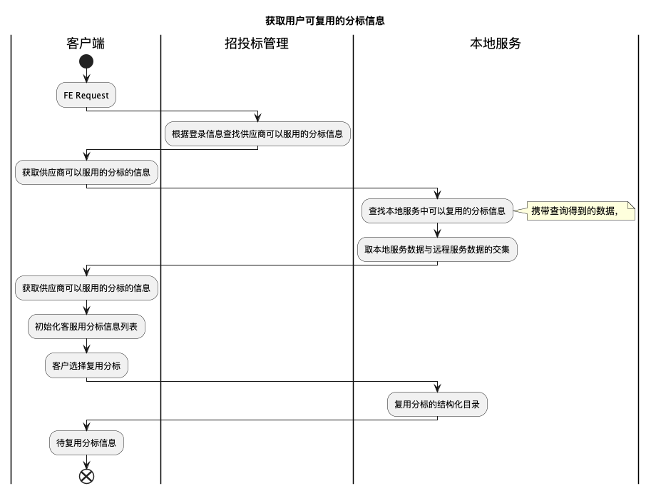
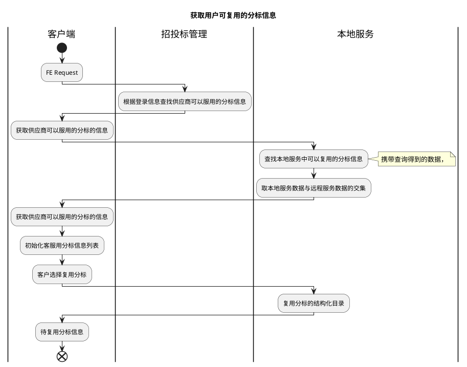
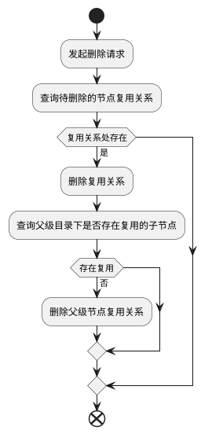
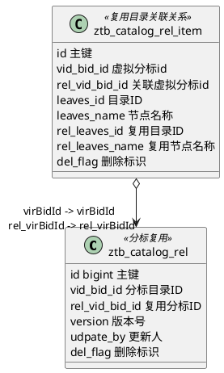

# 设计方案
任务排期


# 一. 背景与目标

## 背景
优化用户体验，减少用户对相似标书的重复工作量

## 目标
投标人在客户端对应标书模板进行结构化填报及编制并添加相应佐证附件，标书制作完毕后可一键生成结构化制式应答文件，并提供标书预览、电子版加密等功能，结构化模块化标书制作提高投标文件编制规范性，同时保证电子版应答文件和纸质版应答文件的信息一致性，推动了无纸化单轨制评审应用。

## 收益
预期功能的收益

# 二. 需求描述

## 名词解释
  
  **末级目录** ：没有子节点的节点

## 标书复用
投标人可以引用历史的投标文件及资质信息，快速生成一版投标文件




### 测试用例

# 三. 系统架构设计

## 总体架构:
系统架构图

## 标书复用流程设计
功能的详细流程设计

### 选择复用的项目及分标

#### 选择复用的项目及分标 流程设计
选择复用的项目及分标，选择框。选择投标文件上传日志中，当前登录账号名称与上传日志中供应商名称一致的数据（项目-分标-虚拟分标一致），再选择当前电脑中存储的项目。

本次投标结构化目录展示：取当前选择的虚拟分标对应的目录。根据目录级次展示。

复用分标的结构化目录展示：取选择项目分标对应的数据库中存储的目录。根据目录级次展示。


<div style="display:none">

</div>

#### 选择复用的项目及分标 系统交互时序图
功能的系统流程调用时序设计

### 标书复用自动关联
判断本次投标结构化目录 与复用分标的结构化目录中名称是否存在重名的目录，重名则自动关联

#### 自动关联 流程设计

<div style="display:none">
```plantuml
title 复用分标自动关联流程图
start
:查询目标分标信息;
note right
目标分标的信息，在选择分标的时候已经确定
选择复用的项目及分标
endnote
:关联直接父级目录信息;
if (目录名称相同) is (是) then
:复用目录;
:客户端服务，保存服用的映射关系; 
endif 
end 
```
</div>

#### 手动关联 系统交互时序图
功能的系统流程调用时序设计

### 标书复用手动关联
判断本次投标结构化目录 与复用分标的结构化目录中名称是否存在重名的目录，重名则自动关联

#### 手动关联 流程设计

<div style="display:none">
```plantuml
|Client|
start
:选择复用节点;
if (父级节点已经存在复用关系) is (是) then
:可选择同一目录下的节点进行复用;
else (否)
:可以选择任意叶子节点进行复用; 
endif
if (类型是否一致) is  (否) then
    :提示 字段类型不一致无法关联;
    note
    类型： 文本 文本域 数字 日期 时间 下拉
    endnote
    stop; 
endif 
|Server|
if (已存在对应的复用关系) is (是) then
:更新复用关系;
else (否)
:插入新的复用关系;
:查询父级目录的复用关系;
if (父级目录已关联) is (否) then
:保存父级目录的复用关系;
endif 
endif 
end
```
</div>

#### 手动关联 系统交互时序图
功能的系统流程调用时序设计

### 标书复用确认
#### 流程设计


<div style="display:none">

```plantuml
title 标书复用确认
|客户端|
start
:点击标书复用;
if (此操作将覆盖掉本分标同目录的文件内容，请确认是否导入?) is (否) then
    :不复用;
    stop
endif
if (分标正在制作中) is (否) then
:生成word;
note
    注意需要修改文件内容的部分
endnote
:标书状态修改为制作中;
:资质信息复用;

'关联项拷贝复用文件的对应资质信息（拷贝数据库中存储的资质信息），如果资质信息字段的文本格式不一致时（下拉框时需要判断下拉的内容是否一致），则不导入资质信息
:word文件复用; 
endif 
end
```
</div

#### 系统交互时序图

### 删除复用关系




### 批量扩展目录
#### 流程设计
录入扩展数量则对应生成拓展目录，如扩展发票500个, 需同时生成同样的子目录

分标如果是未制作状态，则自动生成对应的word，状态修改为制作中


<div style="display:none">
```plantuml
title 批量扩展目录
|客户端|
start
:点击批量扩展目录;
:输入扩展目录数量;
:FE Request|
|招投标管理|
if (分标) is (未制作) then 
:生成word文件;
:修改状态为制作中;
endif 
:生成扩展目录及其子目录;
end 
```
</div>

#### 批量扩展目录 系统交互时序图
功能的系统流程调用时序设计

### 发票修改信息优化

### 上传标书，校验发票信息
1. 校验发票信息 （白名单不走校验接口）
2. 校验通过，上传发票信息

## 数据库设计

### ER图




### 建表语句

- 虚拟分标关联表 (ztb_catalog_rel)：记录用户虚拟分标复用的关联表
  ```mysql
    CREATE TABLE `ztbgl_batch5`.`ztb_catalog_rel`  (
      `id` bigint(20) UNSIGNED NOT NULL AUTO_INCREMENT COMMENT '自增主键',
      `vir_bid_id` bigint(20) NULL DEFAULT NULL COMMENT '当前虚拟分标id',
      `project_name` varchar(255) CHARACTER SET utf8mb4 COLLATE utf8mb4_general_ci NULL DEFAULT NULL COMMENT '当前项目名称',
      `item_name` varchar(255) CHARACTER SET utf8mb4 COLLATE utf8mb4_general_ci NULL DEFAULT NULL COMMENT '分标名称',
      `vir_bid_name` varchar(255) CHARACTER SET utf8mb4 COLLATE utf8mb4_general_ci NULL DEFAULT NULL COMMENT '虚拟分标名称',
      `vendor_name` varchar(255) CHARACTER SET utf8mb4 COLLATE utf8mb4_general_ci NULL DEFAULT NULL COMMENT '供应商名称',
      `bid_type` varchar(255) CHARACTER SET utf8mb4 COLLATE utf8mb4_general_ci NULL DEFAULT NULL COMMENT '当前标书类型',
      `rel_project_name` varchar(255) CHARACTER SET utf8mb4 COLLATE utf8mb4_general_ci NULL DEFAULT NULL COMMENT '关联的项目名称',
      `rel_item_name` varchar(255) CHARACTER SET utf8mb4 COLLATE utf8mb4_general_ci NULL DEFAULT NULL COMMENT '关联的分标名称',
      `rel_vir_bid_name` varchar(255) CHARACTER SET utf8mb4 COLLATE utf8mb4_general_ci NULL DEFAULT NULL COMMENT '关联的虚拟分标名称',
      `rel_vir_bid_id` bigint(20) NULL DEFAULT NULL COMMENT '关联的虚拟分标id',
      `user_id` bigint(20) NULL DEFAULT NULL COMMENT '用户id',
      `create_by` varchar(255) CHARACTER SET utf8mb4 COLLATE utf8mb4_general_ci NULL DEFAULT NULL COMMENT '创建人用户昵称',
      `create_time` datetime NULL DEFAULT NULL COMMENT '创建时间',
      `update_by` varchar(255) CHARACTER SET utf8mb4 COLLATE utf8mb4_general_ci NULL DEFAULT NULL COMMENT '更新人',
      `update_time` datetime NULL DEFAULT NULL COMMENT '更新时间',
      PRIMARY KEY (`id`) USING BTREE
      ) ENGINE = InnoDB AUTO_INCREMENT = 1 CHARACTER SET = utf8mb4 COLLATE = utf8mb4_general_ci COMMENT = '虚拟分标关联表' ROW_FORMAT = Dynamic;
  ```
- 节点关联详情表 (ztb_catalog_rel_item)：记录节点的关联关系
  ```mysql
    CREATE TABLE `ztbgl_batch5`.`ztb_catalog_rel_item`  (
       `id` bigint(20) NOT NULL COMMENT '自增主键',
        `vir_bid_id` bigint(20) NULL DEFAULT NULL COMMENT '关联关系id',
        `rel_vir_bid_id` bigint(20) NULL DEFAULT NULL COMMENT '关联的虚拟分标id',
        `user_id` bigint(20) NULL DEFAULT NULL COMMENT '用户id',
        `leaves_id` bigint(20) NULL DEFAULT NULL COMMENT '当前节点',
        `rel_leaves_id` bigint(20) NULL DEFAULT NULL COMMENT '关联的节点',
        `leaves_name` varchar(255) CHARACTER SET utf8mb4 COLLATE utf8mb4_general_ci NULL DEFAULT NULL COMMENT '节点名称',
        `rel_leaves_name` varchar(255) CHARACTER SET utf8mb4 COLLATE utf8mb4_general_ci NULL DEFAULT NULL COMMENT '关联的节点名称',
        `version` int(11) NULL DEFAULT NULL COMMENT '版本',
        `del_flag` tinyint(1) NULL DEFAULT NULL COMMENT '删除标志',
        `create_by` varchar(255) CHARACTER SET utf8mb4 COLLATE utf8mb4_general_ci NULL DEFAULT NULL COMMENT '创建人',
        `create_time` datetime NULL DEFAULT NULL COMMENT '创建时间',
        `update_by` varchar(255) CHARACTER SET utf8mb4 COLLATE utf8mb4_general_ci NULL DEFAULT NULL COMMENT '更新人',
        `update_time` datetime NULL DEFAULT NULL COMMENT '更新时间',
        `parent_id` bigint(11) NULL DEFAULT NULL COMMENT '父节点id',
        `rel_parent_id` bigint(11) NULL DEFAULT NULL COMMENT '关联的父节点id',
        `have_son` varchar(10) CHARACTER SET utf8mb4 COLLATE utf8mb4_general_ci NULL DEFAULT NULL COMMENT '是否有子项 用于判断是目录还是资质信息节点',
        PRIMARY KEY (`id`) USING BTREE
        ) ENGINE = InnoDB CHARACTER SET = utf8mb4 COLLATE = utf8mb4_general_ci COMMENT = '节点关联详情表' ROW_FORMAT = Dynamic;
  ```
## 接口设计
新增接口
### 复用分标目录关联关系查询
- URL：/ztbgl/reuse/getCatalogReuse

- 方法：POST

- 请求参数

    ```json
      {
          "virBidId": "虚拟分标id"
      }
    ```

- 返回值

    ```json
      {
          "code": 10000,
          "msg": "成功",
          "data": [
              {
          		"projectName": "项目名称",
    	      	"itemName": "分标名称",
        	  	"virBidName": "虚拟分标名称",
        	  	"virBidId": "虚拟分标id",
        	  	"bidType": "标书类型",
                "relList": [
                    {
                        "leavesId": "末级节点id",
                        "leavesName": "末级节点名称",
                        "parentId": "末级节点的父节点id",
                        "relLeavesId": "关联的末级节点id",
                        "relLeavesName": "关联的末级节点名称",
                        "relParentId": "关联的末级节点的父节点id"
                    }
                ]
              }
          ]
    }
    ```

### 查询可复用分标 招投标管理

- URL：/ztbgl/reuse/selectReusableVirBid

- 方法：POST

- 请求参数

    ```json
      {
          "virBidId": "用户选择的虚拟分标Id"
      }
    ```

- 返回值

    ```json
        {
            "code": 10000,
            "msg": "成功",
            "data": [
                {
                    "projectName": "项目名称",
                    "itemName": "分标名称",
                    "virBidName": "虚拟分标名称",
                    "virBidId": "虚拟分标id",
                    "bidType": "标书类型"
                }
            ]
        }
    ```

### 查询可复用分标 本地服务

- URL：/selectReusableVirBid

- 方法：POST

- 请求参数

    ```json
     [
         {
             "projectName": "项目名称",
             "itemName": "分标名称",
             "virBidName": "虚拟分标名称",
             "virBidId": "虚拟分标id",
             "bidType": "标书类型"
         }
    ]
    ```

- 返回值

    ```json
    {
    	"code": 10000,
        "msg": "成功",
        "data": [
            {
                "projectName": "项目名称",
                "itemName": "分标名称",
                "virBidName": "虚拟分标名称",
                "virBidId": "虚拟分标id",
                "bidType": "标书类型"
            }
        ]
    }
    ```

### 标书复用 -- 复用数据

- URL：/ztbgl/reuse/reuseCatalog

- 方法：POST

- 请求参数

    ```json
      {"virBid": "虚拟分标id"}
    ```

- 返回值

    ```json
      {
          "code": 10000,
          "msg": "操作成功",
          "data": ["要复用的word名称", "要复用的word名称"]
      }
    ```

### 标书复用 -- 复用word

- URL：/reuseWord

- 方法：POST

- 请求参数

  ```json
    {
        "projectName": "项目名称",
        "itemName": "分标名称",
        "virBidName": "虚拟分标名称",
        "virBidId": "虚拟分标id",
        "bidType": "标书类型",
        "relProjectName": "要复用的项目名称",
        "relItemName": "分标名称",
        "relVirBidName": "虚拟分标名称",
        "relVirBidId": "虚拟分标id",
        "relBidType": "标书类型",
        "wordList": ["要复用的word名称", "要复用的word名称"]
    }
  ```

- 返回值

  ```json
    {
        "code": 10000,
        "msg": "操作成功"
    }
  ```

### 

### 批量扩展 招投标管理

- URL：/ztbgl/Ys/Make/exdpandLeavesBatch

- 方法：POST

- 请求参数

    ```json
      {
          "leavesId": "要拓展的节点id",
          "num": "批量拓展的数量"
      }
    ```

- 返回值

    ```json
      {
          "code": 10000,
          "msg": "操作成功"
      }
    ```

### 批量扩展 生成文件 本地服务

- URL：/exdpandWordBatch

- 方法：POST

- 请求参数

    ```json
      {"virBid": "目录关联ID"}
    ```

- 返回值

    ```json
      {"status": "成功","id": "目录关联ID", "leavesId": "节点ID", "relLeavesId": "复用节点ID", "relLeavesName": "复用节点名称"}
    ```

### 获取发票状态

修改
### 自动关联，返回关联关系

- URL：/ztbgl/reuse/autoRel

- 方法：POST

- 请求参数

    ```json
      {"virBid": "目录关联ID"}
    ```

- 返回值

    ```json
      {
          "code": 10000,
          "msg": "成功",
          "data": [
                    {
                        "leavesId": "末级节点id",
                        "leavesName": "末级节点名称",
                        "parentId": "末级节点的父节点id",
                        "relLeavesId": "关联的末级节点id",
                        "relLeavesName": "关联的末级节点名称",
                        "relParentId": "关联的末级节点的父节点id"
                    }
    		]
      }
    ```