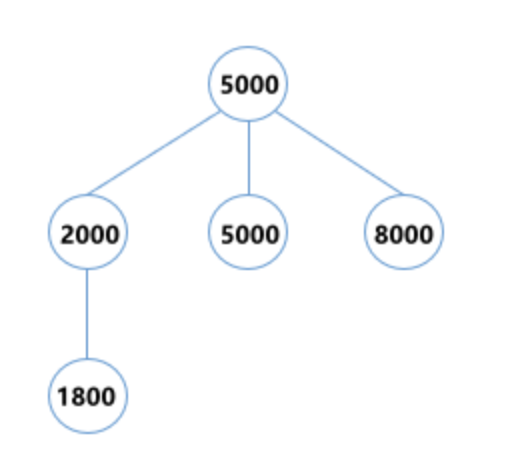
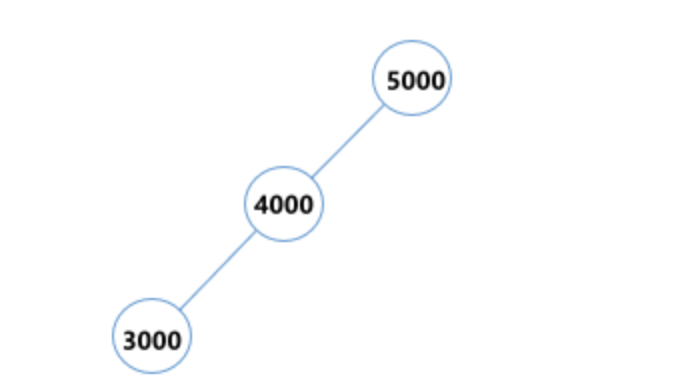

#
# 题目描述：

**定义构造三叉搜索树规则如下：**

每个节点都存有一个数，当插入一个新的数时，从根节点向下寻找，直到找到一个合适的空节点插入。

查找的规则是：
- 如果数小于节点的数减去 500，则将数插入节点的左子树<br>
- 如果数大于节点的数加上 500，则将数插入节点的右子树
- 否则，将数插入节点的中子树

给你一系列数，请按以上规则，按顺序将数插入树中，构建出一棵三叉搜索树，最后输出树的高度。

**输入描述：**

第一行为一个数 `N`，表示有 `N`个数，`1<=N<=10000`

第二行为`N` 个空格分隔的整数，每个数的范围为 `[1,10000]`

**输出描述：**

输出树的高度(根节点的高度为1)

**示例1**

输入：

> 5<br>
> 5000 2000 5000 8000 1800

输出：

> 3

说明：

最终构造出的树高度为3：




**示例2**

输入：

>3<br>
5000 4000 3000

输出：

>3

说明：

最终构造出的树高度为3：


# 解题思路

构建树的同时，即可计算出树木的高度

# 源码 Java
```java
public class AMain {

	public static void main(String[] args) {
		Scanner scanner = new Scanner(System.in);
		int count = scanner.nextInt();
		Node root = new Node(scanner.nextInt());
		int max = 1;
		for (int i = 1; i < count; i++) {
			max = Math.max(max, insert(root, new Node(scanner.nextInt()), 1));
		}
		System.out.println(max);
	}
	public static int insert(Node root, Node node, int hight) {
		// 插入节点后可得到的树的高度
		hight += 1 ;
		if (node.value < root.value - 500) {
			// - 如果数小于节点的数减去 500，则将数插入节点的左子树<br>
			if (root.left == null) {
				root.left = node;
				return hight;
			}
			return insert(root.left, node, hight);
		} else if (node.value > root.value + 500){
			// - 如果数大于节点的数加上 500，则将数插入节点的右子树
			if (root.right == null) {
				root.right = node;
				return hight;
			}
			return insert(root.right, node, hight);
		} else {
			// - 否则，将数插入节点的中子树
			if (root.middle == null) {
				root.middle = node;
				return hight;
			}
			return insert(root.middle, node, hight);
		}
	}

	static class Node{
		public Node left;
		public Node right;
		public Node middle;
		public Integer value;
		public Node(Integer value) {
			this.value = value;
		}
	}
}
```